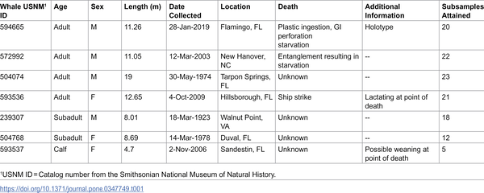
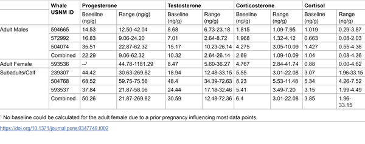

Imagine being able to read a whale’s diary—not written on paper, but encoded in the very structure of its body. For the critically endangered Rice’s whale, researchers have done just that by analyzing hormones stored in its baleen plates. These keratinous filters grow continuously, preserving a biochemical record of the whale’s stress levels and reproductive history over multiple years. This innovative approach offers a rare glimpse into the life of one of the ocean’s most elusive and endangered giants.

> **TL;DR**
> - Hormone analysis of baleen plates from seven Rice’s whales reveals stress patterns linked to starvation and confirms pregnancies, providing a multi-year physiological record.
> - Unlike many baleen whales, Rice’s whales show no clear seasonal testosterone cycles, suggesting they may not have a defined breeding season.

The Rice’s whale (Balaenoptera ricei) is a recently identified species inhabiting the Gulf of Mexico, with fewer than 50 mature adults remaining—making it the most endangered baleen whale species. Unlike many migratory whales, Rice’s whales appear to stay year-round in subtropical waters. Conservation efforts are urgent, but limited knowledge about their reproductive cycles and stress physiology has hindered effective protection. Hormones such as progesterone, testosterone, cortisol, and corticosterone can reveal vital information about reproduction and stress, but collecting blood or tissue samples from these rare whales is challenging. Baleen plates, however, grow continuously and incorporate circulating hormones over time, offering a unique archive of physiological data.

Researchers obtained baleen plates from seven Rice’s whales housed at the Smithsonian National Museum of Natural History, including adult males and females, subadults, and a calf. Each baleen plate was carefully sampled every centimeter along its length, representing approximately 15 to 30 days of growth per sample. The powdered baleen was extracted with methanol, and hormone concentrations were measured using validated enzyme immunoassays. This method allowed the team to reconstruct multi-year hormone profiles for each individual, linking hormone patterns to known life events such as pregnancy or cause of death.

The study found that baleen hormone concentrations reliably reflected physiological states in Rice’s whales. Females with known pregnancies showed sustained high progesterone levels over much of their baleen, confirming pregnancy detection is possible through this method. Two whales that likely died from starvation exhibited elevated cortisol, corticosterone, progesterone, and testosterone near the baleen base, consistent with prolonged stress before death. Interestingly, adult males did not show clear seasonal testosterone peaks, unlike many other baleen whales, suggesting Rice’s whales may breed year-round or have less pronounced breeding seasons. These insights provide the first endocrine data for this critically endangered species.

By unlocking the biochemical archives stored in baleen, scientists can now better understand the reproductive timing and stress physiology of Rice’s whales—information critical for conservation management. Knowing whether these whales breed seasonally or year-round helps inform protective measures during vulnerable periods. Detecting stress hormone elevations linked to starvation or injury highlights the impacts of environmental and anthropogenic threats. This approach offers a non-invasive, retrospective tool to monitor individual health and population trends in a species where direct observation is difficult, ultimately aiding efforts to prevent extinction.

While the findings are promising, the study’s sample size was small due to the rarity of Rice’s whale specimens, and baleen plates represent only one to two years of growth, limiting long-term analysis. The absence of seasonal testosterone cycles in males may reflect the subtropical habitat or could be influenced by individual variation. Further research with more samples and integration of ecological data is needed to confirm reproductive patterns and better understand how stressors affect this species. Nonetheless, this study establishes baleen hormone analysis as a valuable tool for studying and conserving the Rice’s whale.

## Figures

*Summary of key details about the Rice’s whale individuals studied.*

*Summary of enzyme test results from Rice’s whale baleen samples; full data available in supporting info.*

## Sources

- [Baleen hormone analyses reveal stress and reproductive life-history of the critically endangered Rice’s whale (Balaenoptera ricei)](https://journals.plos.org/plosone/article?id=10.1371/journal.pone.0347749)
- DOI: [10.1371/journal.pone.0347749](https://doi.org/10.1371/journal.pone.0347749)
