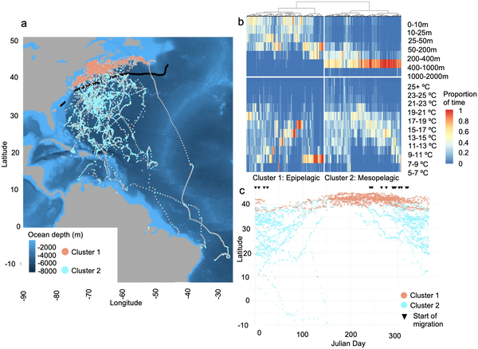
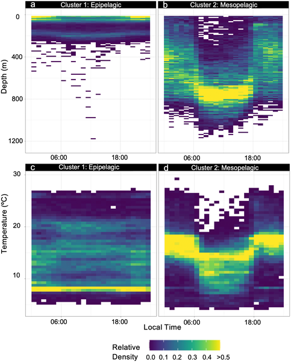
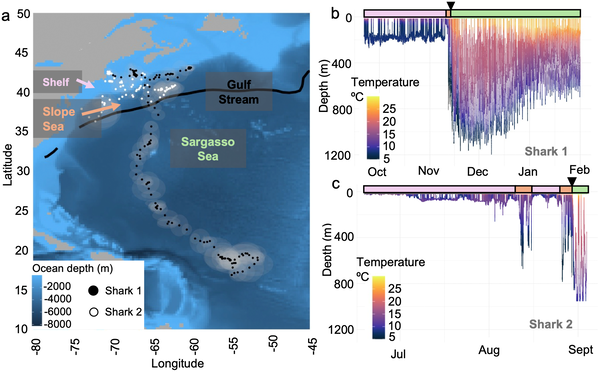
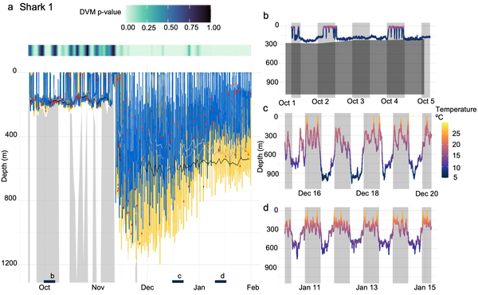

Imagine one of the ocean’s largest fish, the gentle giant basking shark, embarking on an epic migration from the chilly continental shelves of the northeastern United States and Canada all the way to the warm tropical waters of the Caribbean and South America. But these sharks don’t simply glide along the surface, resting on their journey south. Instead, they dive deep into the ocean’s twilight zone, following invisible layers of tiny, bioluminescent creatures that rise and fall daily in a mysterious dance beneath the waves. What drives these deep dives, and what secrets do they hold about the sharks’ survival strategies during migration?

> **TL;DR**
> - Basking sharks migrate thousands of kilometers from temperate shelf waters to tropical regions, spending much of their time in deep offshore waters rather than near the surface.
> - During migration, basking sharks exhibit diel vertical migration behavior, diving into and overlapping with deep scattering layers—dense layers of small marine organisms—suggesting active foraging rather than passive energy conservation.

Long-distance migrations are common among marine animals, allowing them to track seasonal prey availability and favorable ocean conditions. Basking sharks, the world’s second largest fish, are filter feeders known to inhabit temperate shelf habitats in summer but migrate to warmer, lower-latitude waters in winter. Despite their size and widespread presence, much about their overwintering behavior and the ecological function of their migrations has remained a mystery. The Northwest Atlantic Ocean, with its rich seasonal productivity, hosts these migrations, but the deep offshore waters they traverse are often nutrient-poor at the surface, raising questions about how these sharks meet their energetic needs during such journeys.

Researchers tagged 57 basking sharks off Cape Cod, Massachusetts, with pop-up satellite archival transmitting (PSAT) tags between 2004 and 2011. These tags recorded depth, temperature, and light-level data at intervals ranging from seconds to minutes and transmitted daily summaries of time spent at various depths and temperatures. Using sophisticated statistical and clustering analyses, along with state-space models to estimate geographic positions, the team characterized sharks’ vertical habitat use and movement patterns throughout their migrations. Two recovered tags provided high-resolution data, allowing detailed examination of diel vertical migration patterns and detection of bioluminescence as a proxy for prey presence in the deep scattering layers.

The data revealed two main behavioral patterns: shallow occupancy near continental shelves during summer and extensive vertical movements through the mesopelagic zone (200–1000 meters deep) in offshore waters during winter migrations. Notably, basking sharks performed diel vertical migrations (DVM), diving deeper during the day and ascending at night, closely overlapping with both primary and secondary deep scattering layers—dense aggregations of zooplankton, small fishes, and squid that migrate daily in the ocean’s twilight zone. This behavior was widespread across the Sargasso Sea and continued into the Caribbean and during trans-equatorial movements. The sharks also appeared to target prey in deeper, often non-migratory layers below the primary scattering layer. These findings suggest that basking sharks actively forage during migration, rather than relying solely on stored energy as previously thought.

This study challenges earlier assumptions that basking sharks primarily conserve energy during long migrations by resting or relying on fat reserves. Instead, it highlights the ecological importance of mesopelagic prey and the deep scattering layers as critical food resources supporting these giant filter feeders on their journeys. Understanding these behaviors enriches our knowledge of marine food webs and the ecosystem services provided by deep-pelagic communities. Moreover, it underscores the complexity of predator-prey interactions in the open ocean and informs conservation efforts by revealing key habitats and behaviors essential to basking shark survival.

While the study provides robust evidence of basking sharks’ vertical migration and overlap with deep scattering layers, the exact composition and availability of prey within these layers remain difficult to confirm directly. The detection of bioluminescence serves as a proxy but does not quantify prey biomass. Additionally, tagging was opportunistic and mostly involved adult sharks from a specific region, which may limit the generalizability of findings to other populations or age classes. Further research combining acoustic prey surveys, direct sampling, and broader geographic tagging could deepen understanding of these complex migratory and foraging behaviors.

## Figures

*Basking sharks in the Northwest Atlantic show two movement patterns, staying near shelves in summer and migrating offshore in winter.*

*Daily depth and temperature patterns for two groups based on data from 16 tagged subjects.*

*Tracks and depth-temperature data of two basking sharks show their movement and habitat use in the Northwest Atlantic regions.*

*Shark 1's depth and movement patterns over time show day-night shifts and bioluminescence detections in different water layers.*

## Sources

- [Basking sharks overlap with primary and secondary deep scattering layers during overwintering migration in the Northwest Atlantic Ocean](https://journals.plos.org/plosone/article?id=10.1371/journal.pone.0348589)
- DOI: [10.1371/journal.pone.0348589](https://doi.org/10.1371/journal.pone.0348589)
