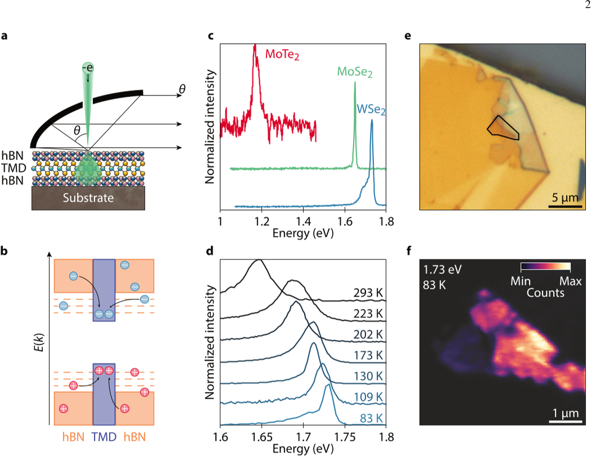
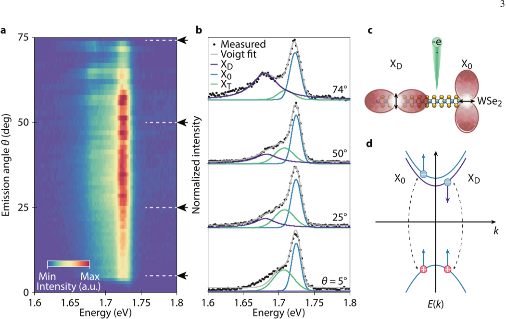
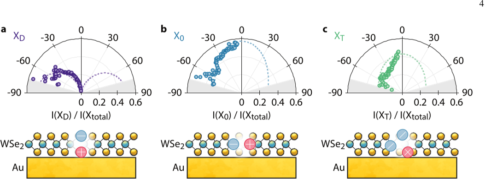

Imagine steering beams of light without the need for tiny antennas, mirrors, or nanostructured surfaces. Recent research reveals that ultra-thin materials, just a single atom thick, can intrinsically direct light emission by harnessing the unique properties of excitons—quasi-particles formed by bound electron-hole pairs. Among these, the elusive 'dark excitons' shine light in surprising directions, opening new pathways for compact, nanoscale photonic devices.

> **TL;DR**
> - Monolayer transition metal dichalcogenides (TMDs) exhibit multiple exciton species with distinct dipole orientations that produce characteristic directional light emission patterns.
> - Using angle-resolved cathodoluminescence spectroscopy, researchers demonstrated that dark excitons in TMD monolayers emit light predominantly at large angles, enabling intrinsic beam routing without external nanostructures.

*Note: this summary is based on a preprint — research shared ahead of formal peer review.*

Routing light at the nanoscale is a fundamental challenge in optics, with important applications in on-chip photonics, quantum information, and sensing. Traditionally, directing light emission requires carefully engineered nanostructures such as gratings, antennas, or waveguides to control the emission direction. Transition metal dichalcogenide monolayers—atomically thin semiconductors like tungsten diselenide (WSe2)—offer a different approach. Their excitons, electron-hole pairs bound by Coulomb attraction, come in various types with distinct spin and dipole orientations. Notably, 'dark excitons' have out-of-plane dipoles that are usually inaccessible by standard optical methods but can emit light directionally at large angles, suggesting a built-in mechanism for beam routing intrinsic to the material itself.

To explore this intrinsic routing, the researchers employed low-temperature, angle-resolved cathodoluminescence spectroscopy. This technique uses a finely focused electron beam to excite the TMD monolayers encapsulated in hexagonal boron nitride (hBN) at cryogenic temperatures. The electron beam generates electron-hole pairs that relax into excitons, which then emit light. By collecting emitted photons over a range of angles using a parabolic mirror and spectrometer, the team resolved the angular emission profiles of different exciton species in monolayers of WSe2, MoSe2, and MoTe2. This method uniquely accesses both in-plane and out-of-plane dipole transitions, including those of dark excitons that are forbidden in normal optical excitation.

The experiments revealed distinct angular emission patterns for three exciton species in WSe2: the bright neutral exciton, the charged trion, and the spin-forbidden dark exciton. Bright excitons and trions, with in-plane dipoles, emitted light predominantly toward the surface normal, producing emission concentrated around small angles. In contrast, dark excitons, characterized by out-of-plane dipoles, emitted light strongly at large angles away from the normal, creating a directional emission channel inaccessible by conventional optical methods. This angular separation allowed the researchers to spectrally and directionally distinguish exciton types. Furthermore, by modifying the local dielectric environment—such as changing the thickness of the hBN encapsulation or introducing graphene layers—they demonstrated control over the relative intensities and energies of these excitonic emissions, highlighting a tunable platform for directional light routing.

This work establishes that intrinsic excitonic transitions in 2D semiconductors can serve as a natural mechanism for directional light emission without relying on complex nanostructuring. The ability to route light by exploiting the orientation of exciton dipoles opens new possibilities for compact photonic architectures, integrated optics, and quantum technologies. Since dark excitons are typically long-lived and spectrally distinct, they offer a stable channel for directional emission that could be harnessed in nanoscale optical devices. The approach also benefits from the high spatial resolution of electron-beam excitation, enabling detailed studies of excitonic behavior and potentially extending to single-photon emitters or moiré heterostructures.

While promising, this research remains at an early stage. The experiments were conducted at low temperatures (around 83 K) to resolve excitonic features clearly, and the dark exciton emission diminishes at higher temperatures due to phonon interactions. Practical applications will require strategies to maintain directional emission at room temperature. Additionally, the current method uses electron-beam excitation, which is not yet practical for device integration. Future work will need to explore optical or electrical excitation schemes and the influence of more complex device geometries. Nonetheless, the findings provide a foundational understanding of intrinsic beam routing in 2D materials that could inspire new photonic device designs.

## Figures

*Electron beams excite light emission in monolayer materials, revealing temperature effects and sample details through color and intensity maps. — Figure from Yonas Lebsir et al., [CC BY 4.0](http://creativecommons.org/licenses/by/4.0/), caption edited.*

*At 83 K, we mapped light emissions from WSe2 showing distinct bright and dark excitons with different orientations and energy patterns. — Figure from Yonas Lebsir et al., [CC BY 4.0](http://creativecommons.org/licenses/by/4.0/), caption edited.*

*Emission patterns of three exciton types show dark excitons emit mostly out-of-plane, while neutral excitons and trions emit mainly straight up from the crystal surface. — Figure from Yonas Lebsir et al., [CC BY 4.0](http://creativecommons.org/licenses/by/4.0/), caption edited.*

## Sources

- [Beam Routing through Excitons in Transition Metal Dichalcogenide Monolayers](https://arxiv.org/abs/2608.12105)
- DOI: [10.48550/arxiv.2608.12105](https://doi.org/10.48550/arxiv.2608.12105)

*This article reuses and adapts text and figures from the original research by Yonas Lebsir et al., available via arXiv Materials Science, under the [CC BY 4.0](http://creativecommons.org/licenses/by/4.0/) license.*
