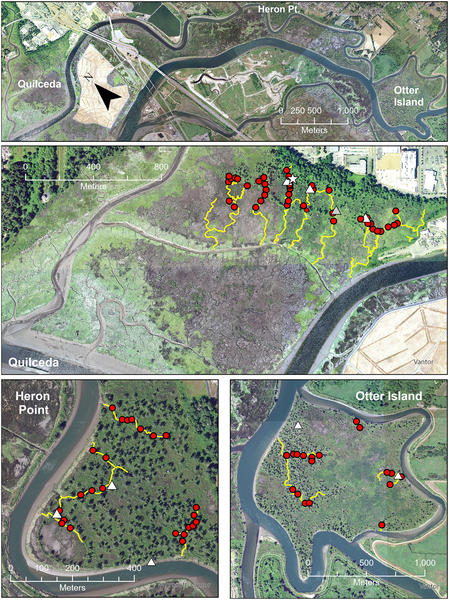
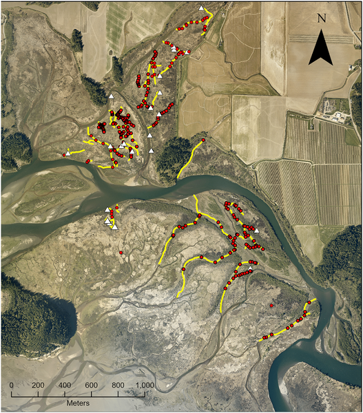
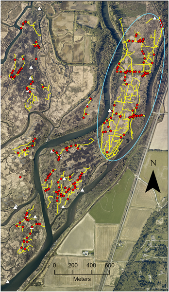
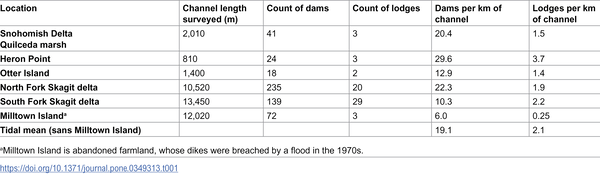

When you think of beavers, images of industrious rodents building dams in forest streams and rivers likely come to mind. But did you know that beavers also thrive in tidal wetlands—areas where the ocean’s tides ebb and flow daily? Recent research from the Pacific Northwest reveals that beavers are not just freshwater engineers but also active inhabitants of tidal river deltas and estuaries, reshaping these dynamic coastal environments in surprising ways.

> **TL;DR**
> - Beavers build and maintain dams in tidal wetlands of the Pacific Northwest, where tides can rise and fall several meters daily.
> - These tidal beaver dams persist for decades and create low-tide pools that provide critical habitat for fish, including threatened Chinook and coho salmon.

Beavers (Castor canadensis in North America) are renowned ecosystem engineers, known for transforming flowing streams into ponded wetlands by building dams. This activity alters water flow, sediment patterns, and habitat structure, benefiting a wide range of plants and animals. Traditionally, beavers have been studied mainly in freshwater river and lake systems. However, tidal wetlands—coastal areas influenced by the rise and fall of ocean tides—have been largely overlooked as beaver habitat. These tidal systems differ from rivers in having bidirectional water flows, variable salinity, and complex channel networks. Understanding whether and how beavers function in these environments is important, especially because tidal wetlands are critical nursery habitats for many fish species, including salmon that are culturally and ecologically valuable in the Pacific Northwest.

To explore beaver presence and their ecological role in tidal wetlands, researchers conducted detailed field surveys in the Skagit and Snohomish river deltas in Washington State—two of the largest freshwater inputs to Puget Sound. Using real-time kinematic GPS technology, they mapped beaver dams, lodges, and channel profiles at low tide, capturing precise measurements of dam dimensions and pool depths. These data were complemented by long-term aerial photo analysis dating back to 1990, which helped document the persistence of beaver dams over decades. The study focused on tidal shrub and Sitka spruce-dominated zones, where woody vegetation provides building materials for beaver structures.

The study found that beavers are widespread and abundant in these tidal wetlands, with dam densities more than twice those reported in freshwater river systems. While tidal beaver dams are somewhat smaller—about 60% the height and 80% the head of riverine dams—their low-tide pools still reach 75% of the depth and 67% of the area of freshwater beaver ponds. Notably, these dams are regularly flooded during high tides but impound water at low tide, allowing beavers to move freely. Aerial imagery confirmed that some tidal beaver dams have persisted for at least 35 years, spanning multiple beaver generations. Importantly, these dams create low-tide pools that significantly enhance fish habitat, providing refuge and resources for juvenile salmon and other aquatic species during periods when tidal channels might otherwise dry out.

This research broadens our understanding of beaver habitat beyond the traditional freshwater paradigm, revealing that beavers are highly adaptable and play important ecological roles in tidal wetlands. By creating and maintaining low-tide pools, beavers help sustain critical estuarine habitats that support fish populations, including threatened Chinook and coho salmon. These findings suggest that beaver activity could be leveraged in estuarine restoration efforts, providing a natural and cost-effective means to enhance habitat complexity and resilience in coastal ecosystems.

While the study provides valuable observational data on beaver presence and dam characteristics in tidal wetlands, many ecological effects remain to be fully understood. For example, the hypothesized benefits to fish—such as reduced energy expenditure and predation risk—have yet to be rigorously tested. Additionally, the study areas are limited to the Pacific Northwest, and tidal beaver ecology may vary in other regions with different tidal regimes and salinity gradients. Further research is needed to clarify the full range of ecosystem impacts and to guide restoration practices that integrate beaver activity effectively.

## Figures

*Map showing beaver dams, lodges, and tidal channels in the Snohomish estuary, highlighting where beavers live and build structures.*

*Map showing beaver dams (red dots) and lodges (white triangles) in tidal wetlands with tidal channels (yellow lines) and surrounding land features.*

*Map shows beaver dams, lodges, and channels in South Fork Skagit delta marshes, highlighting the Milltown Island restoration site.*

*Summary of tidal dam and lodge counts in estuary areas.*

## Sources

- [Beaver in tidal habitat: Examples from the Pacific Northwest](https://journals.plos.org/plosone/article?id=10.1371/journal.pone.0349313)
- DOI: [10.1371/journal.pone.0349313](https://doi.org/10.1371/journal.pone.0349313)
