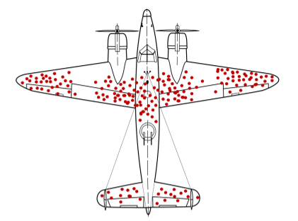

Quantum entanglement has long fascinated scientists and the public alike with its 'spooky' correlations that seem to defy our everyday understanding of space and reality. But what if these mysterious connections are not evidence of instantaneous influences across space or a breakdown of objective reality? What if they are instead a subtle artifact of how experiments select and prepare their data? This idea, grounded in the well-known concept of selection bias, offers a fresh lens on one of quantum physics’ most profound puzzles.

> **TL;DR**
> - Bell correlations—quantum correlations that appear to defy locality—may be explained as a kind of selection bias arising from how experimental initial states are prepared.
> - This reinterpretation preserves both locality (no faster-than-light influence) and realism (an objective world independent of measurement), challenging the common view that one must be abandoned.

*Note: this summary is based on a preprint — research shared ahead of formal peer review.*

In the 1960s, physicist John Stewart Bell formulated a theorem showing that if quantum mechanics is correct, then no local theory—that is, no theory respecting the speed limit set by relativity—can explain the observed correlations between entangled particles. Subsequent experiments have confirmed these predictions, leading many to conclude that either the world is nonlocal, allowing instantaneous influences, or that realism must be abandoned, meaning the world does not exist independently of our observations. These conclusions have sparked decades of debate about the fundamental nature of reality.

The new proposal draws on a familiar concept from statistics and science called selection bias, where the way we select or prepare samples can induce or mask correlations that do not exist in the full population. The author examines different types of selection bias, including collider bias—where conditioning on a variable influenced by two independent causes can create spurious correlations—and range restriction, which can mask true correlations. By analyzing the structure of Bell experiments, particularly the preparation of the initial entangled state (a form of preselection), the work suggests that the observed quantum correlations may be understood as arising from such a selection effect rather than requiring nonlocal influences.

The key insight is that the initial entangled state prepared in Bell experiments acts like a 'correlator'—a variable that, when fixed, induces correlations between outcomes that would otherwise be independent. This is analogous to how selecting only surviving aircraft in WWII led to misleading conclusions about damage patterns (known as survivorship bias). In quantum experiments, the preselection of the entangled state effectively restricts the sample to a sub-ensemble with correlations that differ from the larger, hypothetical super-ensemble of all possible states. This selection bias can produce the Bell correlations without violating locality or realism.

If this reinterpretation holds, it offers a compelling alternative to the conventional narrative that quantum mechanics forces us to accept either faster-than-light influences or a reality dependent on observation. Instead, it suggests that the puzzling quantum correlations are less mysterious and can be explained by well-understood statistical phenomena. This perspective could reshape foundational debates in quantum physics and inspire new ways to think about the relationship between measurement, preparation, and observed correlations.

It is important to note that this proposal is theoretical and has yet to gain broad consensus or experimental validation. The idea reframes rather than resolves the deeper mysteries of quantum mechanics and does not provide a complete explanation for all quantum phenomena. Moreover, the concepts involved are abstract and challenging to visualize, which may limit immediate practical applications or widespread public appeal. As with many foundational questions in physics, further investigation and dialogue will be needed to assess the viability and implications of this approach.

## Figures

*Figure 1 illustrates survivorship bias, showing how focusing only on successes can mislead conclusions. — Figure from Huw Price, [CC BY 4.0](http://creativecommons.org/licenses/by/4.0/), caption edited.*

## Sources

- [Bell Correlations and Selection Bias](https://arxiv.org/abs/2605.00406)
- DOI: [10.48550/arxiv.2605.00406](https://doi.org/10.48550/arxiv.2605.00406)

*This article reuses and adapts text and figures from the original research by Huw Price, available via arXiv Quantum Physics, under the [CC BY 4.0](http://creativecommons.org/licenses/by/4.0/) license.*
