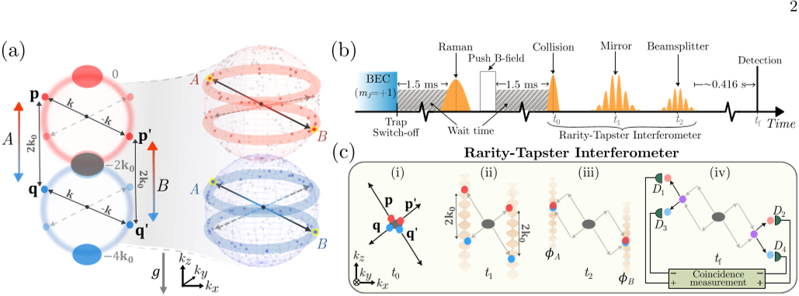

Quantum mechanics has long challenged our classical intuition, famously predicting phenomena that seem to defy the idea that objects have definite properties independent of observation. One of the most striking manifestations of this strangeness is quantum entanglement, where particles become linked so that the state of one instantly influences the state of another, no matter the distance between them. This 'spooky action at a distance,' as Einstein called it, has been experimentally confirmed many times—mostly using photons or the internal states of particles. But what if the entanglement involved the actual motion of massive particles? For the first time, scientists have now demonstrated a violation of Bell’s inequality using the motional states of atoms, pushing the boundaries of quantum weirdness into new territory.

> **TL;DR**
> - Researchers achieved the first experimental violation of Bell’s inequality using the momentum (motion) states of massive helium atoms, confirming quantum nonlocality in an external degree of freedom.
> - The experiment used momentum-entangled pairs of ultracold atoms manipulated by a novel dual-frequency matter-wave interferometer, enabling independent control of measurement settings required for the Bell test.

*Note: this summary is based on a preprint — research shared ahead of formal peer review.*

Bell’s theorem, formulated in the 1960s, showed that no theory based on local realism—where objects have pre-existing properties and no influence travels faster than light—can reproduce all predictions of quantum mechanics. Over decades, physicists have tested Bell inequalities, the mathematical expressions derived from the theorem, using photons and internal quantum states of particles like spins. These tests have consistently violated Bell inequalities, confirming quantum mechanics’ nonlocal predictions. However, the motional states of massive particles—their actual movement through space—had remained an elusive frontier for such tests. Unlike internal states, motional states govern how matter propagates and interacts with forces like gravity, making them a fundamentally different and important aspect to explore.

The experiment began by cooling a cloud of helium atoms to form a Bose-Einstein condensate, a quantum state where atoms behave collectively. Using laser pulses, the researchers split this condensate into distinct momentum components. When these components collided, pairs of atoms scattered with equal and opposite momenta, creating momentum-entangled pairs. To test Bell’s inequality, they developed a dual-resonant Bragg interferometer capable of independently manipulating the phases of the two spatially separated momentum modes. This interferometer applied carefully timed laser pulses acting as mirrors and beam splitters for matter waves, allowing the team to measure correlations between the atoms’ momentum states with high precision. Single-atom detectors recorded the three-dimensional momentum of each atom after free fall, enabling reconstruction of the joint detection probabilities needed for the Bell test.

By varying the interferometric phases independently for the two atoms in each entangled pair, the researchers measured the correlation function characteristic of quantum entanglement. Their data showed clear oscillations consistent with coherent two-particle interference. From these measurements, they extracted a Clauser-Horne-Shimony-Holt (CHSH) Bell parameter S = 2.52 ± 0.17, which exceeds the classical limit of 2 by three standard deviations. This result constitutes the first definitive demonstration of Bell inequality violation using the motional states of massive particles, confirming quantum nonlocality in an external degree of freedom.

This achievement completes a long-standing goal in quantum atom optics by extending Bell tests beyond internal quantum variables to the external motion of massive particles. It opens a new experimental regime for studying quantum nonlocality in matter waves and lays groundwork for future investigations into the interplay between quantum mechanics and gravity. Since motional states respond directly to gravitational and inertial effects, entangled matter waves could one day enable precision measurements and novel tests of fundamental physics that are inaccessible to photon-based systems. The experiment also showcases advanced matter-wave interferometry techniques that could inform emerging quantum technologies.

While the experiment robustly demonstrates Bell inequality violation in motional states, it remains a fundamental physics test rather than an immediate technological application. The measured Bell parameter, though clearly above the classical bound, is limited by experimental imperfections such as finite detection resolution and phase averaging. Achieving even higher fidelities and scaling to more complex systems will require further technical advances. Additionally, although this work opens avenues for exploring quantum effects in gravitational fields, direct tests of quantum gravity remain challenging and speculative at this stage. Nonetheless, this milestone provides a critical stepping stone toward those future goals.

## Figures

*Atoms are split, collided, and interfered to create and detect entangled pairs using pulses and detectors in a controlled sequence. — Figure from Y. S. Athreya et al., [CC BY 4.0](http://creativecommons.org/licenses/by/4.0/), caption edited.*

## Sources

- [Bell inequality violation with momentum-entangled massive particles](https://arxiv.org/abs/2609.02009)
- DOI: [10.48550/arxiv.2609.02009](https://doi.org/10.48550/arxiv.2609.02009)

*This article reuses and adapts text and figures from the original research by Y. S. Athreya et al., available via arXiv Quantum Physics, under the [CC BY 4.0](http://creativecommons.org/licenses/by/4.0/) license.*
