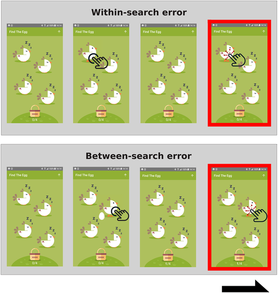
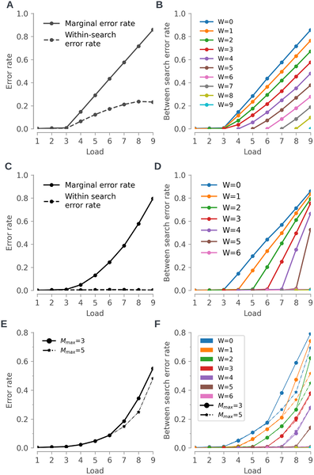
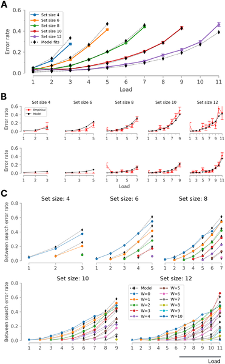
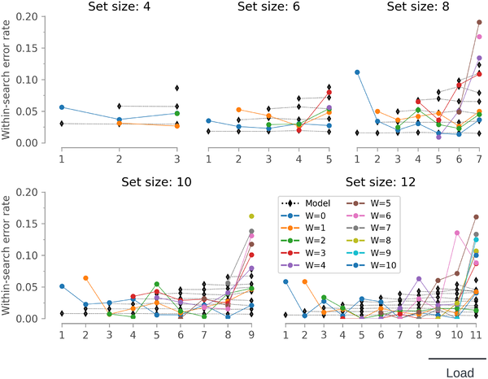

Imagine trying to remember the locations of hidden eggs under a group of chickens, one by one, on your smartphone screen. How does your brain keep track of what you've already discovered and what remains unknown? Recent research has developed a novel computational model that sheds light on this everyday challenge, revealing that our visuospatial working memory relies on two separate systems working in tandem. This insight not only deepens our understanding of memory but also opens new avenues for monitoring cognitive health remotely, especially in conditions like autism and early Alzheimer's disease.

> **TL;DR**
> - Visuospatial working memory operates through two distinct stores: a small, highly reliable system and a larger, less reliable one where retrieval can sometimes fail.
> - A smartphone-based memory game combined with computational modeling can effectively track memory performance across neurotypical individuals, autistic participants, and those with early Alzheimer's, demonstrating potential for large-scale clinical applications.

Visuospatial working memory (VSWM) is our brain's ability to temporarily hold and manipulate visual and spatial information, crucial for everyday tasks like navigation or remembering object locations. Traditionally, studies have focused on how we remember multiple items presented all at once. However, in real life, information often arrives sequentially, and understanding how our brain manages this flow has remained a challenge. This gap is especially important in clinical contexts, where dynamic memory tasks are used to assess cognitive health in diverse populations, including those with autism spectrum disorder (ASD) and prodromal Alzheimer's disease (AD).

To explore how sequential visual information is stored and retrieved, researchers used a gamified smartphone task called 'Find the Egg.' Participants tap on chickens displayed on their phones to find hidden eggs, one at a time, with the challenge increasing as more eggs appear. The task records two types of errors: tapping a chicken that previously hid an egg (between-search errors) and tapping empty chickens repeatedly within the same search (within-search errors). The team collected data from neurotypical adults, autistic individuals, and people in the early stages of Alzheimer's, both in lab settings and remotely via smartphones. They then developed and tested computational models to predict error patterns based on memory capacity and retrieval dynamics.

The study revealed that a simple single-store memory model, where all items compete for the same memory slots, could not fully explain participants' performance. Instead, a dual-store model better captured the data, proposing two independent memory pools: a small, highly reliable store for longer-term retention of previously found eggs, and a larger, less reliable store for items encountered within the current search. Moreover, the model incorporated probabilistic retrieval, acknowledging that sometimes stored information might not be successfully accessed. This dual, probabilistic framework aligned well with observed error rates across all participant groups and task difficulties. Interestingly, the model's parameters correlated with cognitive measures like IQ and detected subtle memory changes in early Alzheimer's patients.

This research advances our understanding of how visuospatial working memory functions in real-world, sequential contexts. By combining a smartphone-based cognitive task with sophisticated computational modeling, it offers a scalable and sensitive approach to monitor cognitive health remotely. Such tools could be invaluable for early detection and tracking of neurodevelopmental and neurodegenerative conditions, potentially guiding interventions and improving patient outcomes. Furthermore, the dual-store memory concept enriches cognitive neuroscience theories, emphasizing the complexity of memory systems beyond traditional capacity limits.

While promising, the model simplifies some aspects of memory processing, such as assuming random item selection within certain pools and not fully capturing strategic behaviors participants might use. The probabilistic retrieval component, though supported by data, requires further investigation to understand its neural basis. Additionally, the smartphone task, while accessible, may be influenced by factors like user engagement or motor skills, which can vary across populations. Future research should explore these nuances and validate the model in broader and more diverse cohorts.

## Figures

*Find the Egg is a smartphone memory game where players tap chickens to find hidden eggs, testing their visuospatial working memory without error feedback.*

*Models show how error rates change with memory load, revealing different patterns for single, dual, and multi-store memory systems.*

*Error rates in a memory task change nonlinearly with load, matching a dual memory model better than single-store models across participants.*

*Error rates stayed mostly steady as task difficulty rose, except in the hardest cases where errors slightly increased.*

## Sources

- [Beyond memory capacity: A probabilistic, dual store model of visuospatial working memory](https://journals.plos.org/ploscompbiol/article?id=10.1371/journal.pcbi.1014535)
- DOI: [10.1371/journal.pcbi.1014535](https://doi.org/10.1371/journal.pcbi.1014535)
