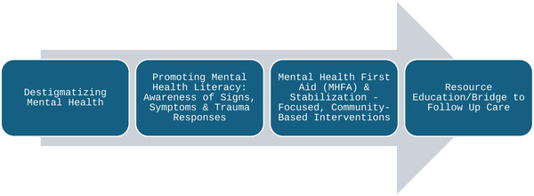

How do repeated natural disasters wear down mental health in vulnerable communities? In Houston, Texas, neighborhoods like Kashmere Gardens, Third Ward, and Fifth Ward have faced successive storms that not only damage homes and infrastructure but also chip away at residents’ emotional wellbeing. This study invites us to listen closely to the voices of those living through these compounded crises and to rethink how mental health support is provided in disaster recovery.

> **TL;DR**
> - Repeated natural disasters create ongoing psychological strain in marginalized communities, leading to persistent anxiety, grief, and emotional exhaustion.
> - Barriers such as stigma, mistrust of institutions, and limited access to affordable, culturally sensitive mental health care hinder recovery and highlight the need for community-embedded support.

Extreme weather events are increasing in frequency and severity, disproportionately impacting under-resourced and marginalized communities. Houston, Texas, exemplifies this challenge, with historically underserved neighborhoods facing repeated hurricanes and floods. These events compound existing social and economic inequities, leaving residents with unmet mental health needs. Despite the growing recognition of disaster-related trauma, little is known about how chronically affected communities perceive their mental health challenges or what kinds of support they prioritize. This study focuses on three predominantly African American neighborhoods with high social vulnerability, aiming to understand lived experiences, barriers to care, and community-driven solutions.

Researchers partnered with trusted community leaders to host town hall–style conversations in Kashmere Gardens, Third Ward, and Fifth Ward. Between March and October 2024, 145 residents participated in facilitated roundtable discussions designed to encourage candid sharing, or what participants called 'Real Talk.' To respect participants’ comfort and foster openness, sessions were not audio-recorded; instead, trained note-takers used standardized templates to capture verbatim comments and observations. A professional artist also created graphic recordings to visually document key ideas. Mental health professionals were present to provide immediate support if needed. The research team used reflexive thematic analysis to identify common themes, ensuring rigor through multiple analysts, consensus-building, and reflective practices.

Three main themes emerged from the conversations. First, residents described living in 'survival mode,' burdened by cumulative emotional exhaustion from repeated disasters. Persistent anxiety, hypervigilance, grief over losses, caregiving pressures, and limited opportunities for self-care were common. Second, participants highlighted significant barriers to accessing mental health support, including cultural stigma, confusing and costly care pathways, and mistrust of institutions due to past unfulfilled promises and inaccessible services. Third, community members emphasized the importance of building a path forward through mental health literacy, embedding services within the community, improving communication with city officials, and securing sustained funding for affordable, culturally responsive care.

This study sheds light on the chronic mental health toll that repeated disasters impose on vulnerable urban communities, extending beyond the immediate aftermath often addressed by emergency response. By centering community voices, it underscores the critical need for disaster mental health strategies that prioritize continuity of care, cultural responsiveness, and local engagement. The findings advocate for shifting from short-term crisis interventions to sustained, community-embedded support systems that can better address the complex realities of disaster-affected populations. Such approaches are increasingly urgent as climate change drives more frequent extreme weather events worldwide.

While the qualitative design offers rich insights into community experiences, the study is limited to three neighborhoods in Houston and may not capture the full diversity of disaster-impacted communities elsewhere. The absence of audio recordings, though intentional to foster trust, relies heavily on note-taking accuracy. Additionally, the findings reflect perceptions and self-reported experiences rather than clinical assessments. Future research could build on these results by including longitudinal studies and evaluating the effectiveness of community-centered mental health interventions in diverse settings.

## Figures

*Improving mental health support in communities hit by multiple disasters.*

## Sources

- [Beyond the emergency: Centering mental health in community disaster preparedness and recovery](https://journals.plos.org/plosone/article?id=10.1371/journal.pone.0345216)
- DOI: [10.1371/journal.pone.0345216](https://doi.org/10.1371/journal.pone.0345216)
