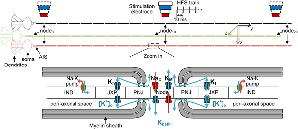

Deep brain stimulation (DBS) has revolutionized treatment for neurological disorders such as Parkinson’s disease and epilepsy. Yet, a puzzling question remains: why does the same electrical stimulation sometimes produce very different effects? Recent research uncovers that neurons don’t simply turn on or off under stimulation. Instead, they can flip between multiple stable firing patterns, much like a complex system responding to tiny changes in its environment.

> **TL;DR**
> - Neurons exposed to high-frequency electrical pulses can abruptly switch between steady, clustered, or silent firing modes due to nonlinear dynamics.
> - These firing transitions depend critically on the precise geometry between stimulating electrodes and axons, as well as the local concentration of potassium ions around nerve fibers.

High-frequency stimulation (HFS) underpins DBS, a therapy that applies rapid electrical pulses to specific brain regions to modulate neural activity. While DBS is clinically effective, the mechanisms by which HFS alters neuron firing remain elusive. Traditional theories focused on conduction block—where neurons stop firing due to sodium channel inactivation—but these explanations don’t fully capture the abrupt and reproducible changes in firing patterns observed experimentally. Neurons, especially their axons, behave as nonlinear dynamical systems, capable of multiple stable states rather than simple on/off responses. Understanding how electrode placement and ionic environment influence these states is crucial for refining DBS therapies.

To investigate these mechanisms, researchers combined in vivo recordings from rat hippocampal CA1 neurons with a detailed computational model of a CA1 pyramidal neuron. The model incorporated realistic morphology, including soma, dendrites, axonal initial segment, and a long myelinated axon with nodes of Ranvier. They simulated extracellular electric fields generated by a bipolar stimulation electrode positioned near the axon and incorporated potassium ion dynamics in the narrow peri-axonal space. The model accounted for potassium accumulation due to outward currents and clearance via diffusion and Na-K pumps. Experiments involved delivering 100 Hz biphasic current pulses to rat brain tissue while recording single-unit activity, allowing comparison between observed firing patterns and model predictions.

The study found that small changes in either the distance between the stimulating electrode and the axon or the extracellular potassium concentration could trigger sudden transitions—bifurcations—in neuron firing patterns. These transitions included tonic (steady) firing, clustered bursts, and low-rate regular firing, or even complete conduction block. Elevated potassium levels shifted the neuron membrane between excitable and non-excitable states, while increasing electrode-axon distance led to conduction block before failure to initiate action potentials. This revealed that axons act as nonlinear elements whose excitability depends on the interplay between local ionic conditions and external electric fields, rather than simple binary switches.

This new bifurcation framework extends classical conduction block theories by highlighting the nonlinear dynamics underlying neuron responses to high-frequency stimulation. It explains why identical stimulation parameters can produce opposite effects across brain regions or patients, emphasizing the importance of precise electrode placement and local brain chemistry. These insights pave the way for optimizing DBS and other neuromodulation therapies by tuning stimulation protocols and electrode positioning to guide neurons toward beneficial firing states, potentially improving therapeutic outcomes and reducing side effects.

While the combined experimental and computational approach provides robust mechanistic insights, the study focused on rat hippocampal neurons and a specific stimulation setup. Human brain anatomy and disease states may introduce additional complexities. Moreover, the model simplifies some biological factors such as glial involvement and broader network effects. Future work is needed to validate these nonlinear dynamics in diverse brain regions and clinical contexts, and to translate these findings into practical DBS programming strategies.

## Figures

*Diagram of a nerve cell model showing its parts, stimulation site, and how ions move through channels along the axon.*

## Sources

- [Bifurcation of neural firing patterns driven by potassium dynamics and neuron–electrode geometry during high-frequency stimulation](https://journals.plos.org/ploscompbiol/article?id=10.1371/journal.pcbi.1014228)
- DOI: [10.1371/journal.pcbi.1014228](https://doi.org/10.1371/journal.pcbi.1014228)
