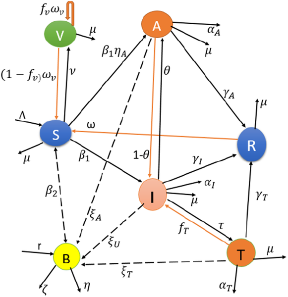

Cholera, a disease often linked to contaminated water and poor sanitation, continues to challenge public health efforts around the world. Despite vaccination campaigns and water treatment projects, outbreaks still flare unpredictably and persist longer than expected. What makes cholera so stubborn? Recent research using advanced mathematical modeling sheds light on hidden complexities in how cholera spreads, revealing why simply reducing infection rates might not be enough to wipe it out.

> **TL;DR**
> - Cholera transmission involves two main routes: direct person-to-person contact and environmental contamination through water, each with distinct dynamics affecting outbreak persistence.
> - Mathematical analysis shows that lowering cholera’s reproduction number below one doesn’t guarantee elimination due to a phenomenon called backward bifurcation, requiring stronger combined vaccination and sanitation efforts.

Cholera is caused by the bacterium Vibrio cholerae, which can spread both through direct contact between people and via contaminated water sources. Traditional models often simplify these pathways or focus on just one, missing key aspects such as asymptomatic carriers who silently transmit the disease and the role of bacterial growth in the environment. Understanding these complexities is crucial for designing effective control strategies, especially in regions where clean water and healthcare access are limited.

Researchers developed a new mathematical model called SVAITRS-B that integrates both deterministic and stochastic elements to capture the full complexity of cholera transmission. This model includes compartments for susceptible, vaccinated, asymptomatic carriers, infected, treated, and recovered individuals, along with bacteria in the environment. It accounts for vaccination efficacy, waning immunity, bacterial shedding rates, treatment failure, and environmental bacterial growth. The team performed bifurcation analyses to identify critical thresholds where disease dynamics change dramatically, and ran stochastic simulations to explore outbreak variability.

The study revealed that person-to-person transmission exhibits a backward bifurcation phenomenon, meaning cholera can persist even when the basic reproduction number (R0) falls below one. In contrast, environmental transmission follows a classical forward bifurcation. Stochastic simulations showed that outbreaks driven by human contact are about 30% more unpredictable than those driven by environmental routes. Moreover, environmental transmission contributes roughly 68% to the overall reproduction number, underscoring its dominant role in long-term endemicity. Sensitivity analyses indicated that bacterial concentration responds logarithmically to sanitation efforts, suggesting that standard intervention targets might underestimate the necessary effort by 15–20%. These insights highlight the importance of combining vaccination with aggressive sanitation improvements.

This research provides a robust mathematical foundation explaining why cholera elimination is more challenging than previously thought. The discovery of backward bifurcation in human transmission routes means public health policies cannot rely solely on reducing average transmission rates. Instead, integrated strategies targeting both direct human transmission and environmental contamination are essential. The accompanying computational toolkit offers health agencies a practical resource to simulate different intervention scenarios tailored to local conditions, improving outbreak preparedness and resource allocation.

While the model incorporates many realistic features, it assumes a well-mixed population without age or spatial structure, which may limit its applicability in highly heterogeneous settings. The stochastic simulations capture outbreak variability but require further field validation, especially regarding spatial heterogeneity and localized transmission patterns. Additionally, the model’s parameters are based on ranges from existing literature and may need refinement with new empirical data. Despite these limitations, the framework represents a significant step forward in understanding cholera dynamics and guiding control efforts.

## Figures

*Diagram showing how cholera spreads through people and the environment, including different stages of infection and bacteria in water.*

## Sources

- [Bifurcation, sensitivity, and noise: Stochastic dynamics of cholera with vaccination and sanitation controls](https://journals.plos.org/complexsystems/article?id=10.1371/journal.pcsy.0000099)
- DOI: [10.1371/journal.pcsy.0000099](https://doi.org/10.1371/journal.pcsy.0000099)
