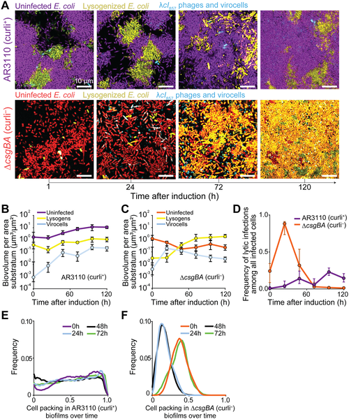
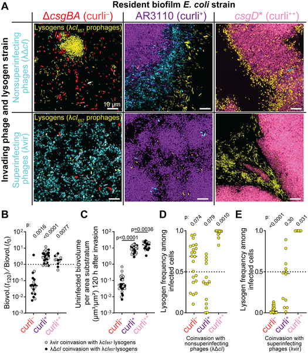

Imagine a hidden battlefield where viruses fight for dominance inside slimy communities of bacteria. These communities, called biofilms, are everywhere—from plaque on your teeth to infections on medical devices. But how do viruses that infect bacteria, known as bacteriophages or phages, compete within these complex structures? Recent research reveals that the physical layout of biofilms plays a crucial role in shaping viral strategies and outcomes.

> **TL;DR**
> - The dense, matrix-rich structure of bacterial biofilms limits how freely viruses can move, favoring viruses that integrate quietly into bacterial genomes over those that burst cells open.
> - When viruses and virus-infected bacteria invade established biofilms together, the biofilm’s architecture and the viruses’ ability to infect already infected bacteria determine which viral strategy wins out.

Bacteriophages come in two main types: lytic phages that rapidly kill their bacterial hosts to release new viruses, and temperate phages that can either kill or quietly insert their DNA into the host genome, lying dormant as 'prophages'. While much is known about these strategies in liquid cultures, bacteria in nature often live in biofilms—dense clusters encased in a self-produced matrix. This matrix can physically restrict virus movement, potentially altering how phages infect and compete. Understanding this interplay is important not only for microbiology but also for developing phage therapies against bacterial infections.

Researchers developed a live imaging system to observe infections at single-cell resolution within three-dimensional biofilms of Escherichia coli. Using fluorescent markers, they tracked uninfected bacteria, bacteria infected by lytic phages, and bacteria carrying temperate phages. They compared biofilms with and without a key matrix component called curli fibers, which affect biofilm density and virus diffusion. They also introduced different phage types—temperate lysogens and virulent lytic phages, some capable of infecting lysogenized bacteria—to study competition during invasion of pre-existing biofilms.

The study found that in biofilms rich in curli fibers, which create dense and diffusion-limiting structures, lytic phages struggled to spread. Temperate phages, which can integrate into bacterial genomes and replicate vertically as bacteria divide, were favored in these environments. In contrast, in biofilms lacking curli fibers, phages moved more freely, leading to rapid lytic infections that killed many bacteria before lysogens eventually dominated. When temperate lysogenized bacteria and virulent phages invaded established biofilms together, the outcome depended on both biofilm structure and whether lytic phages could superinfect lysogens. Dense biofilms that limited virus movement favored temperate phages, highlighting how spatial constraints shape viral competition.

This research sheds light on a subtle microbial arms race occurring within biofilms, revealing that the physical environment profoundly influences viral infection strategies. By showing how biofilm architecture can tip the balance between lytic and lysogenic phages, the study advances our understanding of microbial ecology and evolution. These insights could inform phage therapy approaches, where harnessing or overcoming biofilm barriers is critical for effectively targeting bacterial infections.

While the experiments provide detailed observations in controlled laboratory biofilms of E. coli, natural biofilms are often more complex, containing diverse bacterial species and environmental factors. The study focuses on a model phage and bacterial system, so further work is needed to see how broadly these findings apply across different microbes and settings. Additionally, the dynamics observed depend on specific biofilm matrix components and phage genetics, which may vary in nature.

## Figures

*E. coli biofilms with or without curli fibers show different virus infection and host survival patterns after virus activation over 72 hours.*

*Images and data show how different phages invade E. coli biofilms with varying curli levels over 120 hours, affecting bacterial survival and infection rates.*

## Sources

- [Biofilm spatial structure and superinfection immunity modulate inter-phage competition](https://journals.plos.org/plosbiology/article?id=10.1371/journal.pbio.3003737)
- DOI: [10.1371/journal.pbio.3003737](https://doi.org/10.1371/journal.pbio.3003737)
