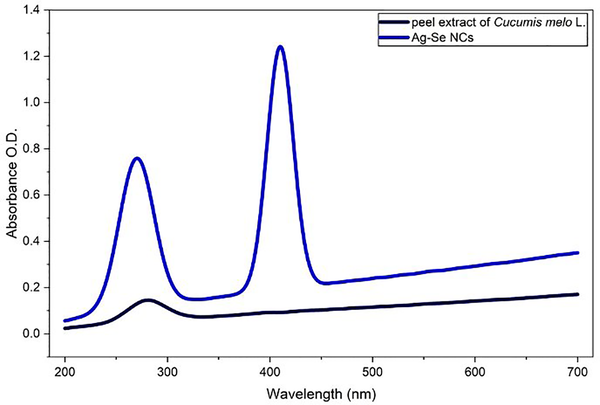
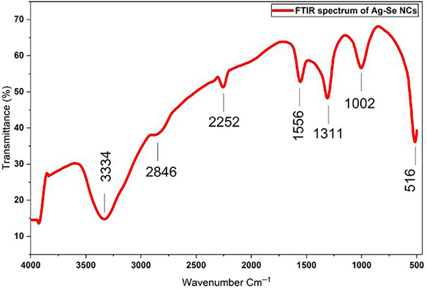
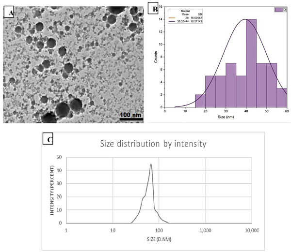

Imagine a tiny particle, just 35 nanometers across—about a thousand times smaller than a human hair—that can both kill cancer cells and fight some of the most stubborn drug-resistant bacteria. Scientists have crafted such a nanoparticle by combining silver and selenium using a green synthesis method that harnesses natural compounds from melon peels, an agricultural waste product. This innovative nanocomposite not only tackles cancer cells but also shows strong antibacterial effects against vancomycin-resistant Staphylococcus aureus (VRSA), a superbug that the World Health Organization has flagged as a top priority for new treatments.

> **TL;DR**
> - A silver–selenium nanocomposite was synthesized using an eco-friendly method with melon peel extract, producing spherical nanoparticles about 35 nm in size.
> - These nanoparticles exhibit selective toxicity against cancer cells and effectively inhibit growth and biofilms of vancomycin-resistant Staphylococcus aureus in laboratory tests.

Antibiotic resistance is a growing global health crisis, with pathogens like vancomycin-resistant Staphylococcus aureus (VRSA) causing infections that are increasingly difficult to treat. At the same time, cancer remains a leading cause of death worldwide, driving the search for new, effective therapies. Nanotechnology offers a promising avenue by enabling the design of multifunctional particles that can target disease cells while minimizing harm to healthy tissue. Silver nanoparticles are well-known for their antimicrobial properties, but their toxicity to normal cells limits their use. Selenium nanoparticles, on the other hand, have antioxidant and anticancer properties with lower toxicity. Combining these two metals into a bimetallic nanocomposite could harness the strengths of both while reducing drawbacks.

The researchers used an eco-friendly, or 'green,' synthesis approach by employing an aqueous extract from the peel of Cucumis melo (melon) as a natural reducing and stabilizing agent. This plant-based extract contains bioactive phytochemicals such as phenolics and flavonoids that facilitate the formation of silver–selenium nanocomposites without harsh chemicals. The resulting nanoparticles were characterized using spectroscopic techniques confirming their composition, high crystallinity, and spherical shape with an average size of approximately 35 nanometers. The biological activity was then tested in vitro against cancer cell lines and clinical isolates of VRSA bacteria, including assessments of bacterial growth inhibition, biofilm disruption, and synergy with the antibiotic vancomycin.

The silver–selenium nanocomposite demonstrated selective cytotoxicity, showing strong inhibitory effects on hepatocellular carcinoma (Hep-G2) and breast adenocarcinoma (MCF-7) cell lines, while exhibiting low toxicity toward normal lung fibroblasts. Against VRSA clinical isolates, the nanocomposite inhibited bacterial growth with minimum inhibitory concentrations comparable to standard antibiotics. It also disrupted bacterial biofilms, which are protective layers that often shield bacteria from drugs. Time-kill studies revealed rapid bactericidal activity, and membrane damage assays indicated that the nanoparticles compromised bacterial cell integrity. When combined with vancomycin, the nanocomposite showed variable effects, including synergy and additive interactions in some strains, suggesting potential to enhance existing antibiotic therapies.

This study highlights the potential of green-synthesized silver–selenium nanocomposites as multifunctional therapeutic agents that can simultaneously target cancer cells and drug-resistant bacteria. The use of melon peel extract not only provides a sustainable and cost-effective synthesis route but also improves nanoparticle stability and biocompatibility. By addressing two major public health challenges—antibiotic resistance and cancer—this research opens avenues for developing novel nanomedicines with dual applications. Moreover, the ability of these nanoparticles to disrupt biofilms and potentiate antibiotic effects could help overcome some limitations of current antimicrobial treatments.

While the results are promising, it is important to note that all findings are based on laboratory (in vitro) experiments. The safety, efficacy, and behavior of these nanocomposites in living organisms remain to be evaluated through animal studies and clinical trials. Additionally, the long-term effects and potential toxicity of silver-based nanoparticles require careful assessment before any medical application. The variability in interactions with antibiotics also suggests that further optimization and understanding of mechanisms are needed. Thus, while the study provides a compelling proof of concept, more research is necessary to translate these findings into practical therapies.

## Figures

*UV-Vis spectra showing light absorption of melon peel extract and the made silver-selenium nanocomposite.*

*FTIR spectrum of Ag–Se nanocomposite showing key absorption bands from plant compounds that help form and stabilize the particles.*

*Microscopic images and size analyses show the shape and size distribution of biosynthesized silver-selenium nanocrystals.*

## Sources

- [Biogenic Silver–Selenium nanocomposite with anticancer activity and potent efficacy against vancomycin-resistant Staphylococcus aureus](https://journals.plos.org/plosone/article?id=10.1371/journal.pone.0351844)
- DOI: [10.1371/journal.pone.0351844](https://doi.org/10.1371/journal.pone.0351844)
