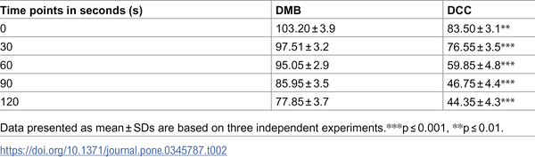
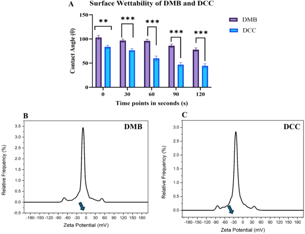
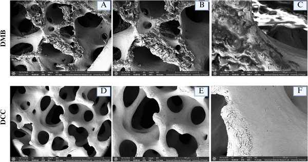

When a bone graft is implanted during oral surgery, the body’s immune system faces a critical decision: accept the graft and support healing, or reject it and trigger inflammation. This decision hinges on the complex interactions between immune cells and the graft’s surface. Recent research reveals that tiny differences in the texture and chemistry of bone graft materials can steer immune cells called macrophages toward either healing or inflammation, influencing the success of the graft.

> **TL;DR**
> - Bone graft surfaces differ in texture and chemistry, which affects how proteins from blood serum stick to them.
> - These adsorbed proteins then influence macrophages to adopt either a healing or inflammatory state, impacting graft acceptance.

Bone grafting is a common technique to repair bone defects caused by injury, disease, or surgery. However, the success of these grafts can be compromised if the immune system mounts an adverse reaction, known as the foreign body reaction (FBR). Central to this reaction are macrophages, immune cells that can adopt different functional states—some promote inflammation and tissue damage, while others encourage healing and tissue regeneration. The surface properties of the graft, including how proteins from the surrounding fluid adsorb onto it, create molecular signals that guide macrophage behavior. Understanding these interactions is key to designing better bone graft materials that the body is more likely to accept.

Researchers compared two types of bone grafts derived from bovine sources: demineralized bone matrix (DMB), which is collagen-rich and rough, and decellularized bone matrix (DCC), which retains mineral content and has a smoother surface. They characterized the physical and chemical properties of these grafts, including surface roughness, charge, and wettability. Both graft types were incubated in serum to allow proteins to adsorb onto their surfaces. The adsorbed proteins were then analyzed using advanced proteomic techniques. Finally, human macrophage-like cells were exposed to these adsorbed protein layers to observe changes in their shape, surface markers, and gene expression related to inflammation and healing.

The study found that DCC grafts had hydrophilic (water-attracting), negatively charged, and smooth surfaces, while DMB grafts were more hydrophobic (water-repelling), mildly negatively charged, and rough. These differences influenced which serum proteins adhered to each graft. Macrophages exposed to proteins from DCC grafts adopted an elongated shape and expressed markers associated with a healing, anti-inflammatory state, including higher levels of Arg-1, IL-10, and TGF-β. In contrast, macrophages exposed to DMB-associated proteins were rounder and expressed markers linked to inflammation, such as iNOS and pro-inflammatory surface proteins. This suggests that the physicochemical properties of bone grafts direct protein adsorption patterns that in turn modulate immune cell polarization and the overall immune response to the graft.

These findings highlight the importance of the bone graft’s surface characteristics in shaping the immune environment after implantation. By understanding how biomaterial-associated molecular patterns (BAMPs)—including adsorbed proteins and surface chemistry—influence macrophage behavior, researchers and clinicians can better predict and control graft acceptance or rejection. This knowledge paves the way for designing next-generation bone graft materials that actively promote healing by guiding the immune response, potentially improving outcomes in oral and reconstructive surgeries.

While this study provides valuable insights into the interactions between bone graft surfaces, adsorbed proteins, and macrophage polarization, it was conducted in vitro using a macrophage cell line and serum proteins. The complex in vivo environment involves many additional factors, including other immune cells, mechanical forces, and patient-specific variables. Further studies in animal models and clinical settings are necessary to confirm these findings and translate them into practical graft design improvements.

## Figures

*Water contact angles (WCA) for DMB and DCC measured from 0 to 120 seconds, showing average values with variability.*

*DCC bone grafts absorb water faster and have a stronger negative charge than DMB grafts, showing differences in surface properties.*

*Microscope images show DMB has a rough, porous surface, while DCC has a smoother texture at different zoom levels.*

## Sources

- [Biomaterial-associated molecular patterns (BAMPs) modulate macrophage polarization in bone grafting](https://journals.plos.org/plosone/article?id=10.1371/journal.pone.0345787)
- DOI: [10.1371/journal.pone.0345787](https://doi.org/10.1371/journal.pone.0345787)
