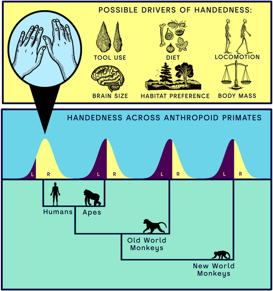
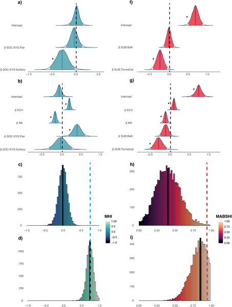
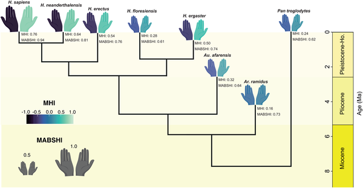

Why do nearly 90% of people worldwide prefer their right hand? This question touches on one of humanity's most distinctive traits: a population-level right-hand dominance unmatched in the animal kingdom. While many primates show individual hand preferences, none approach the consistent rightward bias seen in humans. Recent research dives deep into the evolutionary roots of this phenomenon, revealing surprising connections to our ability to walk on two legs and the expansion of our brains.

> **TL;DR**
> - Humans are evolutionary outliers with a strong population-level right-hand preference, unlike other primates.
> - The emergence of bipedalism and increased brain size are key evolutionary drivers behind this unique handedness.

Handedness—the preference for using one hand over the other—is a well-known human trait, but its origins have long puzzled scientists. While some primates show hand preferences during specific tasks, these preferences rarely show a consistent population-level bias. Humans, by contrast, overwhelmingly favor the right hand across cultures and history. Previous studies have suggested links to brain specialization and genetics, but the evolutionary pressures shaping this trait remained unclear. This new study leverages data from 41 primate species, combining phylogenetic comparative methods with meta-analysis to unravel how handedness evolved in our lineage.

The researchers compiled a large dataset of over 2,000 individuals from 41 anthropoid primate species, including humans. They measured two aspects of handedness: direction (whether a species tends to favor the right or left hand) and strength (how strongly individuals prefer one hand). Using advanced statistical models that account for evolutionary relationships, they tested multiple hypotheses about what ecological and anatomical factors might influence handedness. Key variables included brain size (measured as endocranial volume), body size, locomotion style (bipedal vs. quadrupedal), social behavior, and tool use. They also used phylogenetic outlier tests to determine how uniquely human handedness is compared to other primates.

The study confirmed that humans are clear evolutionary outliers with an exceptionally strong right-hand bias. No other primate species showed a comparable population-level preference. Interestingly, this uniqueness disappears statistically when accounting for two key traits: brain size and intermembral index—a measure related to limb proportions that reflects bipedalism. Larger brain size and adaptations for walking upright correlate strongly with the emergence of right-hand dominance. The data also suggest that while strong hand preference strength evolved early in hominin evolution, the pronounced rightward directionality emerged with the genus Homo. Predictions for extinct hominins indicate a gradual increase in right-hand bias over time, paralleling brain expansion and bipedal adaptations.

These findings shed light on how two hallmark human traits—bipedal locomotion and brain enlargement—shaped our unique handedness. Understanding this evolutionary link helps clarify why human brains developed specialized hemispheres and how behavioral asymmetries emerged. The study also provides a framework for distinguishing human-specific adaptations from broader primate trends, deepening our grasp of what makes us biologically unique. This knowledge enriches fields from anthropology to neuroscience and offers a clearer picture of our evolutionary past.

While the study uses robust comparative data and phylogenetic methods, some limitations remain. The complexity of handedness genetics and environmental influences means that brain size and bipedalism are likely part of a multifactorial story. Additionally, handedness measurements in non-human primates can vary by task and context, and sample sizes for some species remain small. Predictions for extinct species depend on available fossil data and assumptions about their traits. Future research integrating developmental, genetic, and neurological data will help refine these evolutionary insights.

## Figures

*Humans show a strong right-hand preference unlike other primates, highlighting unique factors behind our handedness.*

*This figure shows how models predict traits with and without humans, highlighting which effects are reliable and how predictions vary for humans.*

*This figure shows predicted hand preference strength and direction in ancient human species, with hand size and color indicating bias levels.*

## Sources

- [Bipedalism and brain expansion explain human handedness](https://journals.plos.org/plosbiology/article?id=10.1371/journal.pbio.3003771)
- DOI: [10.1371/journal.pbio.3003771](https://doi.org/10.1371/journal.pbio.3003771)
