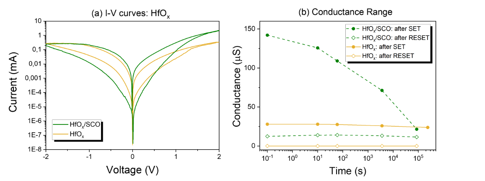
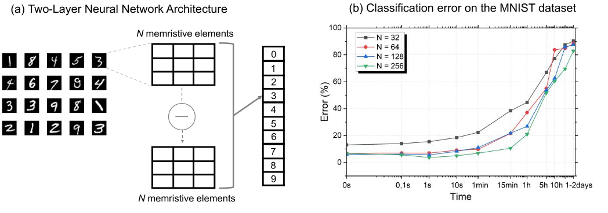
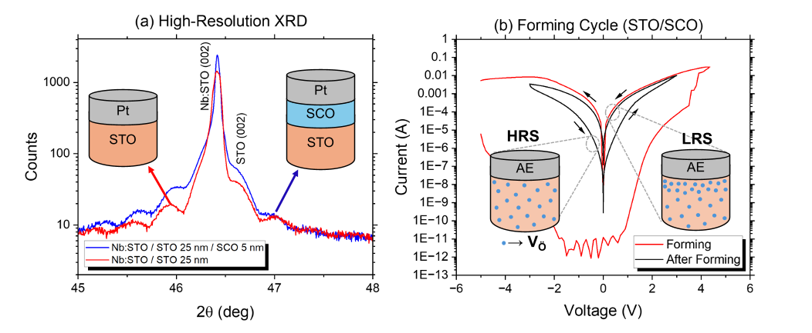

What if your computer’s memory could hold nearly three times more information while using less power? Scientists have engineered a novel material interface that boosts memristor memory states from 8 to 22, potentially enabling computers to learn and process information more like the human brain.

> **TL;DR**
> - Introducing a high ionic mobility layer at the electrode/dielectric interface in memristive devices expands the number of stable resistance states from 8 to 22, enhancing memory capacity.
> - This interface engineering reduces operating voltages by 50% and improves device endurance, with demonstrated benefits for neural network training, though it requires periodic state refresh due to reduced retention.

*Note: this summary is based on a preprint — research shared ahead of formal peer review.*

Modern computing faces challenges from the separation of memory and processing units, creating bottlenecks in speed and energy efficiency. Memristors, devices capable of switching between multiple resistance states, offer a promising solution by combining memory and computation in a single element. Achieving a larger number of stable resistance states in memristors is crucial for increasing data density and enabling advanced applications such as neuromorphic computing, which mimics brain-like information processing. However, technical hurdles remain, including limited memory windows, high operating voltages, and device variability.

The research team focused on engineering the interface between the dielectric layer and the electrode in memristive stacks. They fabricated thin-film devices using pulsed laser deposition, creating structures based on strontium titanate (SrTiO3) with and without an interfacial layer of strontium cobaltite (SrCoO3), a material known for its high oxygen-ion mobility. This interfacial layer facilitates oxygen exchange, which is central to the resistive switching mechanism. The devices were characterized electrically under various conditions to evaluate resistance states, switching voltages, endurance, and variability. To test practical implications, the team simulated neural network training using the experimentally derived memristor characteristics. They also extended the approach to hafnium oxide (HfOx)-based devices to demonstrate transferability.

Introducing the SrCoO3 interfacial layer significantly expanded the memristor’s memory window, increasing distinguishable resistance states from 8 to 22—surpassing the threshold for 4-bit encoding. This enhancement was accompanied by a 50% reduction in the SET/RESET voltages, indicating lower power consumption and faster switching. Device endurance improved markedly, and variability between devices and switching cycles decreased. However, the enhanced ionic mobility led to increased temporal drift, reducing long-term retention and necessitating periodic refresh of the stored states within about one hour to maintain reliable operation. Neural network simulations using these memristor parameters achieved classification errors below 7% on the MNIST handwritten digit dataset, demonstrating the devices’ suitability for neuromorphic applications. The interface engineering strategy also proved effective in HfOx-based devices, confirming its broader applicability.

This work highlights the critical role of interface engineering in overcoming key limitations of memristive devices. By integrating a high ionic mobility layer, the researchers have substantially increased the number of stable memory states while reducing power requirements and improving endurance. These improvements are particularly relevant for neuromorphic computing, where devices must reliably represent multiple analog states to emulate synaptic behavior. The approach’s transferability to different material systems and compatibility with scalable fabrication methods suggest promising pathways toward more efficient, high-density memory and computing hardware that could accelerate the development of brain-inspired artificial intelligence.

The enhanced memory window comes with trade-offs, notably reduced long-term retention due to ionic drift, requiring periodic refreshing of the device states to ensure reliable operation. This refresh requirement could complicate device integration and energy efficiency in some applications. Additionally, while the study demonstrates promising neural network performance on a standard dataset, further work is needed to assess device behavior in more complex, real-world scenarios and to optimize the balance between endurance, retention, and switching speed. The structural characterization suggests the interfacial layer may be amorphous rather than crystalline, which could influence reproducibility and device uniformity. Finally, scaling these findings from lab-scale devices to commercial technologies will require addressing fabrication challenges and long-term stability under operational stresses.

## Figures

*Graphs show voltage, resistance over time, and durability cycles for STO/SCO and STO materials under different conditions. — Figure from José Diogo Costa et al., [CC BY 4.0](http://creativecommons.org/licenses/by/4.0/), caption edited.*

*A two-layer neural network's size affects its accuracy over time when classifying handwritten digits without retraining. — Figure from José Diogo Costa et al., [CC BY 4.0](http://creativecommons.org/licenses/by/4.0/), caption edited.*

*X-ray and electrical tests show how layered films on substrates change structure and conduct electricity, with oxygen vacancies affecting resistance states. — Figure from José Diogo Costa et al., [CC BY 4.0](http://creativecommons.org/licenses/by/4.0/), caption edited.*

*Graph shows electrical behavior and conductance over time for HfOx and HfOx/SCO materials under different conditions. — Figure from José Diogo Costa et al., [CC BY 4.0](http://creativecommons.org/licenses/by/4.0/), caption edited.*

## Sources

- [Boosting the Memory Window of Memristive Stacks via Engineered Interfaces with High Ionic Mobility](https://arxiv.org/abs/2512.04706)
- DOI: [10.1021/acsaelm.6c01143](https://doi.org/10.1021/acsaelm.6c01143)

*This article reuses and adapts text and figures from the original research by José Diogo Costa et al., available via arXiv Materials Science, under the [CC BY 4.0](http://creativecommons.org/licenses/by/4.0/) license.*
