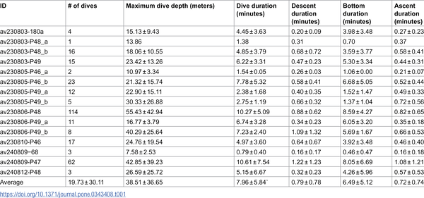
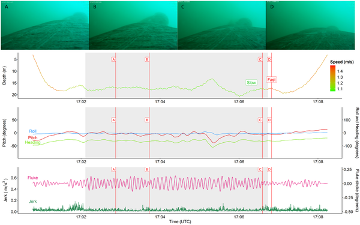
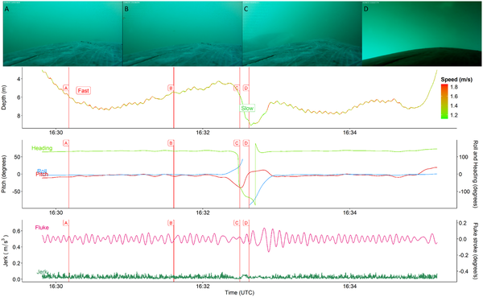

Imagine diving into the icy waters of the Arctic and following a giant bowhead whale as it hunts for tiny prey. How do scientists know when these massive marine mammals are actually feeding? Recent advances in biologging technology combined with underwater video have allowed researchers to decode the subtle changes in whale swimming speed and body orientation that signal feeding activity. This insight not only deepens our understanding of bowhead whale behavior but also helps predict how climate-driven changes in Arctic ecosystems might impact these iconic creatures.

> **TL;DR**
> - Bowhead whale feeding behavior can be identified by specific patterns in swim speed, body pitch and roll, and changes in fluke stroke frequency, validated by underwater video.
> - Feeding kinematics vary with depth and environmental conditions, highlighting the need for detailed movement data beyond traditional dive shape analysis to accurately assess foraging effort.

Bowhead whales are baleen whales that feed by ram filtration, swimming with their mouths open to filter tiny zooplankton from the water. Understanding how much time they spend feeding is crucial for assessing their energy intake, especially as climate change alters prey availability in Arctic waters. Previous studies have mostly focused on whales feeding on stable, deep prey layers, but bowheads in sub-Arctic fjords face more variable conditions. This study aimed to identify the precise movement patterns associated with confirmed feeding in such dynamic environments, using a combination of biologging sensors and video footage.

Researchers tagged bowhead whales in Cumberland Sound, Nunavut, with high-resolution biologging devices called Customized Animal Tracking Solutions (CATS) tags. These tags recorded three-dimensional movement data—including accelerometer, gyroscope, and magnetometer readings—along with depth and swim speed, all synchronized with forward-facing video cameras. The video allowed scientists to visually confirm when whales were feeding by observing their open mouths. Dive data were segmented into descent, bottom, and ascent phases, and various kinematic variables such as pitch, roll, swim speed, and fluke stroke frequency were calculated. Statistical models then identified which variables best predicted feeding behavior.

The study found that mean swim speed near the bottom of dives, body pitch and roll angles, changes in swim speed, and time of day were strong predictors of feeding. Fluke stroke frequency was higher during feeding compared to non-feeding periods, but interestingly, this frequency varied with depth—being faster in shallower waters (≤23 m) and slower at greater depths. These variations likely reflect physical forces such as buoyancy and drag affecting swimming mechanics. Importantly, relying solely on dive shape to infer feeding could overestimate actual foraging time, whereas incorporating detailed kinematic data improves accuracy.

By combining biologging with video validation, this research advances our ability to detect feeding behavior in bowhead whales under variable environmental conditions. This is particularly important as Arctic ecosystems undergo rapid change, affecting prey distribution and abundance. Improved identification of feeding bouts supports better estimates of energy intake and foraging effort, which are essential for conservation and management. Moreover, understanding how whales adjust their swimming mechanics in response to different prey layers enhances our knowledge of their ecological adaptations.

While the study provides robust insights, it focuses on a specific sub-Arctic fjord population and a limited number of tagged individuals, which may not capture all behavioral variability across the species’ range. Additionally, swim speed estimates below certain thresholds are less reliable due to sensor limitations. Future research with larger sample sizes and across different regions will help generalize these findings. Lastly, the complexity of underwater environments means some feeding events might still be challenging to detect without direct observation.

## Figures

*Summary of dive data showing average values and variation for Pitch, Roll, and Heading during deployments.*

*This figure shows a detailed dive of a tagged animal feeding, with video snapshots and data on its speed, body movement, and swimming effort.*

*A sea animal's non-foraging dive on Aug 3, 2023, shows its depth, speed, body orientation, and movement captured by video and sensors.*

## Sources

- [Bowhead whale foraging dives are defined by speed and body orientation](https://journals.plos.org/plosone/article?id=10.1371/journal.pone.0343408)
- DOI: [10.1371/journal.pone.0343408](https://doi.org/10.1371/journal.pone.0343408)
