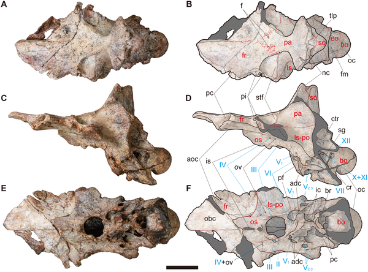
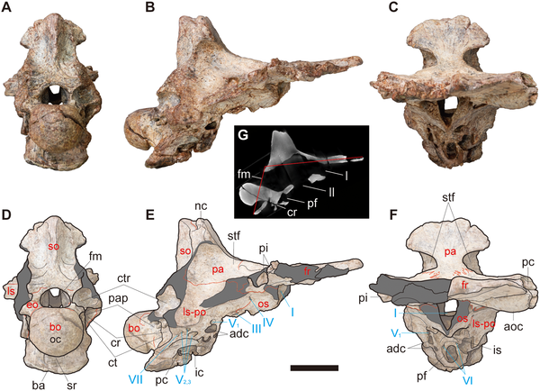
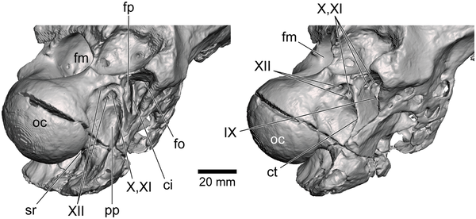

Imagine peering inside the skull of a dinosaur that roamed the Earth over 100 million years ago. Recently, paleontologists have done just that with Siamraptor suwati, a large predatory dinosaur from the Early Cretaceous of Thailand. By examining fossilized braincases using advanced imaging techniques, researchers have uncovered new details about the anatomy of this ancient predator’s head and clarified its place in the dinosaur family tree.

> **TL;DR**
> - Two partial braincases from Siamraptor suwati reveal unique skull features not seen in related dinosaurs.
> - These findings confirm Siamraptor as an early member of the carcharodontosaurian group, helping trace the evolution of these giant theropods.

Siamraptor suwati belongs to Carcharodontosauria, a group of large-bodied carnivorous dinosaurs that dominated many ecosystems from the Late Jurassic to the Late Cretaceous. Despite their global presence, early members of this group, especially from Asia, remain poorly understood. The fossils studied come from the Khok Kruat Formation in northeastern Thailand, a site known for preserving Early Cretaceous fauna. Until now, detailed braincase anatomy for Siamraptor was unknown, limiting understanding of its evolutionary relationships and cranial features.

The research team analyzed two partial braincases recovered from the Khok Kruat Formation. One specimen was scanned using industrial micro-CT technology, allowing the scientists to create detailed 3D reconstructions of the internal and external skull anatomy without damaging the fossils. They carefully examined bone sutures, nerve exits, and unique structural features. The new anatomical data were incorporated into a comprehensive phylogenetic analysis using updated dinosaur datasets to determine Siamraptor’s evolutionary position among allosauroid theropods.

The study identified several synapomorphies—shared derived traits—linking the specimens to carcharodontosaurians, such as a partially roofed anteromedial corner of the supratemporal fossa and a tall nuchal crest. Notably, the braincases showed a wedge-shaped frontoparietal suture and two deep pits on the frontal bone’s lateral margin, features not previously reported in any allosauroid dinosaur. These unique characteristics serve as autapomorphies—distinctive traits—of Siamraptor. Phylogenetic analysis confirmed Siamraptor as one of the earliest branching members of the carcharodontosaurian lineage, illuminating aspects of early cranial evolution in this group.

This research fills a critical gap in knowledge about the cranial anatomy of early carcharodontosaurians, a group that includes some of the largest terrestrial predators ever known. By revealing new anatomical details, the study enhances our understanding of how these dinosaurs’ skulls evolved over time. Moreover, it highlights the paleontological importance of Southeast Asia as a region preserving key fossils that help trace dinosaur evolutionary history. Such insights contribute to a more complete picture of theropod diversity and adaptation during the Early Cretaceous.

While the findings provide valuable new information, the study is based on only two partial braincases, which limits the full reconstruction of Siamraptor’s skull anatomy. Future discoveries of more complete specimens will be necessary to confirm and expand upon these results. Additionally, some features used in phylogenetic analyses can be subject to interpretation, and ongoing revisions to dinosaur family trees may refine Siamraptor’s exact evolutionary placement. Nonetheless, the current data represent a significant step forward in understanding this enigmatic dinosaur.

## Figures

*Views of skull NRRU-F01020035 show bone sutures and key skull parts with nerves marked; scale bar is 50 mm.*

*Views and cross-section of fossil NRRU-F01020035 showing skull bones, sutures, and nerve exits with scale bars for size reference.*

*3D CT images show the back skull area of specimen NRRU-F01020035 from two angles, highlighting key bone features and nerve exits.*

## Sources

- [Braincase of Siamraptor suwati and insights into the cranial anatomy of Carcharodontosauria](https://journals.plos.org/plosone/article?id=10.1371/journal.pone.0345155)
- DOI: [10.1371/journal.pone.0345155](https://doi.org/10.1371/journal.pone.0345155)
