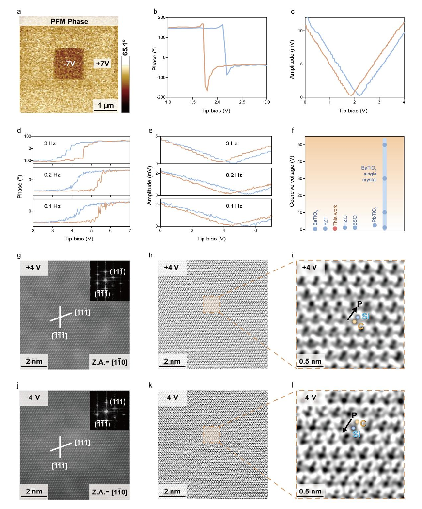
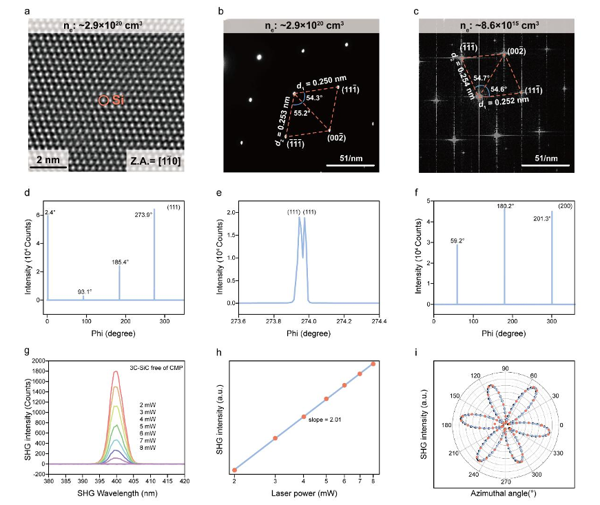
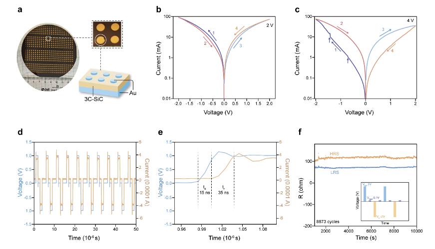
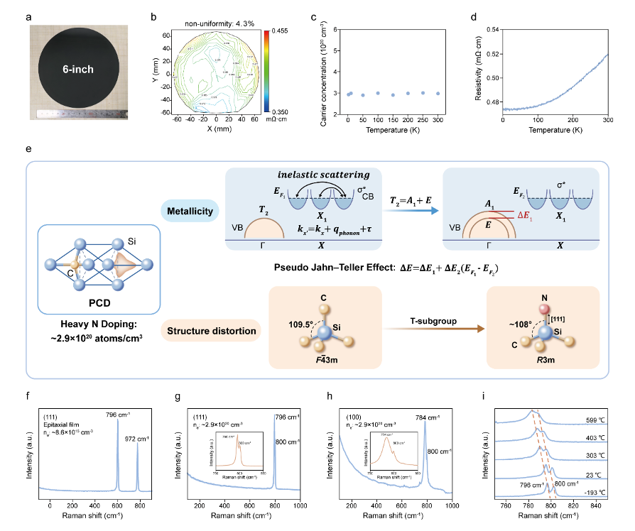

For decades, scientists believed that metals and ferroelectric materials were fundamentally incompatible. Metals, with their free-flowing electrons, were thought to screen out the electric fields necessary to sustain ferroelectric polarization — a property where materials retain a reversible electric dipole. But now, a team of researchers has shattered this rule by creating a metallic material that can remember its electric state, visualizing polarization flipping at the atomic scale, and demonstrating promising device applications that could transform future electronics.

> **TL;DR**
> - By heavily doping cubic silicon carbide (3C-SiC) with nitrogen, researchers induced a metallic state alongside a polar structural distortion, enabling switchable ferroelectricity in a bulk single crystal metal.
> - Atomic-resolution imaging directly captured about 180° polarization reversal under applied voltage, and devices made from this material showed ultra-fast, low-voltage, and durable nonvolatile memory performance.

*Note: this summary is based on a preprint — research shared ahead of formal peer review.*

Ferroelectric materials have long been essential in memory storage and sensors because they can maintain an electric polarization that reverses under an external field. Traditionally, ferroelectricity occurs in insulators, where the absence of free carriers allows stable dipolar order. Metals, however, contain free electrons that typically screen and suppress such polar order, making the coexistence of metallicity and ferroelectricity a major scientific challenge. While polar metals have been theorized and some structurally polar metals observed, none have demonstrated switchable ferroelectricity in bulk single crystals — a critical step for practical applications. The new work focuses on cubic silicon carbide, a non-polar semiconductor, heavily doped with nitrogen to push it into a metallic state while inducing a polar distortion.

The researchers grew large, uniform single crystals of cubic silicon carbide doped with nitrogen at concentrations around 2.9 × 10^20 atoms per cm³. This heavy doping introduced a high density of free electrons, shifting the material into a metallic state. Using advanced techniques such as high-angle annular dark-field scanning transmission electron microscopy (HAADF-STEM) and Raman spectroscopy, they characterized the structural changes from the original cubic symmetry to a polar R3m phase. Crucially, in-situ atomic-scale imaging under applied voltage revealed direct evidence of polarization reversal. They also fabricated ferroelectric tunnel junction devices from these crystals to test memory functionality, measuring resistance states, switching speeds, endurance, and retention.

Heavy nitrogen doping caused a structural transition driven by the pseudo-Jahn-Teller effect, breaking the cubic symmetry and creating a polar lattice distortion along the &lt;111&gt; direction. Despite the metallic conduction, electrons occupied antibonding orbitals that did not effectively screen local polar distortions, allowing ferroelectricity to persist. Atomic-resolution STEM images showed clear 180° polarization switching under external voltage bias, providing the first direct microscopic proof of switchable ferroelectricity in a bulk metal. Devices made from these ferroelectric metals exhibited distinct high- and low-resistance states, ultrafast switching speeds around 50 nanoseconds, low operating voltages near 1 volt, excellent endurance beyond 85,000 cycles, and projected data retention times of up to 100 years.

This discovery overturns a fundamental materials science paradigm by demonstrating that metallicity and ferroelectricity can coexist and be switched electrically in a bulk single crystal. It opens a new platform for exploring exotic physical phenomena in ferroelectric metals and paves the way for next-generation memory devices that combine ultra-high speed, low power consumption, and long-term stability. The ability to visualize polarization switching at the atomic scale also provides deep insight into the mechanisms enabling this coexistence, guiding future materials design.

While the results are compelling, they currently stem from a single material system and study. Further research is needed to confirm the generality of this approach and to optimize device architectures for commercial applications. The interplay of conduction electrons and polarization in such materials is complex, and long-term reliability under varied operating conditions remains to be fully explored. Nonetheless, this study provides a solid foundation for future advances in ferroelectric metals.

## Figures

*Images and graphs show that heavily nitrogen-doped 3C-SiC can switch its electric polarization reliably and consistently at different frequencies. — Figure from Hui Li et al., [CC BY 4.0](http://creativecommons.org/licenses/by/4.0/), caption edited.*

*High-res images and patterns show how heavy nitrogen changes the atomic structure of 3C-SiC crystals. — Figure from Hui Li et al., [CC BY 4.0](http://creativecommons.org/licenses/by/4.0/), caption edited.*

*Photos and tests show fast, reliable switching in heavily N-doped 3C-SiC devices with clear resistance states and long-lasting performance. — Figure from Hui Li et al., [CC BY 4.0](http://creativecommons.org/licenses/by/4.0/), caption edited.*

*Photos and measurements show uniform, heavily nitrogen-doped 3C-SiC crystals with metallic behavior and slight lattice distortion. — Figure from Hui Li et al., [CC BY 4.0](http://creativecommons.org/licenses/by/4.0/), caption edited.*

## Sources

- [Breaking the mutual exclusivity between metallicity and ferroelectricity in a non-polar covalent semiconductor via orbital selective doping](https://arxiv.org/abs/2608.18189)
- DOI: [10.48550/arxiv.2608.18189](https://doi.org/10.48550/arxiv.2608.18189)

*This article reuses and adapts text and figures from the original research by Hui Li et al., available via arXiv Materials Science, under the [CC BY 4.0](http://creativecommons.org/licenses/by/4.0/) license.*
