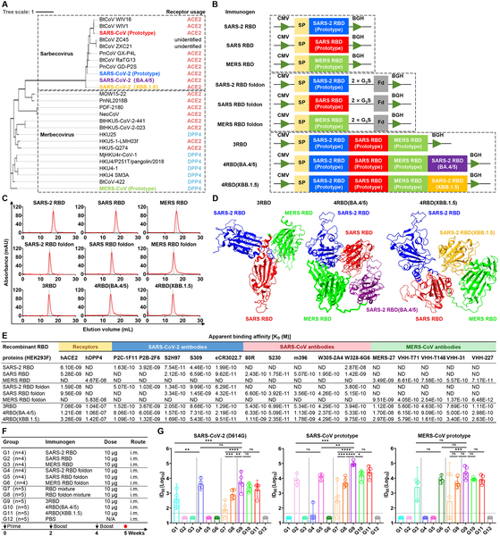
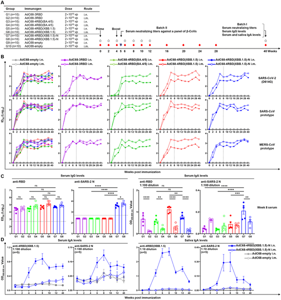
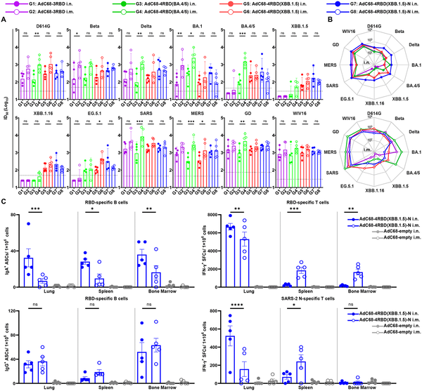
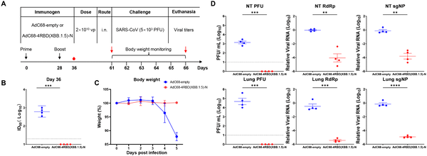

What if a simple nasal spray could not only protect you from severe COVID-19 but also stop the virus from infecting you or spreading to others? Scientists have recently developed a promising intranasal vaccine that targets multiple dangerous coronaviruses, including SARS-CoV-2 variants and the original SARS virus. This vaccine shows strong and lasting protection in animal studies, raising hopes for a new tool to curb current and future coronavirus outbreaks.

> **TL;DR**
> - A chimpanzee adenovirus-based nasal vaccine expressing linked receptor-binding domains (RBDs) from SARS-CoV-2, SARS-CoV, and MERS-CoV, plus the nucleocapsid protein, induces broad and durable immune responses.
> - In animal models, this vaccine prevents infection and transmission of SARS-CoV-2 variants and protects against SARS-CoV, demonstrating potential as a next-generation mucosal vaccine.

Current COVID-19 vaccines, delivered by injection, have been highly effective at preventing severe disease but fall short when it comes to blocking infection and transmission. This limitation arises because these vaccines primarily stimulate systemic immunity but generate limited mucosal immunity in the respiratory tract—the main entry point for coronaviruses. Without strong mucosal defenses, the virus can still replicate in the nose and throat, allowing it to spread and evolve. To address these challenges, researchers have been exploring vaccines that can be administered through the nose to directly stimulate local immune responses where the virus first attacks.

Building on this idea, the research team engineered a vaccine using a rare chimpanzee adenovirus (AdC68) as a vector to deliver a combination of viral proteins intranasally. They linked receptor-binding domains (RBDs)—the critical parts of the virus that attach to human cells—from SARS-CoV-2, SARS-CoV, and MERS-CoV into a single protein, and fused this to the nucleocapsid protein of SARS-CoV-2 to enhance T cell responses. The vaccine, named AdC68-4RBD(XBB.1.5)-N, was tested in mice, Syrian hamsters, and genetically modified mice susceptible to SARS-CoV infection. The researchers measured antibody responses in blood and saliva, analyzed immune cells in respiratory tissues, and evaluated protection against viral infection and transmission over several months.

The vaccine induced strong and lasting immune responses, including mucosal IgA antibodies in the nose and saliva, systemic IgG antibodies in the blood, and tissue-resident B and T cells. Notably, neutralizing antibodies persisted for up to 40 weeks in mice. Monoclonal antibodies derived from long-lived bone marrow cells showed broad activity against multiple coronavirus strains. In Syrian hamsters, a single intranasal immunization prevented replication of the SARS-CoV-2 XBB.1.5 variant in both nasal and lung tissues and blocked transmission to unvaccinated animals for up to four months. Additionally, in transgenic mice engineered to be susceptible to SARS-CoV, the vaccine provided robust protection against viral challenge, reducing weight loss and viral loads in tissues.

These results demonstrate that an intranasal vaccine delivering multiple coronavirus RBDs and nucleocapsid protein via a chimpanzee adenovirus vector can generate broad, durable immunity at the respiratory mucosa and systemically. By blocking infection and transmission of diverse pathogenic coronaviruses, this approach addresses key limitations of current COVID-19 vaccines. If translated successfully to humans, such a vaccine could become a powerful tool for pandemic preparedness, reducing viral spread and the emergence of new variants.

While the findings are promising, they are currently limited to preclinical animal models. Human immune systems and responses can differ, and further studies are needed to evaluate safety, optimal dosing, and efficacy in people. Additionally, manufacturing and regulatory challenges remain for intranasal viral vector vaccines. Nonetheless, this study provides a strong foundation for developing next-generation mucosal vaccines against coronaviruses.

## Figures

*Engineered linked RBD proteins from various coronaviruses trigger stronger immune responses than single or mixed RBD forms in mice.*

*Nasal vaccine triggers strong, lasting antibody responses in blood and saliva against COVID-19 and related viruses in mice.*

*Intranasal vaccine triggers strong antibodies and immune cells in blood and tissues, offering broad protection against multiple virus variants.*

*Intranasal vaccine AdC68-4RBD(XBB.1.5)-N protects mice from SARS-CoV by boosting antibodies, reducing weight loss, and lowering virus levels in tissues.*

## Sources

- [Broad and durable protection against SARS-CoV-2 and SARS-CoV by an intranasal chimpanzee adenovirus vaccine expressing tandem RBDs and nucleocapsid](https://journals.plos.org/plospathogens/article?id=10.1371/journal.ppat.1014436)
- DOI: [10.1371/journal.ppat.1014436](https://doi.org/10.1371/journal.ppat.1014436)
