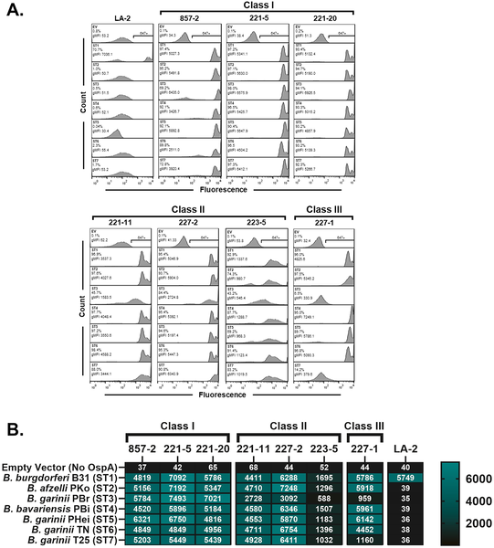
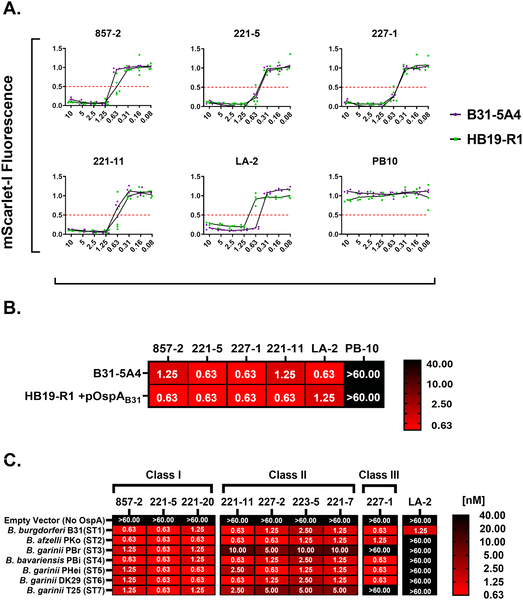
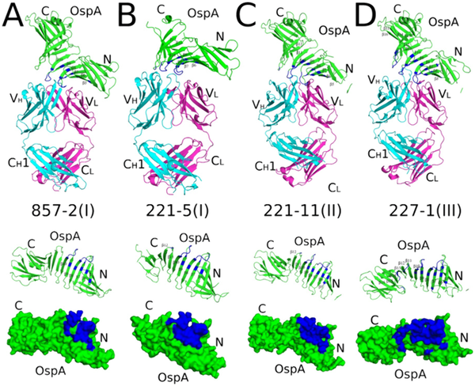

Lyme disease, a tick-borne infection caused by various Borrelia bacteria, is on the rise across North America, Europe, and Asia. While vaccines targeting a key bacterial protein called Outer surface protein A (OspA) have shown promise, their effectiveness has been limited by differences among bacterial strains. Now, scientists have discovered common protective regions on OspA shared across diverse Lyme disease bacteria, offering hope for a universal vaccine that could block transmission from ticks to humans worldwide.

> **TL;DR**
> - A panel of genetically engineered Borrelia strains expressing seven major OspA types allowed researchers to test human antibodies against all common Lyme disease bacteria.
> - Certain antibodies target a conserved region in the central part of OspA, effectively killing all tested Borrelia strains, suggesting a promising universal vaccine target.

Lyme disease is caused by a group of related bacteria collectively known as Borrelia burgdorferi sensu lato. Different regions of the world harbor distinct bacterial species and strains, each producing slightly different versions of OspA, a protein found on the bacterial surface inside ticks. Vaccines like LYMErix, which targeted one OspA type common in North America, were effective locally but failed to protect against other strains prevalent in Europe and Asia. This antigenic diversity has made creating a single vaccine that protects against all Lyme disease bacteria a significant challenge.

To overcome this, researchers developed a set of genetically identical Borrelia strains, each engineered to express one of the seven major OspA serotypes found worldwide. Using this panel, they tested a collection of human monoclonal antibodies known to bind OspA’s central β-sheet region. They measured how well these antibodies could bind to the bacteria and, importantly, whether they could trigger the immune system’s complement pathway to kill the bacteria. Structural studies using crystallography further revealed how these antibodies interact with OspA at the molecular level.

The study identified three classes of antibodies based on their ability to recognize and kill Borrelia strains. Notably, Class I antibodies bound strongly and killed all seven OspA serotypes, demonstrating broad protective potential. Structural analysis showed these antibodies target overlapping epitopes spanning β-strands 6 to 10 of OspA’s central β-sheet, contacting amino acid residues that are largely unchanged across strains. A key residue, Lysine-107, was found to influence antibody susceptibility across even more Borrelia species, highlighting a conserved vulnerability. These findings suggest that a vaccine designed to present this conserved region could provide broad protection against Lyme disease.

This research addresses a major hurdle in Lyme disease vaccine development by pinpointing a shared, protective epitope on OspA present across diverse Borrelia strains. By focusing on this conserved region, future vaccines could potentially block transmission from ticks to humans regardless of geographic strain differences. Such a broadly protective vaccine would be a powerful tool to reduce the growing global burden of Lyme disease, improving public health outcomes in endemic regions worldwide.

While these findings are promising, the study primarily used laboratory-engineered bacterial strains and in vitro assays. Further research is needed to confirm that vaccines targeting these conserved epitopes will be effective and safe in humans across different populations. Additionally, the complexity of Lyme disease transmission and immune response means that vaccine development will require careful clinical testing to ensure broad and lasting protection.

## Figures

*Antibodies bind differently to B. burgdorferi surface proteins, showing strong and specific interactions across various strains.*

*Antibodies targeting OspA help the immune system kill different strains of Lyme disease bacteria by activating complement proteins.*

*Crystal structures show how different antibodies bind to the same spots on OspA ST1 protein, highlighting key interaction areas.*

## Sources

- [Broadly conserved protective epitopes on the lyme disease vaccine antigen, OspA](https://journals.plos.org/plospathogens/article?id=10.1371/journal.ppat.1013740)
- DOI: [10.1371/journal.ppat.1013740](https://doi.org/10.1371/journal.ppat.1013740)
