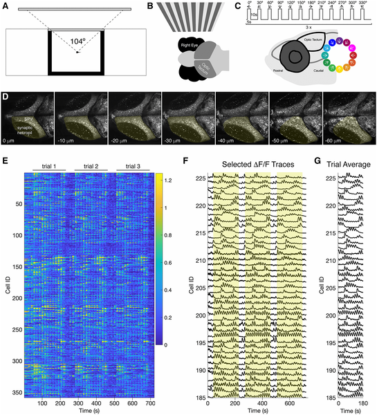
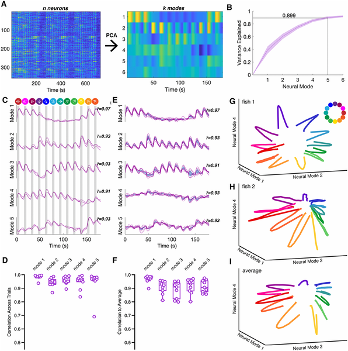
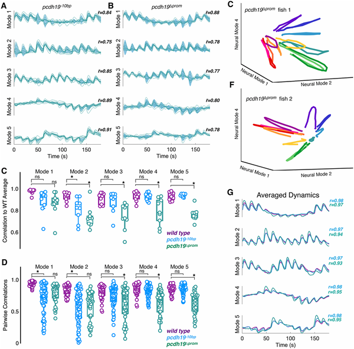
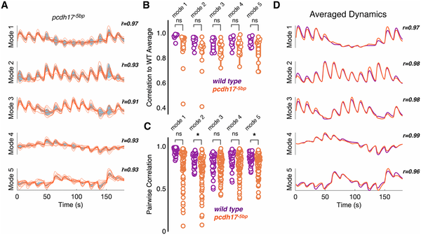

How does our brain reliably wire itself despite the inherent chaos of development? Imagine a complex construction project where thousands of tiny parts must fit perfectly together, yet the blueprint is constantly jostled by genetic quirks and environmental noise. This is the challenge faced by the developing brain. Recent research using transparent zebrafish larvae reveals that certain genes act like master architects, canalizing—or guiding—neural circuit development to reduce randomness and ensure consistent brain function.

> **TL;DR**
> - Mutations in δ-protocadherin genes, specifically Protocadherin-19 and Protocadherin-17, cause unpredictable disruptions in neural circuit activity in the zebrafish visual system.
> - These genes help canalize development, buffering the brain’s wiring process against variability, which may explain why some neurodevelopmental disorders show diverse symptoms.

The brain’s function depends on the precise organization of its neural networks. Yet, the process of building these networks during development is subject to many sources of variation—genetic differences, environmental factors, and random chance. In humans, mutations in many genes have been linked to neurodevelopmental disorders like autism and schizophrenia, but the symptoms often vary widely, even among individuals with the same mutation. This variability has long puzzled scientists. The concept of canalization, introduced by developmental biologist Conrad Waddington in the 1940s, proposes that genes act to stabilize developmental trajectories, guiding them toward consistent outcomes despite disturbances. But how this works in the brain’s complex wiring has remained unclear.

To investigate, researchers turned to larval zebrafish, whose transparent brains allow direct visualization of neural activity. They focused on the optic tectum, a brain region critical for processing visual information. Using genetically modified zebrafish expressing a fluorescent calcium indicator in neurons, the team presented moving visual patterns—sinusoidal gratings drifting in various directions—to the fish’s eye. They then recorded the resulting neural activity in the optic tectum using two-photon calcium imaging, capturing the responses of thousands of neurons simultaneously. By applying mathematical techniques like principal component analysis, they distilled these complex neural responses into a few key patterns, or 'neural modes,' which were remarkably consistent across individual wild-type fish.

When the researchers studied zebrafish mutants lacking either Protocadherin-19 or Protocadherin-17—members of the δ-protocadherin family of cell adhesion molecules—they observed striking differences. Instead of consistent neural activity patterns, these mutants showed stochastic, or randomly varying, deviations from the typical responses. Each mutant fish had a distinct pattern of circuit disruption, suggesting that without these adhesion molecules, the brain’s wiring becomes less canalized and more susceptible to random variation. Importantly, these changes were not uniform defects but variable alterations in neural dynamics, highlighting how these genes help buffer development against unpredictability.

This work provides a compelling example of developmental canalization in a vertebrate neural circuit. By demonstrating that δ-protocadherins stabilize neural dynamics during brain development, it offers a framework for understanding why mutations in certain genes linked to neurodevelopmental disorders lead to variable and overlapping symptoms. The findings suggest that some brain disorders may arise not from a single, predictable circuit defect but from increased developmental variability—essentially, a loss of the brain’s normal robustness. Moreover, the zebrafish model and live imaging approach offer powerful tools for quantifying phenotypic variability and exploring how multiple genetic mutations might combine to affect neural circuit formation.

While zebrafish provide a valuable system for studying neural development, it is important to recognize differences between fish and human brains. The direct implications for human neurodevelopmental disorders remain to be fully established. Additionally, the study focuses on two protocadherin genes, but many other genes and environmental factors contribute to brain wiring and disorders. The stochastic variability observed in mutants underscores the complexity of genetic influences on neural circuits, suggesting that predicting individual outcomes from genetic mutations alone will remain challenging. Future research will need to explore how these findings translate to mammalian systems and how multiple genetic and environmental factors interact during brain development.

## Figures

*Zebrafish larvae brain cells light up in response to moving patterns shown to one eye, revealing how they see motion directions.*

*Zebrafish brain activity patterns during visual stimuli show consistent neural responses across trials, explained by five main neural modes.*

*Mutations in pcdh19 change brain activity patterns in mutant larvae compared to normal ones, showing altered neural responses.*

*Mutations in pcdh17 change brain activity patterns in mutant larvae compared to normal ones, showing altered neural responses.*

## Sources

- [Canalization of neural dynamics by δ-protocadherins in the developing zebrafish optic tectum](https://journals.plos.org/plosgenetics/article?id=10.1371/journal.pgen.1012171)
- DOI: [10.1371/journal.pgen.1012171](https://doi.org/10.1371/journal.pgen.1012171)
