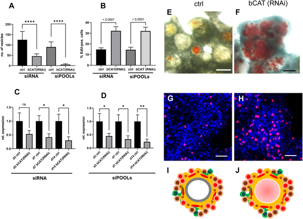
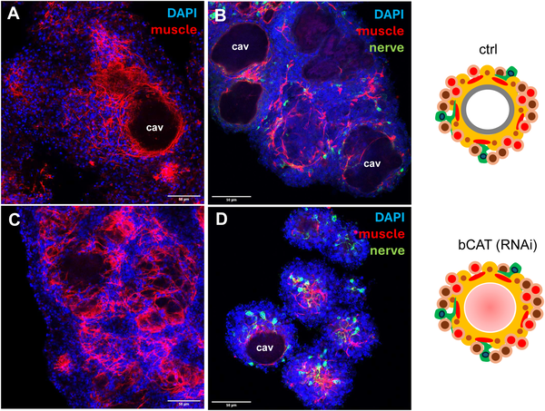
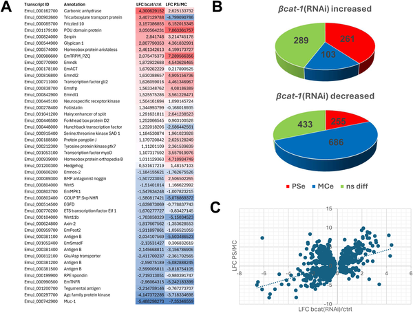
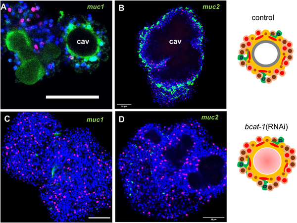

Imagine a parasite that grows inside its host like a cancer, infiltrating organs and evading the immune system. This is the reality of alveolar echinococcosis, a lethal disease caused by the larval stage of the tapeworm Echinococcus multilocularis. Scientists have long wondered how this parasite’s larva, called the metacestode, develops such a unique body plan and proliferates so aggressively. Recent research now uncovers that the parasite hijacks a key developmental signaling pathway, canonical WNT signaling, to direct its growth and body patterning. Understanding this molecular control opens new avenues to potentially stop this deadly infection.

> **TL;DR**
> - Knocking down the parasite’s β-catenin gene, a central player in canonical WNT signaling, disrupts larval development and prevents formation of mature metacestode cysts.
> - Loss of β-catenin causes the parasite cells to hyperproliferate stem cells but fail to properly pattern their body axis, shifting gene expression toward an early 'head-like' state and impairing parasite growth.

Alveolar echinococcosis (AE) is a serious zoonotic disease caused by the larval stage of the fox tapeworm Echinococcus multilocularis. After ingestion of infectious eggs, the parasite’s oncosphere hatches in the intestine and migrates to the liver, where it transforms into the metacestode—a network of fluid-filled vesicles that grows invasively, much like a malignant tumor. This larval stage is unusual among tapeworms because it lacks typical head structures and instead forms broadly posteriorized tissue, allowing asexual multiplication inside the host. The parasite’s stem cells, called germinative cells, drive this growth and differentiation. However, the molecular signals guiding this unique body plan and proliferation were not well understood.

To investigate the molecular control of metacestode development, researchers used a primary cell culture system derived from Echinococcus multilocularis that recapitulates larval vesicle formation in vitro. They applied RNA interference (RNAi) to specifically reduce expression of the parasite’s β-catenin gene (bcat-1), a key effector of canonical WNT signaling known to regulate body axis formation in many animals. The team assessed the effects of bcat-1 knockdown on vesicle formation, stem cell proliferation, muscle fiber organization, and gene expression using microscopy, EdU labeling for proliferating cells, and genome-wide transcriptomics. In situ hybridization was used to localize expression of key developmental genes.

Reducing bcat-1 expression to less than half of normal levels caused a striking failure of metacestode vesicle formation in culture. Instead of developing mature cyst-like vesicles, the parasite cells remained arrested at an early stage characterized by red-stained cavities. Interestingly, stem cells in these cultures hyperproliferated, doubling the proportion of cells in DNA synthesis compared to controls. Muscle fiber patterns were also disrupted, with fewer organized fibers around cavities. Transcriptomic analyses revealed a broad shift in gene expression toward anterior, 'head-like' markers such as sfrp, follistatin, and frizzled-10, while genes specific to the posteriorized metacestode tissue, including mucin genes and antigen B, were downregulated. This anteriorization of gene expression indicates that canonical WNT signaling via β-catenin is essential for establishing the parasite’s posteriorized body axis and successful larval development.

This study uncovers a central role for canonical WNT signaling in shaping the body axis and driving the cancer-like growth of the Echinococcus metacestode. Because WNT signaling pathways are well-studied in human biology and cancer, and because small-molecule inhibitors targeting this pathway already exist, these findings suggest promising new strategies for developing drugs against alveolar echinococcosis. Targeting β-catenin or other components of the WNT pathway could disrupt the parasite’s ability to grow and proliferate within hosts, potentially improving treatment options for this often fatal disease.

While these results are compelling, they are based on in vitro cell culture models that mimic but do not fully replicate the complex environment inside a living host. Further studies in animal models and eventually clinical contexts will be needed to confirm that targeting canonical WNT signaling can effectively control parasite growth in vivo. Additionally, because WNT signaling is a fundamental pathway in many organisms, careful consideration of potential side effects will be important in drug development. Nonetheless, this work provides a valuable mechanistic foundation for future therapeutic exploration.

## Figures

*Reducing bcat-1 gene activity stops Echinococcus cells from forming mature cysts and lowers stem cell growth.*

*Reducing bcat-1 changes muscle and nerve cell patterns in 2-week-old Echinococcus cell cultures, shown by colorful cell staining.*

*Reducing bat-1 gene activity shifts Echinococcus cells toward an early developmental state, shown by changes in gene activity patterns.*

*bcat-1 RNAi-treated cultures lack specific mucin gene expression seen in normal parasite cells, shown by colorful cell imaging.*

## Sources

- [Canonical WNT signalling governs Echinococcus metacestode development](https://journals.plos.org/plospathogens/article?id=10.1371/journal.ppat.1014046)
- DOI: [10.1371/journal.ppat.1014046](https://doi.org/10.1371/journal.ppat.1014046)
