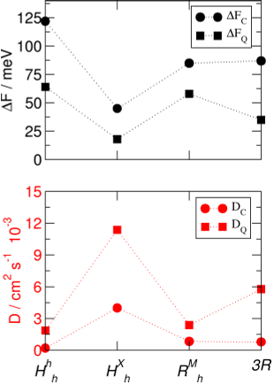
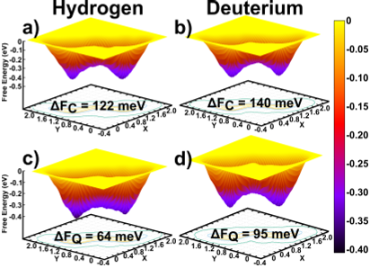
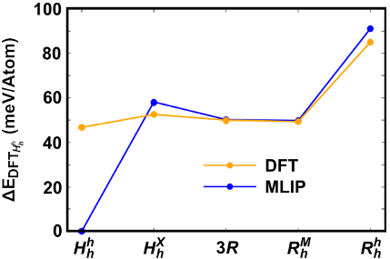
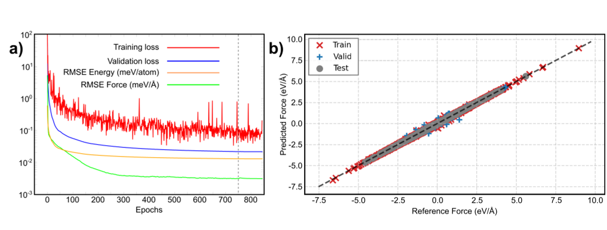

Hydrogen is the lightest and smallest atom, yet its journey through materials can be surprisingly complex—especially when quantum mechanics comes into play. Imagine hydrogen atoms slipping through the ultra-thin layers of molybdenum disulfide (MoS2), a two-dimensional material with unique stacking patterns. Recent research reveals that quantum effects like tunneling and zero-point motion dramatically change how hydrogen diffuses through these layered structures, with important consequences for hydrogen storage, fuel cells, and isotope separation technologies.

> **TL;DR**
> - Nuclear quantum effects significantly lower the energy barriers for hydrogen diffusion in MoS2, enhancing its mobility compared to classical predictions.
> - The diffusion of hydrogen varies spatially in twisted bilayer MoS2 due to moiré superlattice patterns, and hydrogen and its isotope deuterium show distinct diffusion behaviors.

*Note: this summary is based on a preprint — research shared ahead of formal peer review.*

Layered two-dimensional materials such as MoS2 have garnered attention for their ability to host atoms and ions between their sheets, making them promising candidates for energy-related applications like hydrogen storage and fuel cells. Hydrogen’s small size allows it to penetrate the van der Waals gaps between layers, but accurately predicting how it moves requires considering nuclear quantum effects (NQEs) — phenomena like quantum tunneling and zero-point energy that are especially important for light atoms even at room temperature. Moreover, twisting the layers relative to each other creates moiré patterns that can alter local atomic environments, potentially affecting hydrogen transport in complex ways.

To tackle this intricate problem, researchers combined state-of-the-art machine learning with advanced quantum simulation techniques. They trained a machine-learning interatomic potential on high-fidelity density functional theory (DFT) data, enabling simulations of hydrogen diffusion at scales that would be computationally prohibitive with DFT alone. Using path-integral molecular dynamics (PIMD), which treats nuclei quantum-mechanically, alongside well-tempered metadynamics to explore diffusion pathways, they studied hydrogen and deuterium transport across various MoS2 polytypes and twisted bilayer structures. This approach allowed them to explicitly incorporate nuclear quantum effects and capture isotope-dependent behaviors.

The simulations revealed that nuclear quantum effects substantially lower the free-energy barriers for hydrogen diffusion by up to nearly 60 meV, leading to significantly higher diffusion coefficients compared to classical models. Different stacking arrangements of MoS2 layers showed varying sensitivities to these quantum effects, with the most stable stacking exhibiting the largest reduction in barrier height. The study also found a pronounced kinetic isotope effect: deuterium, the heavier isotope of hydrogen, faced higher effective diffusion barriers than protium, reflecting their mass difference in quantum behavior. In twisted bilayer MoS2, hydrogen diffusion was not uniform but strongly dependent on local stacking configurations within the moiré superlattice, creating spatially varying diffusion landscapes.

These insights highlight the crucial role of quantum mechanics in governing hydrogen transport through layered materials, which is essential for designing efficient hydrogen storage and fuel cell technologies. Understanding how twisting layers modulates diffusion pathways opens avenues for engineering materials with tailored transport properties. Moreover, the isotope-selective diffusion mechanisms uncovered here could inform novel approaches to isotope separation, a process important in both scientific research and industrial applications. By combining machine learning with quantum simulations, this work sets a new standard for accurately modeling light-atom transport in complex two-dimensional systems.

While the simulations provide detailed atomistic insights, they rely on computational models and approximations inherent to machine-learned potentials and density functional theory. Experimental validation of these quantum effects in hydrogen diffusion through MoS2 and twisted bilayers remains an important next step. Additionally, the study focuses on idealized, defect-free materials and specific twist angles; real-world samples may present additional complexities such as defects, impurities, or environmental factors that could influence diffusion behavior.

## Figures

*Energy barriers and movement rates of MoS2 layers compared using classical and quantum models. — Figure from Ismail Eren et al., [CC BY 4.0](http://creativecommons.org/licenses/by/4.0/), caption edited.*

*Comparison of classical and quantum models shows how hydrogen and deuterium move between layers in MoS2, highlighting energy barriers involved. — Figure from Ismail Eren et al., [CC BY 4.0](http://creativecommons.org/licenses/by/4.0/), caption edited.*

*Comparison of energy differences per atom for different stackings, using DFT's Hh h stacking as the zero energy reference. — Figure from Ismail Eren et al., [CC BY 4.0](http://creativecommons.org/licenses/by/4.0/), caption edited.*

*Training progress and accuracy of the neural network show improved predictions of atomic forces over time, matching reference data closely. — Figure from Ismail Eren et al., [CC BY 4.0](http://creativecommons.org/licenses/by/4.0/), caption edited.*

## Sources

- [Capturing Nuclear Quantum Effects in Hydrogen Diffusion through MoS2 via Machine-Learning-Enhanced Path-Integral Simulations](https://arxiv.org/abs/2606.25991)
- DOI: [10.48550/arxiv.2606.25991](https://doi.org/10.48550/arxiv.2606.25991)

*This article reuses and adapts text and figures from the original research by Ismail Eren et al., available via arXiv Materials Science, under the [CC BY 4.0](http://creativecommons.org/licenses/by/4.0/) license.*
