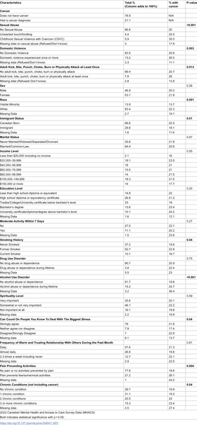

Could the traumas we endure in childhood silently shape our health decades later? A recent Canadian study suggests that severe childhood sexual violence, particularly when coercion is involved, may cast a long shadow—doubling the odds of cancer diagnosis in older adulthood. This finding adds a new layer to our understanding of how early life experiences influence long-term health.

> **TL;DR**
> - Older adults who experienced childhood sexual violence with coercion have twice the odds of having been diagnosed with cancer compared to those without such experiences.
> - This association remains significant even after accounting for many known cancer risk factors, including socioeconomic status, health behaviors, chronic pain, and mental health conditions.

Cancer remains a leading cause of death worldwide, with risk increasing as people age. While well-known factors like tobacco use, diet, and environmental exposures contribute to cancer risk, emerging research points to psychosocial factors—such as adverse childhood experiences (ACEs)—as important influences on long-term health. Childhood maltreatment, including physical and sexual abuse and exposure to parental domestic violence, has been linked to various chronic health problems. Yet, the specific relationship between these early adversities and cancer risk, especially among older adults, has been less clear, particularly in Canadian populations.

Researchers analyzed data from the 2022 Canadian Mental Health and Access to Care Survey (MHACS), focusing on 2,636 Canadians aged 65 and older. Participants self-reported their history of childhood adversities—including childhood sexual abuse (CSA) subdivided into unwanted touching/fondling and more severe sexual violence with coercion (CSVC), childhood physical abuse (CPA), and exposure to parental domestic violence (PDV)—as well as any cancer diagnoses. The study used logistic regression models to examine associations between these childhood experiences and cancer, adjusting for a wide range of factors such as demographics, socioeconomic status, health behaviors (like smoking and physical activity), chronic pain, mental health conditions, social support, and spiritual coping. This comprehensive approach aimed to isolate the impact of childhood trauma on cancer risk.

The study found that older adults who reported severe childhood sexual violence involving coercion (CSVC) had more than double the odds of having a cancer diagnosis compared to those without such experiences. While other forms of childhood adversity—such as physical abuse or parental domestic violence—were initially linked to higher cancer prevalence, these associations did not remain statistically significant after adjusting for other factors. Notably, the elevated cancer risk associated with CSVC persisted even after controlling for many known cancer risk factors, suggesting a robust link. Approximately 6% of the sample reported experiencing CSVC, and among them, 35.5% had been diagnosed with cancer, compared to 20% among those without childhood sexual abuse.

These findings highlight the profound and lasting impact that severe childhood trauma can have on physical health well into older adulthood. Understanding that early life stressors like CSVC may increase cancer risk underscores the importance of trauma-informed care in oncology and public health strategies. It suggests that addressing the psychosocial roots of health problems could improve prevention, screening, and treatment outcomes. Moreover, this research supports the need for integrated healthcare approaches that consider patients' life histories and the complex interplay between psychological trauma and biological health.

While the study benefits from a large, nationally representative sample and thorough adjustment for confounding factors, it relies on self-reported data, which can be subject to recall bias or underreporting, especially regarding sensitive topics like childhood abuse. The cross-sectional design means causality cannot be firmly established, and the biological mechanisms linking childhood trauma to cancer remain speculative. Further longitudinal research is needed to explore how stress-induced changes in immune function and other biological pathways might mediate this association. Additionally, the study focused on older adults in Canada, so findings may not generalize to younger populations or other countries.

## Figures

*Table showing how common different social traits, health habits, and cancer are among Canadians aged 65 and older (2,636 people).*

## Sources

- [Casting a long shadow: Exploring the link between childhood maltreatment and cancer in adulthood](https://journals.plos.org/plosone/article?id=10.1371/journal.pone.0345411)
- DOI: [10.1371/journal.pone.0345411](https://doi.org/10.1371/journal.pone.0345411)
