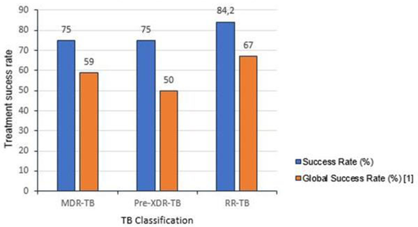
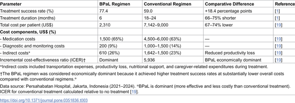

Tuberculosis (TB) remains a formidable global health challenge, especially in countries like Indonesia where drug-resistant forms of the disease are common. Conventional treatments for multidrug-resistant TB (MDR-TB) are long, costly, and often only partially effective. But a newer, shorter drug regimen called BPaL is changing the landscape, showing promise to save lives and reduce treatment costs dramatically.

> **TL;DR**
> - The BPaL regimen increased treatment success rates from 59% to 77.4% among patients with drug-resistant TB in Indonesia.
> - Treatment costs per patient dropped by 67%, and hospital stays were reduced by 60%, making BPaL both more effective and more affordable.

Indonesia faces a heavy burden of drug-resistant tuberculosis, diagnosing approximately 24,000 cases annually—about 8% of the global total. Traditional treatment regimens last 18 to 24 months, cost upwards of $7,000 per patient, and succeed in only about 59% of cases. These treatments also place a significant strain on Indonesia’s national health insurance budget and often push affected families into poverty. There is an urgent need for more effective, affordable, and accessible treatment options to meet global targets for TB elimination by 2030.

Researchers conducted a retrospective cohort study at Persahabatan Hospital in Jakarta, Indonesia’s national TB referral center. They analyzed data from 84 patients treated with the BPaL regimen between 2021 and 2024, comparing outcomes to historical controls treated with conventional regimens from 2018 to 2020. The BPaL regimen combines three drugs—Bedaquiline, Pretomanid, and Linezolid—administered orally over six months, a significant reduction from the typical 18–24 month course. The study assessed treatment success, costs, hospital stays, and adherence, using statistical analyses to ensure robust comparisons.

The study found that BPaL improved treatment success rates to 77.4%, compared to 59% with conventional therapy. Success rates were notably higher across different drug-resistant TB types, including rifampicin-resistant TB and pre-extensively drug-resistant TB. Patients on BPaL spent 60% less time hospitalized—median 10 days versus 25 days—and demonstrated much better treatment adherence (95.2% vs. 70%). Costs per patient dropped by two-thirds, from an average of over $8,000 to just over $2,300, driven by shorter treatment duration, fewer hospital stays, and reduced diagnostic expenses. The incremental cost-effectiveness ratio indicated that BPaL is a highly cost-effective intervention in this setting.

These findings suggest that the BPaL regimen is a game-changer for managing drug-resistant TB in Indonesia and potentially other low- and middle-income countries. By improving cure rates, shortening treatment duration, and cutting costs, BPaL could ease the economic and social burden of TB on patients and health systems alike. Integrating BPaL into Indonesia’s national health insurance framework and expanding decentralized diagnostic capabilities could accelerate progress toward the World Health Organization’s End TB 2030 targets. This study provides a real-world model demonstrating how new drug regimens can transform TB control in high-burden settings.

While the results are promising, the study was retrospective and conducted at a single referral hospital, which may limit generalizability. Some patients were excluded due to incomplete data or co-infections, and longer-term outcomes beyond treatment completion were not assessed. Additionally, successful scale-up will depend on addressing diagnostic gaps and ensuring consistent drug supply and patient monitoring. Further research in diverse settings and larger populations will help confirm BPaL’s broader applicability and long-term impact.

## Figures

*Bar graph shows BPaL treatment success rates: 84.2% for RR-TB, 75% for MDR-TB and pre-XDR-TB, all higher than 59% historical rates.*

*Table comparing the cost-effectiveness of the BPaL treatment to standard treatments from 2021 to 2024.*

## Sources

- [Catalysing tuberculosis elimination in Indonesia: Health economic and policy insights from the BPaL regimen](https://journals.plos.org/plosone/article?id=10.1371/journal.pone.0351836)
- DOI: [10.1371/journal.pone.0351836](https://doi.org/10.1371/journal.pone.0351836)
