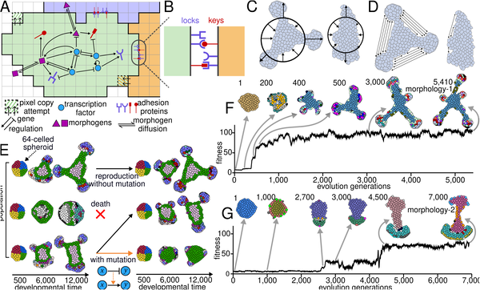
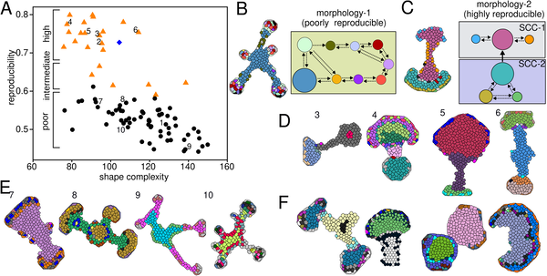
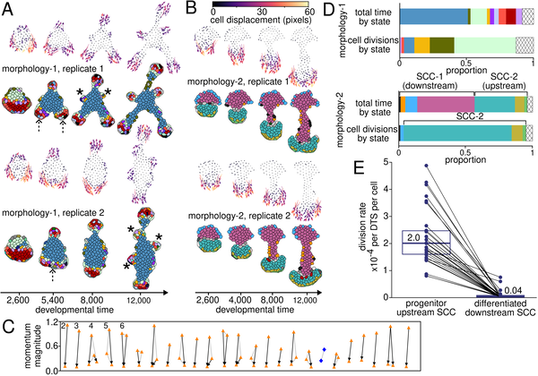
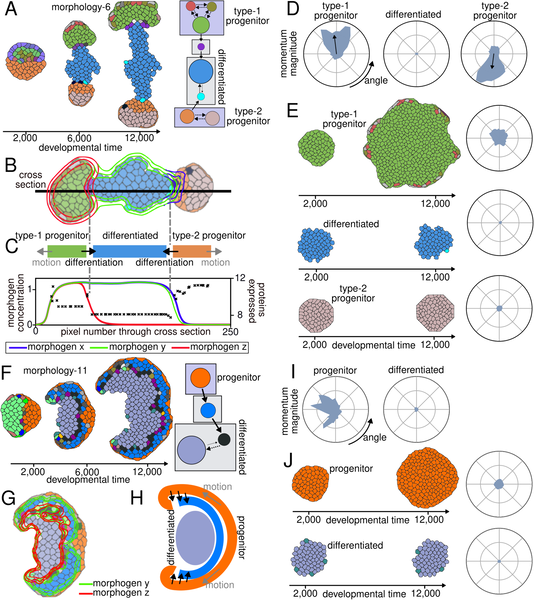

Have you ever wondered how animals reliably grow complex organs and limbs that look remarkably similar from one individual to the next, despite the noisy and unpredictable nature of biological processes? This remarkable consistency, known as morphogenetic reproducibility, has puzzled scientists for centuries. Recent computational research sheds light on how cells cooperate through a division of labor — with some cells actively shaping tissues and others stabilizing them — to reliably build complex body structures.

> **TL;DR**
> - Computational evolution of cell populations shows that reproducible body shapes can emerge without direct selection for reproducibility.
> - Irreversible differentiation of progenitor cells into stationary, non-dividing cells at tissue boundaries underpins this reproducibility by creating a division of labor between moving and stabilizing cells.

Morphogenesis is the biological process by which simple clusters of cells transform into the intricate shapes of organs, limbs, and tissues. While chemical signals and gene networks have been studied extensively, less is known about how cellular behaviors themselves contribute to the reliable formation of these shapes. Real developing tissues face constant molecular and mechanical noise, yet animals consistently develop correctly shaped structures. Understanding the cellular mechanisms that ensure this reliability is not only a fundamental question in developmental biology but also crucial for advancing tissue engineering and regenerative medicine.

To investigate this, researchers built a computational model simulating a population of cells arranged on a two-dimensional grid. Each cell carries a genome encoding a gene regulatory network that governs the production of proteins influencing cell adhesion, membrane tension, and signaling molecules called morphogens. The model uses the Cellular Potts Model framework to simulate realistic cell behaviors such as movement, growth, division, and adhesion dynamics. By applying an evolutionary algorithm, the model selects for morphologies with complex shapes over many generations, allowing the spontaneous emergence of diverse tissue structures without directly selecting for reproducibility. This setup enabled the team to observe how different cellular strategies evolve to produce stable, reproducible shapes despite inherent noise.

The study found that many evolved morphologies were highly reproducible across repeated simulations, even though reproducibility was not explicitly favored during evolution. A key feature of these reproducible morphologies was a spatial division of labor: motile progenitor cells actively shaped the tissue, while differentiated, non-dividing cells remained stationary, anchoring the structure. Importantly, the progenitor cells irreversibly differentiated into these stationary cells at the tissue boundaries, mirroring processes observed in natural development. This irreversible differentiation helped stabilize the morphology against fluctuations, ensuring consistent shape formation. Thus, cell differentiation plays a critical role not only in producing specialized cell types but also in maintaining the reproducibility of complex body forms.

These findings provide a fresh perspective on the fundamental role of cell differentiation in development. Beyond generating specialized functions, differentiation appears essential for reliable morphogenesis by creating a robust division of labor among cells. This insight bridges evolutionary theory with developmental biology and offers practical implications for tissue engineering. For example, improving the reproducibility of lab-grown organoids—a current challenge in regenerative medicine—might benefit from strategies that mimic this natural division of labor and irreversible differentiation. The study also demonstrates the power of computational evolution in uncovering biological principles that are difficult to isolate experimentally.

While the model captures key aspects of cell behavior and gene regulation, it simplifies many real biological complexities. For instance, it operates in two dimensions and does not include certain cellular forces like polarized contractility or three-dimensional tissue architectures. Additionally, the evolutionary simulations select for shape complexity but not directly for reproducibility, which may differ from natural selection pressures. Therefore, while the results highlight a plausible mechanism, further experimental validation is needed to confirm how broadly these principles apply in living organisms. Nonetheless, the study provides a valuable conceptual framework for understanding morphogenetic reproducibility.

## Figures

*A model shows how cells with different proteins stick, communicate, and form shapes, measuring how complex these shapes are compared to a circle.*

*Shapes evolve with varying reproducibility and complexity, showing different patterns of cell state transitions and connections.*

*Cells move and divide in predictable ways, transitioning steadily to non-moving, non-dividing states across different developmental stages.*

*This figure shows how two types of progenitor cells move and change into a differentiated cell type over time, guided by chemical signals.*

## Sources

- [Cell differentiation can underpin the reproducibility of morphogenesis](https://journals.plos.org/ploscompbiol/article?id=10.1371/journal.pcbi.1014361)
- DOI: [10.1371/journal.pcbi.1014361](https://doi.org/10.1371/journal.pcbi.1014361)
