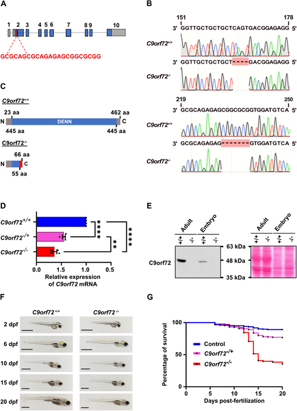
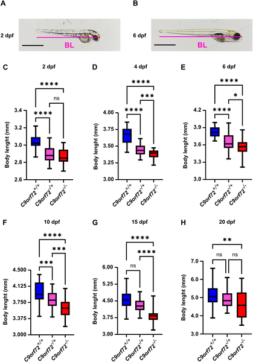
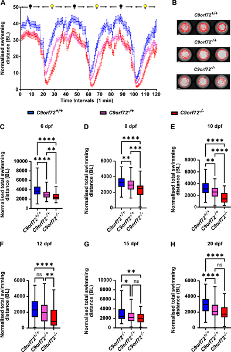
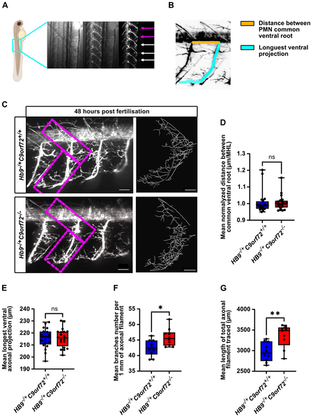

Amyotrophic lateral sclerosis (ALS) is a relentless neurodegenerative disease that progressively impairs motor neurons, leading to muscle weakness and paralysis. Among its genetic causes, expansions in the C9orf72 gene stand out as the most common. To better understand how loss of C9orf72 function contributes to ALS, scientists have turned to animal models. Recently, a team created a stable zebrafish model completely lacking C9orf72, uncovering motor impairments and subtle neuronal changes. Intriguingly, they also identified a drug, originally found to improve movement in tiny worms, that alleviated motor deficits in these fish. This cross-species approach offers fresh insights and a new platform for testing ALS therapies.

> **TL;DR**
> - A stable zebrafish model lacking the C9orf72 gene shows dose-dependent motor deficits, reduced survival, and persistent growth reduction.
> - Drug screening in C. elegans identified pizotifen malate, which improved motor function in the zebrafish model, highlighting a potential therapeutic avenue.

ALS is a devastating disease marked by the gradual loss of motor neurons, the nerve cells that control voluntary muscles. The most common genetic contributor to ALS is a hexanucleotide repeat expansion in the C9orf72 gene, which leads to reduced expression of this gene’s protein product. While much research has focused on toxic gain-of-function mechanisms caused by these repeats, loss of C9orf72 function (LOF) itself is also thought to play a critical role. However, existing animal models, especially in mice, have shown inconsistent or incomplete ALS-like symptoms when C9orf72 is lost. Zebrafish, with their genetic similarity to humans and transparent larvae that enable detailed observation, offer a promising alternative for modeling ALS caused by C9orf72 LOF.

To create a robust model, researchers used CRISPR/Cas9 gene editing to knock out the C9orf72 gene in zebrafish, generating stable lines with frameshift mutations that prevent production of functional C9orf72 protein. They confirmed reduced mRNA levels and absence of the protein in these fish. The team then tracked survival, growth, and motor behavior of larvae from 2 to 20 days post-fertilization. To explore neuronal changes, they examined spinal motor neurons using fluorescent markers. For therapeutic screening, they leveraged a complementary worm model (Caenorhabditis elegans) with a similar gene knockout to identify compounds that improved movement and reduced neurodegeneration. Two promising drugs from the worm screen were then tested in the zebrafish model.

The C9orf72 knockout zebrafish exhibited several ALS-relevant phenotypes. Larvae showed a dose-dependent decrease in survival, with homozygous knockouts surviving at much lower rates than heterozygotes or wild-type fish. Both heterozygous and homozygous knockouts were consistently smaller than controls throughout development. Importantly, motor activity was significantly impaired from 6 days post-fertilization onward, with homozygous fish showing the greatest deficits. Anatomically, spinal motor neurons displayed mild overbranching of axons without changes in axon length, suggesting subtle disruptions in neuronal wiring. From the worm model screen, twelve compounds improved motor function and reduced paralysis; among these, pizotifen malate stood out by significantly rescuing motor deficits when administered to the zebrafish larvae.

This study introduces a stable zebrafish model that faithfully recapitulates key features of C9orf72 loss-of-function relevant to ALS, addressing inconsistencies seen in previous knockdown models. The model’s clear motor deficits and neuronal changes provide a valuable platform for studying disease mechanisms and testing candidate therapies in a vertebrate system. The cross-species validation of pizotifen malate—from worms to fish—demonstrates the power of combining simple and complex models for drug discovery. While still early-stage, this compound represents a promising lead for further preclinical evaluation, potentially accelerating the search for effective ALS treatments.

Although the zebrafish model exhibits important ALS-related phenotypes, it does not show overt motor neuron degeneration at the larval stage, which is a hallmark of human disease. The motor deficits and neuronal abnormalities are relatively mild compared to some knockdown models, possibly reflecting differences between stable genetic knockout and transient gene suppression approaches. Furthermore, while pizotifen malate improved motor function in fish, its mechanisms and efficacy in mammals remain to be explored. As with all preclinical models, findings need cautious interpretation and further validation before clinical relevance can be established.

## Figures

*Scientists created and confirmed zebrafish lacking the C9orf72 gene, showing reduced gene activity and altered protein production.*

*Zebrafish lacking C9orf72 gene stay smaller than normal from embryo to larval stages, showing persistent size reduction up to 20 days old.*

*Removing the C9orf72 gene reduces swimming activity in zebrafish larvae from 6 to 20 days after fertilization.*

*Loss of C9orf72 causes slight extra branching in spinal motor neuron axons without changing their length in developing larvae.*

## Sources

- [Characterization of a C9orf72 Knockout Danio rerio model for ALS and cross-species validation of potential therapeutics screened in Caenorhabditis elegans](https://journals.plos.org/plosone/article?id=10.1371/journal.pone.0346613)
- DOI: [10.1371/journal.pone.0346613](https://doi.org/10.1371/journal.pone.0346613)
