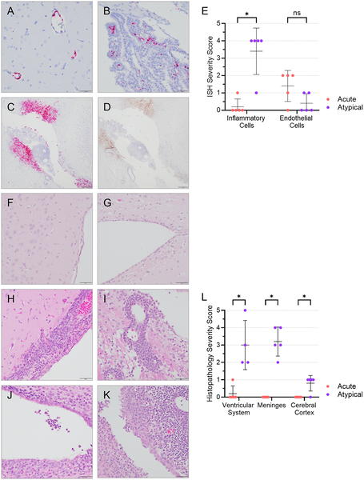

What if Ebola virus could lie dormant in your brain, only to strike weeks after you’ve seemingly recovered? While Ebola virus disease (EVD) is typically known for its rapid and deadly course, scientists have uncovered a surprising twist: the virus can persist quietly in immune-privileged sites like the brain, leading to delayed and atypical illness. A new study using ferrets reveals how Ebola can hide and cause neurological disease long after the initial infection, providing crucial insights into the virus’s stealthy behavior.

> **TL;DR**
> - Ebola virus can persist in the brain and cause a delayed, atypical form of disease characterized by neurological symptoms.
> - Ferrets treated with monoclonal antibodies survived acute Ebola infection but later developed this late-onset brain disease, making them a valuable model for studying Ebola recrudescence.

Ebola virus has long been feared for its swift and often fatal acute disease, marked by systemic infection and organ failure. However, the 2013–2016 West African epidemic, which produced thousands of survivors, revealed new challenges: the virus can linger in certain protected areas of the body, such as the eyes, testes, and central nervous system. These reservoirs can lead to rare but serious relapses, often involving neurological complications like meningoencephalitis. Until now, studying these atypical manifestations has been difficult because existing animal models usually succumb rapidly to acute Ebola infection, leaving little room to observe delayed disease.

To explore these late-onset effects, researchers infected ferrets—a species susceptible to wild-type Ebola virus—with a lethal dose of the virus. They then treated the animals with low doses of a potent human monoclonal antibody cocktail designed to neutralize the virus. This partial treatment allowed some ferrets to survive the acute phase but later develop unusual symptoms. The team monitored survival, weight, viral loads in blood and organs, and signs of neurological disease. They also performed detailed analyses of brain tissue to assess viral presence, inflammation, and damage to the blood-brain barrier.

The study found that while some ferrets died quickly from acute Ebola infection, others survived the initial illness only to succumb between 12 and 18 days after infection. These late deaths were linked to an atypical disease marked by high levels of virus in the brain, but low levels in the blood and other organs like the liver and spleen. Unlike acute cases, these ferrets showed only moderate systemic inflammation but significant brain inflammation and damage, including meningoencephalitis and breakdown of the blood-brain barrier. The virus appeared to hide in the brain, evading immune clearance and causing neurological decline that led to death.

This discovery is significant because it provides a tractable animal model—the ferret—for studying Ebola virus recrudescence, a phenomenon that has been difficult to investigate. Understanding how Ebola persists and reactivates in the brain could inform treatments to prevent relapse and neurological complications in survivors. Moreover, the findings highlight the importance of monitoring survivors for late-onset symptoms and tailoring therapies to address viral reservoirs beyond the bloodstream. The ferret model offers a promising platform to test new interventions aimed at eradicating hidden virus and improving long-term outcomes.

While the ferret model reveals important aspects of Ebola persistence and atypical disease, it is still an animal model and may not capture all complexities of human infection. The monoclonal antibody treatment used was at low doses and may not fully replicate human therapeutic scenarios. Additionally, the mechanisms by which Ebola crosses into and persists in the brain remain to be fully elucidated. Further research is needed to confirm these findings in humans and to explore how different treatments might prevent or mitigate late neurological disease.

## Figures

*Human antibody treatment gave limited protection to ferrets infected with Ebola virus, with timing and infection route affecting survival and weight.*

*Viral RNA and infectious virus levels vary over time and across organs in ferrets with different disease outcomes.*

*Brain scans show virus presence and inflammation in ferrets with atypical Ebola, unlike acute cases with virus only in blood vessels.*

## Sources

- [Characterization of atypical Ebola virus disease in ferrets](https://journals.plos.org/plospathogens/article?id=10.1371/journal.ppat.1013916)
- DOI: [10.1371/journal.ppat.1013916](https://doi.org/10.1371/journal.ppat.1013916)
