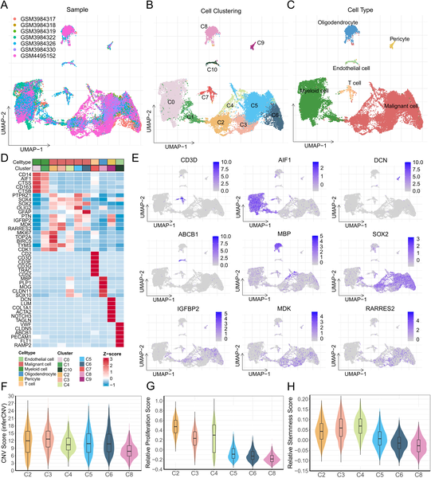
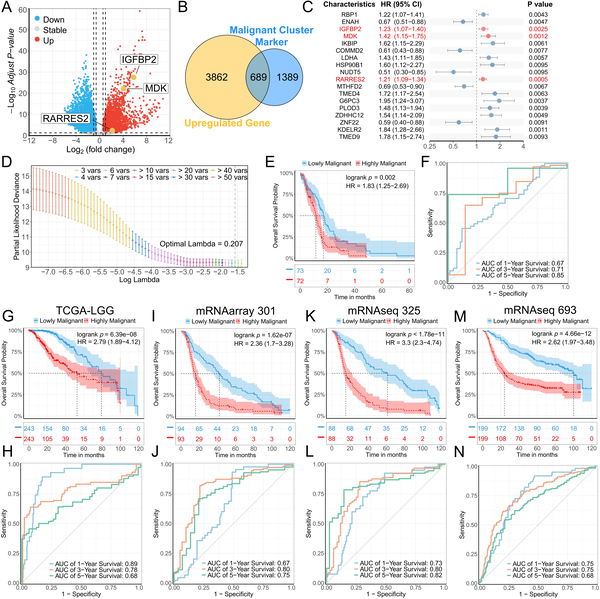
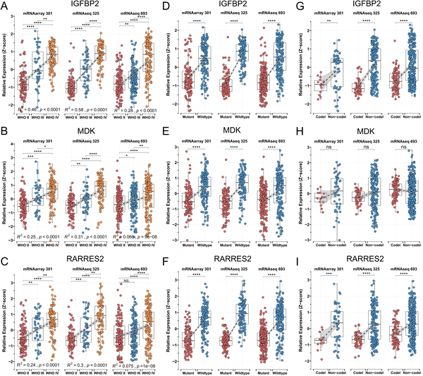
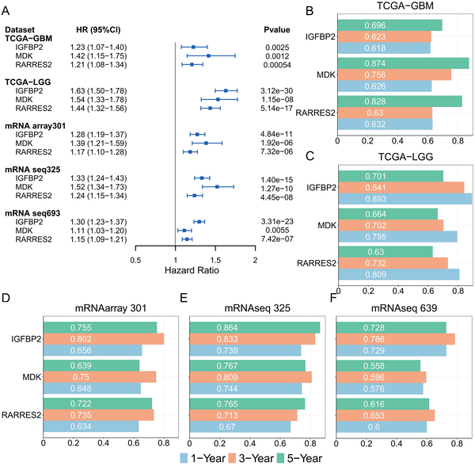

Glioma, a highly invasive brain tumor, remains one of the most challenging cancers to treat effectively. Despite advances in surgery and therapy, predicting patient outcomes with precision is difficult, and survival rates have seen little improvement. Now, by harnessing cutting-edge single-cell and bulk RNA sequencing technologies, scientists have identified three key genes that not only help forecast glioma progression more accurately but also shed light on how tumors might manipulate the immune system to their advantage.

> **TL;DR**
> - A three-gene signature—IGFBP2, MDK, and RARRES2—was identified using integrated single-cell and bulk transcriptome data, improving glioma prognosis prediction.
> - RARRES2 is linked to immune cell infiltration in tumors, suggesting it may influence glioma progression through interactions with macrophages and other immune cells.

Glioma is the most common primary malignant brain tumor, notorious for its invasiveness and tendency to recur after treatment. Traditional methods like the World Health Organization’s grading system and known molecular markers provide some prognostic guidance but lack the precision needed to tailor treatments effectively. Moreover, glioma tumors are heterogeneous, composed of diverse cell populations that bulk tissue analyses often obscure. Single-cell RNA sequencing (scRNA-seq) offers a powerful lens to examine this complexity by profiling gene expression at the individual cell level, revealing distinct cellular states and molecular signatures within tumors.

In this study, researchers analyzed single-cell RNA sequencing data from glioma samples alongside bulk RNA sequencing datasets from large patient cohorts, including The Cancer Genome Atlas (TCGA) and the Chinese Glioma Genome Atlas (CGGA). They applied statistical models—Cox regression and LASSO (Least Absolute Shrinkage and Selection Operator)—to identify genes whose expression levels correlated with patient survival. This approach distilled a three-gene prognostic signature comprising IGFBP2, MDK, and RARRES2. The team validated the predictive power of this model across multiple independent datasets. They further explored how these genes relate to immune cell infiltration by examining correlations with immune cell markers and performed laboratory experiments to study RARRES2’s expression and function in glioma tissues and mouse models.

The three-gene signature effectively stratified glioma patients by risk, with higher expression levels linked to poorer survival outcomes. Notably, RARRES2 stood out for its association with immune cells within the tumor microenvironment. Its expression correlated positively with infiltration by M2-like macrophages, natural killer (NK) cells, and CD8+ T cells—immune populations known to influence tumor progression. Since RARRES2 receptors are found mainly on myeloid cells and glioma cells, the researchers propose that RARRES2 may act through autocrine signaling to promote tumor growth and via paracrine signaling to recruit and modulate macrophages. These insights suggest a dual role for RARRES2 in both cancer cell behavior and immune system interactions.

This study advances glioma research by integrating single-cell and bulk transcriptomic data to identify robust prognostic markers with potential clinical utility. The three-gene signature enhances the accuracy of survival predictions beyond existing molecular markers, which could help clinicians better stratify patients and personalize treatment plans. Additionally, uncovering RARRES2’s role in immune cell recruitment opens avenues for therapeutic interventions targeting tumor-immune interactions. Such strategies might improve treatment responses by disrupting the tumor’s ability to manipulate its immune environment.

While the findings are promising, further research is needed to fully understand the mechanisms by which RARRES2 influences immune cells and tumor progression. The study’s models, though validated across multiple cohorts, require prospective clinical trials to confirm their predictive power in diverse patient populations. Moreover, the complex interplay between glioma cells and the immune system involves many factors beyond the three genes identified here. Future studies should explore these dynamics and assess how targeting these pathways might translate into effective therapies.

## Figures

*A detailed map shows different cell types and key gene activity in glioma tumors, highlighting variations in cell growth and characteristics.*

*This figure shows how a model predicts survival in brain tumor patients using gene data across multiple patient groups.*

*Higher levels of MPS genes IGFBP2, MDK, and RARRES2 are linked to more aggressive gliomas and specific genetic traits in patient data.*

*Analysis shows how genes IGFBP2, MDK, and RARRES2 predict patient outcomes across multiple brain tumor datasets.*

## Sources

- [Characterizing malignant prognostic signatures in primary glioma based on single-cell and bulk transcriptome sequencing](https://journals.plos.org/plosone/article?id=10.1371/journal.pone.0349749)
- DOI: [10.1371/journal.pone.0349749](https://doi.org/10.1371/journal.pone.0349749)
