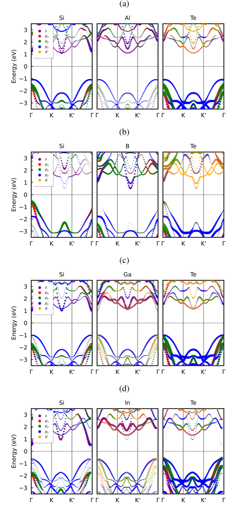
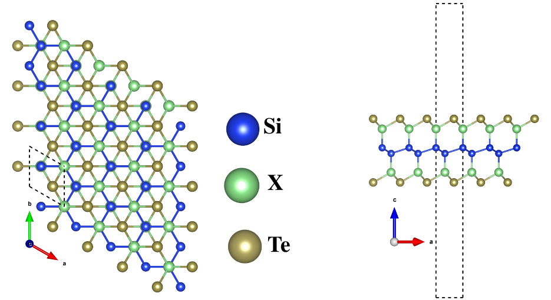
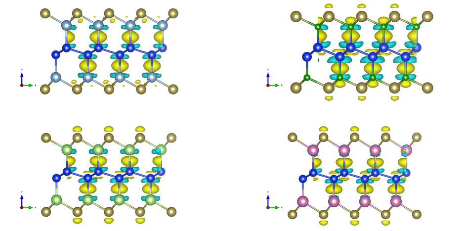
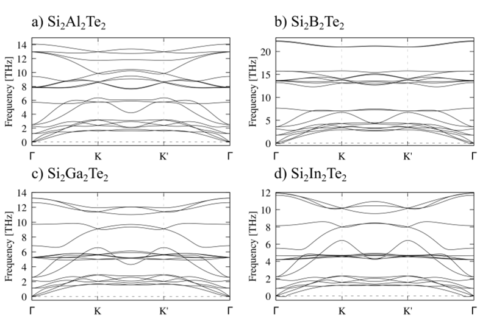

Imagine a material so thin it’s just one atom thick, yet capable of hosting exotic quantum states that could one day power advanced electronics and quantum technologies. Scientists have now found a way to chemically tweak such a two-dimensional material—silicene wrapped in tellurium—by swapping out tiny atoms to switch its fundamental quantum behavior. This discovery opens a new path to designing materials with controllable quantum properties.

> **TL;DR**
> - By substituting different group-III atoms (B, Al, Ga, In) in Si2X2Te2 monolayers, researchers systematically tune their electronic and vibrational properties.
> - The indium-containing monolayer (Si2In2Te2) emerges as a promising quantum spin Hall insulator, a topological phase with potential for quantum device applications.

*Note: this summary is based on a preprint — research shared ahead of formal peer review.*

Two-dimensional (2D) materials like graphene have captivated scientists due to their unique electronic and optical properties. Beyond graphene, silicene—a silicon-based cousin—offers intriguing possibilities, especially when combined with heavier elements like tellurium that introduce strong spin-orbit coupling effects. Such coupling can lead to topological phases of matter, where electrons flow along edges without dissipation, a property highly sought after for future quantum and spintronic devices. However, controlling these phases often requires complex engineering. Chemical substitution, swapping one atom for another, presents a simpler, tunable approach to tailor these quantum properties at the atomic scale.

The research team employed advanced first-principles computational methods grounded in density functional theory to model the atomic and electronic structures of Si2X2Te2 monolayers, where X represents group-III elements boron (B), aluminum (Al), gallium (Ga), and indium (In). They optimized the crystal structures and confirmed their stability by calculating phonon vibrations, ensuring no imaginary frequencies that would indicate instability. To accurately capture electronic behavior, especially relativistic effects from heavy atoms, they included spin-orbit coupling and used hybrid functionals known for improved band gap predictions. They further analyzed optical properties by solving the Bethe–Salpeter equation to account for electron-hole interactions and determined topological characteristics via calculations of the Z2 invariant from Wannier-interpolated Hamiltonians.

All four Si2X2Te2 monolayers are stable semiconductors with band gaps influenced by the specific group-III element. The lattice expands progressively from B to In, reflecting atomic size increases. Vibrational analyses show that lighter B leads to higher phonon frequencies, while heavier elements soften vibrational modes. Electronically, the valence bands are dominated by tellurium p orbitals, while conduction bands feature mixed contributions from silicon, tellurium, and the group-III atom. Crucially, the indium-substituted monolayer exhibits strong spin-orbit coupling effects that invert band order, signaling a topological phase transition. Calculations of the Z2 topological invariant confirm that only Si2In2Te2 qualifies as a quantum spin Hall insulator candidate, whereas the others remain topologically trivial. Optical simulations reveal modest excitonic effects and weak anisotropy in light absorption, consistent across the series.

This study demonstrates a straightforward chemical strategy to switch the topological nature of a 2D material by atomic substitution, highlighting Si2In2Te2 as a promising platform for exploring quantum spin Hall physics. The ability to chemically control electronic and topological properties in silicene-based monolayers could accelerate the development of new quantum materials with tailored functionalities. Such materials are foundational for future quantum computing, spintronics, and low-power electronics, where robust edge states and strong spin-orbit interactions are essential.

While the computational predictions are robust and based on state-of-the-art methods, experimental synthesis and characterization of these Si2X2Te2 monolayers remain necessary to validate their stability and quantum properties. The practical realization of devices exploiting these topological phases will require overcoming challenges related to material fabrication, environmental stability, and integration with existing technologies. Moreover, the quantum spin Hall effect observed here is predicted at the monolayer scale and may be sensitive to defects or substrate interactions not fully captured in the simulations.

## Figures

*Electronic band structures of four materials (Si2Al2Te2, Si2B2Te2, Si2Ga2Te2, Si2In2Te2) calculated using advanced methods. — Figure from Gabriel Elyas Gama Araujo et al., [CC BY 4.0](http://creativecommons.org/licenses/by/4.0/), caption edited.*

*Top and side views of Si2X2Te2 monolayers show blue, green, and gold spheres as Si, X (B, Al, Ga, In), and Te atoms with lattice directions a and b. — Figure from Gabriel Elyas Gama Araujo et al., [CC BY 4.0](http://creativecommons.org/licenses/by/4.0/), caption edited.*

*Colored surfaces show where electrons gather (yellow) or leave (blue) in four different thin material layers. — Figure from Gabriel Elyas Gama Araujo et al., [CC BY 4.0](http://creativecommons.org/licenses/by/4.0/), caption edited.*

*Phonon vibrations in four materials are shown along key crystal directions to understand their atomic movements. — Figure from Gabriel Elyas Gama Araujo et al., [CC BY 4.0](http://creativecommons.org/licenses/by/4.0/), caption edited.*

## Sources

- [Chemical Control of Electronic Structure and Topology in Tellurium-Encapsulated Silicene](https://arxiv.org/abs/2608.21295)
- DOI: [10.48550/arxiv.2608.21295](https://doi.org/10.48550/arxiv.2608.21295)

*This article reuses and adapts text and figures from the original research by Gabriel Elyas Gama Araujo et al., available via arXiv Materials Science, under the [CC BY 4.0](http://creativecommons.org/licenses/by/4.0/) license.*
