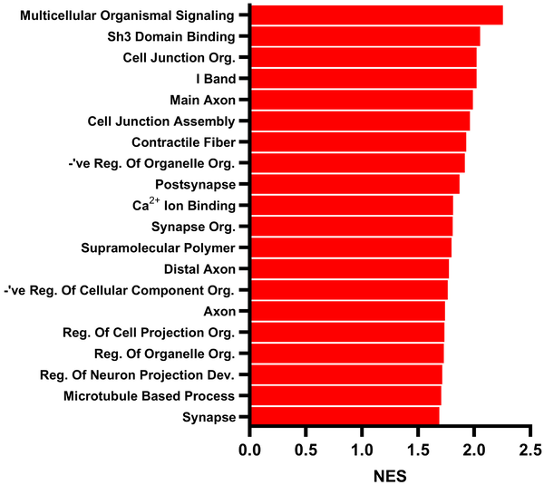
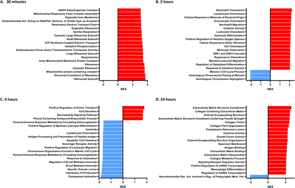
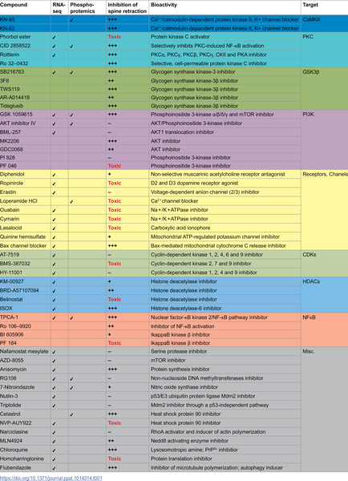
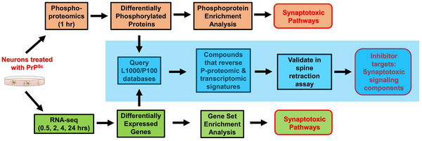

Prion diseases are mysterious and devastating brain disorders caused by infectious proteins that corrupt normal brain proteins, leading to progressive neurodegeneration. One of the earliest and most critical events in these diseases is the loss of synapses—the tiny connections between neurons that enable brain communication. But how exactly do prions sabotage these synapses? And can we stop them before irreversible brain damage occurs? Recent research sheds light on the molecular sabotage behind prion-induced synapse loss and reveals promising drug candidates that may protect brain cells from this damage.

> **TL;DR**
> - Prion proteins trigger a harmful signaling network in neurons that leads to rapid loss of synaptic connections.
> - By analyzing changes in protein phosphorylation and gene expression, researchers identified key enzymes involved and discovered drugs that can block prion-induced synaptic damage.

Prion diseases, such as Creutzfeldt-Jakob disease in humans and scrapie in animals, are caused by the misfolding of a normal brain protein (PrP) into an infectious form (PrPSc). While scientists have long understood how prions replicate, the precise molecular mechanisms by which they cause neurons to malfunction and die have remained elusive. Early synapse loss is a hallmark of prion diseases and many other neurodegenerative disorders, but studying this process has been challenging due to the lack of suitable experimental models. To address this, researchers developed a culture system of mouse hippocampal neurons that mimics prion-induced synaptic degeneration, allowing detailed investigation of the cellular events triggered by prions.

Using this neuronal culture model, the team exposed hippocampal neurons to purified infectious prions and tracked the timeline of synapse damage, noting that dendritic spines—small protrusions on neurons that form synapses—begin retracting within hours. They then applied advanced phosphoproteomics to measure changes in protein phosphorylation, and RNA sequencing to observe gene expression alterations at multiple time points after prion exposure. These molecular signatures were compared against large public databases of drug-induced cellular responses (L1000 and P100) to identify compounds that could reverse the prion-induced changes. The most promising drugs were then tested directly in the neuron cultures for their ability to prevent synapse loss.

The analyses revealed that prion exposure rapidly alters phosphorylation of proteins involved in synaptic function, cell junctions, and calcium signaling pathways. Gene expression changes were more modest but pointed to mitochondrial stress and extracellular matrix remodeling. Importantly, the drug screening approach identified 52 compounds predicted to counteract prion effects, with 17 showing strong protection against dendritic spine retraction. These compounds targeted three key protein kinases—CaMKII, PKC, and GSK3β—that become activated and relocate to synapses following prion exposure. Alongside N-methyl-D-aspartate receptors (NMDARs), which mediate calcium influx, these kinases form a signaling network that drives synaptic degeneration in prion disease.

This study advances our understanding of prion neurotoxicity by mapping a detailed kinase-dependent signaling pathway that leads to early synapse loss. By integrating phosphoproteomic and transcriptomic data with drug signature databases, the researchers not only uncovered molecular targets but also identified existing compounds capable of blocking prion-induced synaptic damage. These findings open new avenues for therapeutic intervention in prion diseases, which currently lack effective treatments, and may also have broader implications for other neurodegenerative disorders characterized by synapse loss.

While the neuronal culture model provides valuable insights into early synaptic changes, it does not fully replicate the complex environment of the living brain, where multiple cell types and systemic factors contribute to disease progression. The identified compounds were tested at a single concentration and in vitro; further studies are needed to evaluate their efficacy, safety, and pharmacokinetics in animal models and ultimately in humans. Additionally, prion diseases are rare, and translating these findings into clinical therapies will require overcoming significant challenges. Nonetheless, this work lays important groundwork for future research targeting prion-induced neurodegeneration.

## Figures

*Top 20 cell pathways changed in hippocampal neurons after 1-hour PrP Sc treatment, based on protein modification analysis.*

*Key biological pathways in hippocampal neurons change over time after PrP Sc treatment, shown by RNA analysis at 30 min, 2, 4, and 24 hours.*

*Top compounds that protect brain cells from prion damage were identified using gene and protein data, targeting key enzymes to prevent spine loss.*

*A step-by-step study identified key prion disease pathways and 52 compounds that protect brain cells from damage.*

## Sources

- [Chemo-omic pipeline enables discovery of prion synaptotoxic pathways and inhibitory drugs](https://journals.plos.org/plospathogens/article?id=10.1371/journal.ppat.1014314)
- DOI: [10.1371/journal.ppat.1014314](https://doi.org/10.1371/journal.ppat.1014314)
