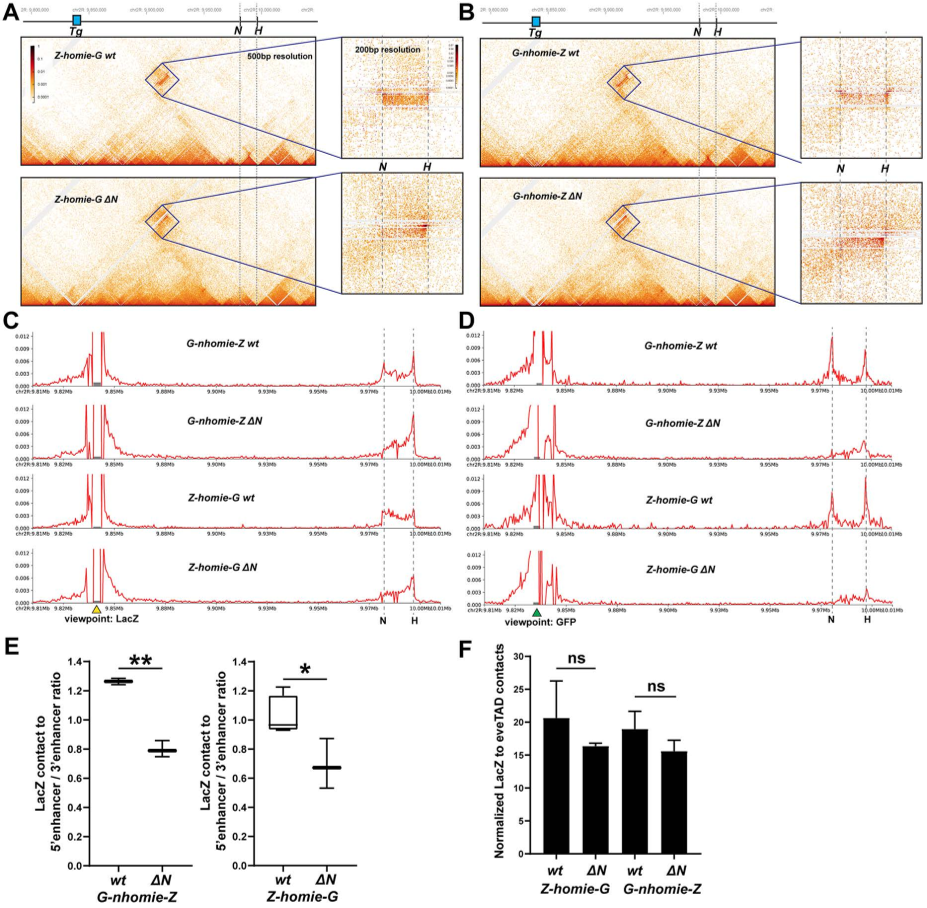
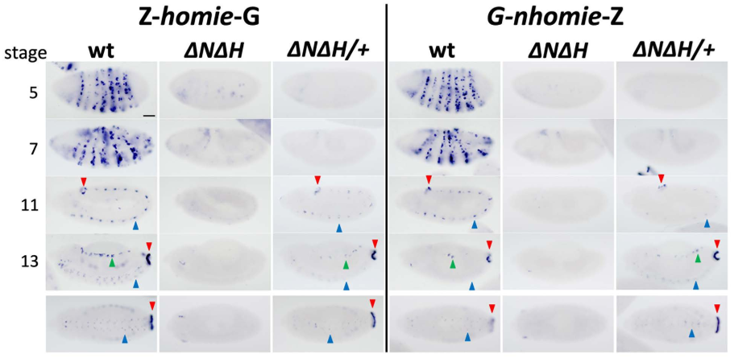
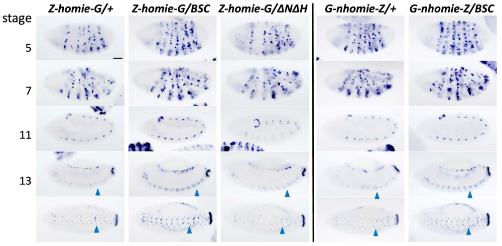
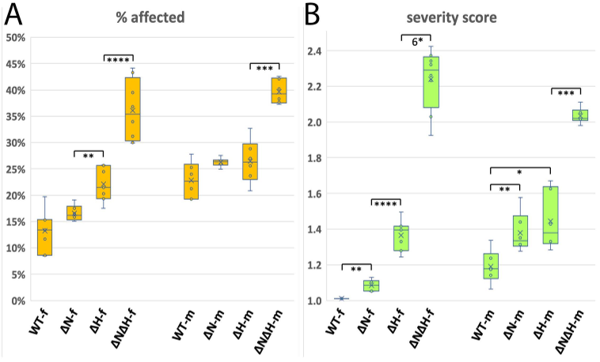

Imagine chromosomes as bustling cities where neighborhoods—called chromatin domains—need clear boundaries to keep their unique character. Chromatin insulators act like fences or walls, separating these neighborhoods and controlling which genes get turned on or off. Two such insulators, named homie and nhomie, flank a critical gene called even-skipped (eve) in fruit flies. But how do these insulators physically connect with each other and with distant DNA regions to orchestrate gene activity? Recent research uncovers surprising complexity in how homie and nhomie interact, revealing a delicate balance that shapes gene expression during early development.

> **TL;DR**
> - Homie and nhomie insulators can physically pair with distant copies either individually or together, influencing how enhancers activate gene promoters.
> - Removing one or both insulators disrupts these interactions, weakens gene function, and allows repressive chromatin to spread beyond normal boundaries.

Chromatin insulators are DNA elements that define the borders between distinct chromatin domains—regions of the chromosome with unique chemical marks and gene activity patterns. By blocking or facilitating interactions between enhancers (DNA sequences that boost gene expression) and promoters (gene start sites), insulators help organize the genome into functional units. The insulators homie and nhomie flank the even-skipped (eve) gene, a key developmental regulator in fruit flies. Previous work showed that these insulators can pair with copies of themselves located far away on the chromosome, looping the DNA to bring distant elements into proximity. However, the nature of these interactions—whether they happen in pairs or involve multiple partners—and their effects on gene regulation were not fully understood.

To investigate how homie and nhomie interact, researchers used genetic engineering to delete either or both insulators from the endogenous eve locus in fruit flies. They also inserted reporter transgenes containing homie or nhomie at a site 142 kilobases away from eve. These transgenes carried two reporter genes controlled by eve promoters, allowing measurement of enhancer-promoter communication influenced by insulator pairing. Physical interactions between chromosomal regions were examined using Micro-C, a high-resolution chromosome conformation capture technique that maps DNA contacts genome-wide. By comparing gene expression patterns and chromatin interactions in wild-type and mutant flies, the team dissected how the presence or absence of insulators affected long-range regulatory loops.

The study found that when both endogenous insulators are present, a distant copy of homie or nhomie can interact with either or both, forming complex chromatin loops. These interactions bias enhancer-promoter communication toward the reporter gene nearest the interacting insulator. However, when one endogenous insulator is deleted, the remaining one interacts more strongly with the transgenic insulator, shifting enhancer activity accordingly. Physical data suggest that interactions are not limited to simple pairs but may involve tripartite complexes. Importantly, deleting one or both endogenous insulators reduces eve gene function during a critical early developmental stage and causes the spreading of repressive Polycomb chromatin marks beyond their normal boundaries. This demonstrates that homie and nhomie are essential for maintaining proper gene regulation and chromatin domain integrity in their native genomic context.

These findings advance our understanding of how chromatin insulators organize the genome in three dimensions to regulate gene expression. The discovery that insulators can compete or cooperate in multi-partner complexes challenges simpler models of insulator function and highlights the nuanced mechanisms controlling enhancer-promoter interactions. Since gene regulation and chromatin architecture are fundamental to development and disease, insights into insulator behavior have broad implications for genetics and epigenetics research. The work also underscores the importance of studying insulators in their natural chromosomal environment to fully appreciate their roles in genome organization.

While the study provides detailed mechanistic insights, it focuses on a specific gene locus (eve) in fruit flies, and the extent to which these findings generalize to other genes or organisms remains to be explored. The artificial insertion of transgenes, although informative, may not fully replicate natural chromatin contexts. Additionally, the complexity of chromatin interactions means that multiple factors beyond homie and nhomie likely contribute to gene regulation. Future research will be needed to unravel how insulator networks integrate with other chromosomal elements across diverse biological systems.

## Figures

*This figure shows how a transgene physically interacts with the eve gene in normal and mutant cells, highlighting changes in contact patterns.*

*Genetic elements homie and nhomie need their natural partners to interact with eve gene enhancers during later embryo stages, shown by tissue-specific RNA signals.*

*Gene activity in the nervous system is stronger late in development when a key gene region is missing on the paired chromosome.*

*Removing both nhomie and homie genes causes more severe embryo defects than removing either alone, especially when eve gene function is reduced.*

## Sources

- [Chromatin insulators homie and nhomie can interact with distant copies either together or separately, with distinct outcomes for enhancer-promoter interactions](https://journals.plos.org/plosgenetics/article?id=10.1371/journal.pgen.1011940)
- DOI: [10.1371/journal.pgen.1011940](https://doi.org/10.1371/journal.pgen.1011940)
