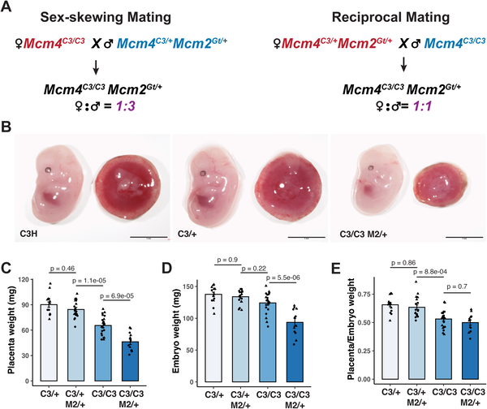
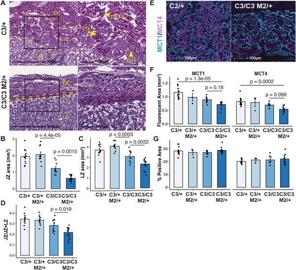
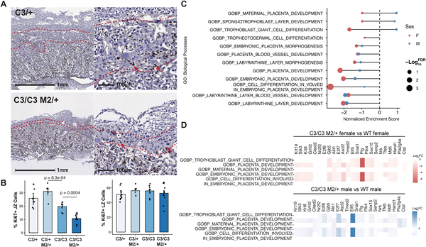
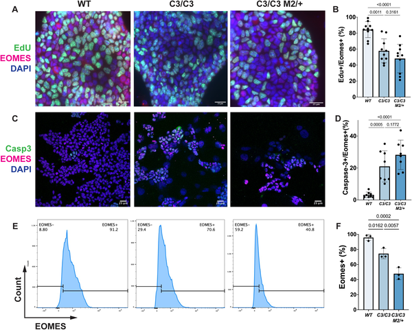

Pregnancy is a complex biological journey where the placenta plays a critical role as the lifeline between mother and fetus. But what happens when the very process of copying DNA in early development goes awry? Recent research in mice reveals that persistent stress during DNA replication can damage placental stem cells, leading to poorly developed placentas and threatening fetal health—especially in female embryos.

> **TL;DR**
> - Genetic mutations causing chronic DNA replication stress impair the growth and structure of the placenta in mice, particularly reducing the junctional zone.
> - Placental stem cells called trophoblast stem cells lose their ability to self-renew under replication stress, leading to placental defects and reduced embryo viability, with female fetuses being more severely affected.

The placenta is a temporary but vital organ that supports fetal growth by facilitating nutrient and gas exchange with the mother. Its development depends on the proper proliferation and differentiation of specialized placental stem cells called trophoblast stem cells. While the placenta naturally tolerates some genetic changes, excessive DNA damage during early development can disrupt its formation. Genome maintenance—especially accurate DNA replication—is essential to prevent such damage. However, the molecular mechanisms linking DNA replication stress to placental dysfunction have remained largely unexplored until now.

Scientists used mouse models carrying mutations in the MCM2–7 complex, a key DNA replicative helicase responsible for unwinding DNA during replication. These mutations cause persistent replication stress and genomic instability. By examining placental and embryonic development in these mutant mice at mid-gestation, researchers combined histological staining, immunofluorescence, and RNA sequencing techniques. They also studied mice deficient in FANCM, a protein involved in DNA repair during replication, to confirm the effects of replication stress on placental development. Cell proliferation markers and gene expression analyses helped pinpoint which placental zones and cell types were most affected.

The study found that although mutant embryos appeared morphologically normal, their placentas were significantly smaller, with a pronounced reduction in the junctional zone—a region rich in trophoblast stem cells and their differentiated derivatives. Cell proliferation was specifically decreased in this zone, while the labyrinth zone, responsible for nutrient exchange, was less affected. Trophoblast stem cells with replication stress failed to maintain their stemness, leading to fewer progenitor cells and a shortage of key placental cell types such as glycogen trophoblasts and spongiotrophoblasts. Notably, female fetuses showed more severe placental defects and growth restriction than males. Similar placental abnormalities were observed in FANCM-deficient mice, reinforcing the link between replication-associated DNA damage and placental dysfunction.

These findings highlight a previously underappreciated vulnerability of placental stem cells to DNA replication stress and genomic instability. Since placental health is crucial for fetal development and pregnancy success, understanding how genome maintenance pathways protect placental formation offers important insights into causes of fetal growth restriction and pregnancy loss. The sex-specific differences observed also raise intriguing questions about how male and female fetuses respond differently to genetic stress during development. This research opens avenues for exploring therapeutic strategies to support placental function in pregnancies at risk due to genetic or environmental factors that induce replication stress.

While the mouse models provide valuable insights, the extent to which these findings translate directly to human placental development remains to be determined. The placenta is a complex organ with species-specific features, and replication stress may interact with other genetic and environmental factors in humans. Additionally, the study focuses on early to mid-gestation stages, so the long-term consequences of replication stress on placental and fetal health warrant further investigation. Finally, the molecular pathways linking replication stress to inflammation and placental dysfunction are complex and not fully elucidated, suggesting the need for additional research to clarify these mechanisms.

## Figures

*Mutant embryos with semi-lethal genes show lower placental and body weights compared to normal ones at mid-pregnancy.*

*Placentae with semi-lethal genotypes show smaller key zones and altered cell markers, highlighting developmental differences at mid-gestation.*

*Placenta's junctional zone shows more cell changes than the labyrinth zone in semi-lethal genotypes, affecting development-related genes.*

*Stem cells with a semi-lethal gene show unusual growth and cell death patterns compared to normal cells.*

## Sources

- [Chronic replication stress-mediated genomic instability disrupts placenta development in mice](https://journals.plos.org/plosgenetics/article?id=10.1371/journal.pgen.1012111)
- DOI: [10.1371/journal.pgen.1012111](https://doi.org/10.1371/journal.pgen.1012111)
