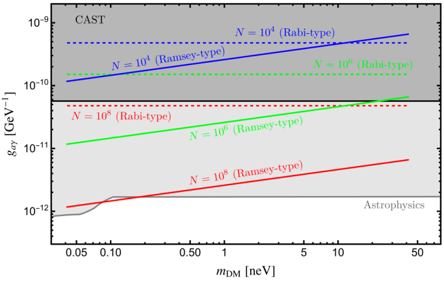
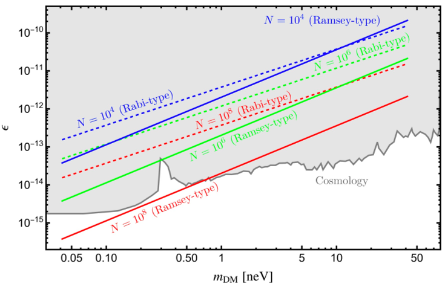
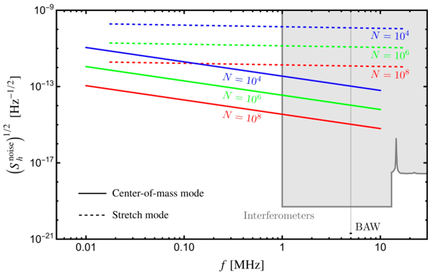

Imagine harnessing millions of quantum bits—tiny units of quantum information—to detect invisible waves rippling through the universe, waves generated by mysterious dark matter or elusive high-frequency gravitational waves. This is the exciting frontier explored by recent theoretical work proposing a novel quantum sensing method that uses large arrays of qubits in superposition states to amplify faint cosmic signals without the need for complex entanglement. Could this be a new way to 'hear' the universe's hidden whispers?

> **TL;DR**
> - A new quantum sensing scheme uses many qubits prepared in superposition states to detect wave-like dark matter and potentially high-frequency gravitational waves with enhanced sensitivity.
> - Unlike previous methods requiring entangled qubits, this approach scales more easily by simply increasing the number of qubits, making large-scale dark matter detection more feasible.

*Note: this summary is based on a preprint — research shared ahead of formal peer review.*

Dark matter remains one of the greatest mysteries in physics. Although it makes up most of the matter in the universe, it neither emits nor absorbs light, making it invisible to traditional telescopes. Some theories suggest dark matter behaves like a coherent wave of ultralight particles, oscillating at frequencies related to their tiny masses. Detecting these waves requires incredibly sensitive instruments. Quantum technologies, especially systems built from qubits—the fundamental units of quantum information—offer promising new ways to sense such subtle effects. However, many quantum detection methods rely on entangling qubits, which is technically challenging to scale up to millions or more. This new work proposes a different route, leveraging the collective response of many non-entangled qubits to detect dark matter-induced signals.

The proposed detection scheme uses arrays of qubits trapped in linear Paul traps—devices that hold charged ions in place using electric fields. Each ion acts as a qubit with two quantum states, and lasers manipulate these states to prepare qubits in superpositions, such as (|0⟩ + |1⟩)/√2. When a wave-like dark matter field passes through, it induces coherent transitions in these qubits, subtly shifting the balance between the number of qubits measured in state |0⟩ versus |1⟩. By measuring this imbalance across millions of qubits simultaneously, the scheme amplifies the signal proportional to the number of qubits, improving sensitivity without requiring entanglement. The method relies on Ramsey-type interferometry, a well-established quantum technique, and carefully accounts for noise sources like readout errors and motional heating. Theoretical analysis shows that with around 10^6 to 10^8 qubits, the sensitivity could match or exceed current experimental bounds on dark matter coupling strengths.

The key finding is that the signal-to-noise ratio in this Ramsey-type measurement scales linearly with the number of qubits (N), meaning sensitivity improves as 1/√N, a better scaling than traditional non-entangled detection schemes. Importantly, this scaling is achieved without the technical complexity of creating entangled states. The authors demonstrate that trapped-ion qubits in linear Paul traps can serve as practical sensors, with projected sensitivities that could surpass existing laboratory, astrophysical, and cosmological constraints on axion-like particles and dark photons—two leading dark matter candidates. Additionally, the framework can be adapted to search for high-frequency gravitational waves in the MHz range, a frequency band difficult to probe with current detectors.

This work offers a promising new direction for quantum sensing in fundamental physics. By enabling large-scale, coherent detection of wave-like dark matter without entanglement, it lowers the technical barriers to building ultra-sensitive detectors. If realized experimentally, such sensors could open new windows into the dark sector of the universe, helping to confirm or rule out leading dark matter models. Moreover, the ability to detect high-frequency gravitational waves could complement existing gravitational wave observatories, potentially revealing astrophysical phenomena currently beyond our reach. The approach also exemplifies how advances in quantum information science can impact broader physics challenges.

While the theoretical framework is solid and grounded in existing quantum technologies, significant experimental challenges remain. Scaling up to millions or billions of qubits in stable, synchronized arrays is a formidable task. Precise control over noise sources, calibration, and environmental stability is essential to achieve the predicted sensitivities. Furthermore, the random phase of dark matter waves requires repeated measurements and careful statistical analysis. Although the method avoids the complexity of entanglement, it still demands high-fidelity quantum operations and readout. Thus, practical implementation will require continued advances in quantum hardware and experimental techniques.

## Figures

*This figure shows how well different methods detect axion particles using varying ion counts over a year, compared to past limits. — Figure from Ryuichiro Kitano and Ryoto Takai, [CC BY 4.0](http://creativecommons.org/licenses/by/4.0/), caption edited.*

*This figure shows how well different methods detect dark photons using varying ion counts over a year, with some regions already ruled out by space studies. — Figure from Ryuichiro Kitano and Ryoto Takai, [CC BY 4.0](http://creativecommons.org/licenses/by/4.0/), caption edited.*

*This figure shows how sensitive different ion setups are to noise across frequencies from 10 kHz to 10 MHz over one year, compared to existing experiments. — Figure from Ryuichiro Kitano and Ryoto Takai, [CC BY 4.0](http://creativecommons.org/licenses/by/4.0/), caption edited.*

## Sources

- [Coherent collective response in many-qubit systems for dark matter detection](https://arxiv.org/abs/2606.26736)
- DOI: [10.48550/arxiv.2606.26736](https://doi.org/10.48550/arxiv.2606.26736)

*This article reuses and adapts text and figures from the original research by Ryuichiro Kitano and Ryoto Takai, available via arXiv Quantum Physics, under the [CC BY 4.0](http://creativecommons.org/licenses/by/4.0/) license.*
