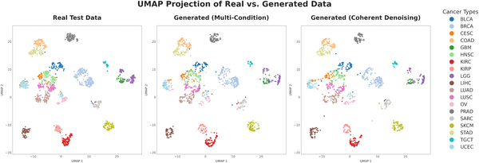
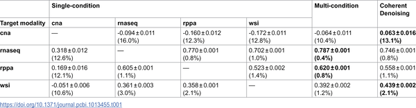
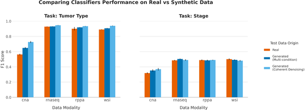
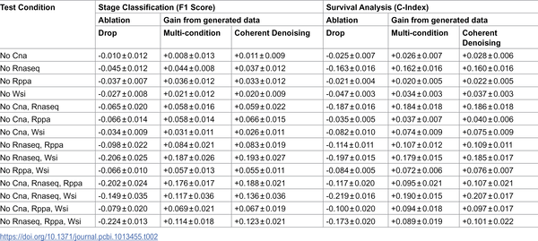

What if artificial intelligence could fill in the missing pieces of a cancer patient’s medical data, helping doctors make better-informed decisions? Many cancer patients’ records are incomplete, missing crucial genetic or imaging information needed for precise diagnosis and treatment. Researchers have now developed a novel AI technique that can generate realistic synthetic data to fill these gaps, enabling more accurate predictions even when some data is unavailable.

> **TL;DR**
> - The new AI method, called Coherent Denoising, generates high-quality synthetic biomedical data to complete missing cancer patient information across multiple data types.
> - This synthetic data helps maintain the accuracy of predictive models for cancer diagnosis, staging, and survival, and can guide which diagnostic tests to prioritize.

Precision medicine aims to tailor treatments based on a patient’s unique biological profile, which often requires integrating diverse types of data—such as genetic mutations, gene expression, protein levels, and tissue images. Large initiatives like The Cancer Genome Atlas (TCGA) have collected such multimodal data from thousands of cancer patients. However, in real-world clinical settings, patient records are often incomplete because some tests are expensive, technically challenging, or unavailable. This missing data limits the effectiveness of AI models designed to predict cancer outcomes and guide treatment decisions.

To tackle this challenge, the researchers developed a generative AI framework using a novel ensemble-based diffusion method called Coherent Denoising. This approach combines predictions from multiple specialized models, each trained to generate one missing data type conditioned on available data types, and enforces consensus among them to produce coherent synthetic profiles. The team applied this method to a large TCGA dataset of over 10,000 cancer samples spanning 20 tumor types, involving four data modalities: copy-number alterations (CNA), transcriptomics (RNA-Seq), proteomics (RPPA), and histopathology image embeddings (WSI). Each data type was encoded into a low-dimensional latent space to enable efficient modeling.

The AI-generated synthetic data closely resembled real patient data, preserving complex biological patterns that distinguish different cancer types. Quantitative evaluations showed high reconstruction fidelity, especially for transcriptomics and proteomics data, while copy-number alterations were more challenging to generate accurately. Importantly, predictive models for tumor type classification, cancer staging, and survival analysis maintained their performance when using synthetic data to complete missing modalities. The researchers also demonstrated that their method could guide the prioritization of costly diagnostic tests by simulating the impact of acquiring additional data on prediction accuracy.

This work represents a significant step toward overcoming a major barrier in precision oncology: incomplete patient data. By generating realistic synthetic biomedical data, the Coherent Denoising framework enables AI models to function effectively even when some patient information is missing. This could improve clinical decision-making, optimize resource allocation by identifying which diagnostic tests are most valuable, and ultimately enhance personalized cancer care. Moreover, because the synthetic data do not directly replicate real patient records, this approach offers privacy advantages, facilitating data sharing and collaborative research.

While promising, the method’s accuracy varies across data types, with some modalities like copy-number alterations being harder to reconstruct. The synthetic data are approximations and should complement, not replace, actual clinical measurements. Further validation in clinical settings and with prospective patient data is needed to confirm the utility and safety of relying on AI-generated data for medical decisions. Additionally, the technical complexity of the approach may limit immediate adoption outside specialized research environments.

## Figures

*UMAP maps show real and generated patient data grouped by cancer type, with both models accurately capturing key patterns and clusters.*

*Table shows how well different models predict data and their confidence, with best scores in bold and variability as a percentage of real data variance.*

*Random Forest classifiers show similar accuracy on real and synthetic data for tumor type and stage prediction, with results averaged over 10 tests.*

*Table shows how generating missing data improves tumor stage and survival prediction accuracy across different data gaps, averaged over 10 tests.*

## Sources

- [Coherent cross-modal generation of synthetic biomedical data to advance multimodal precision medicine](https://journals.plos.org/ploscompbiol/article?id=10.1371/journal.pcbi.1013455)
- DOI: [10.1371/journal.pcbi.1013455](https://doi.org/10.1371/journal.pcbi.1013455)
