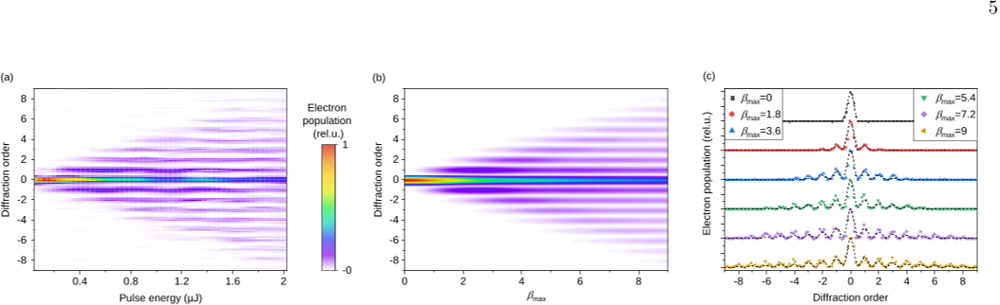
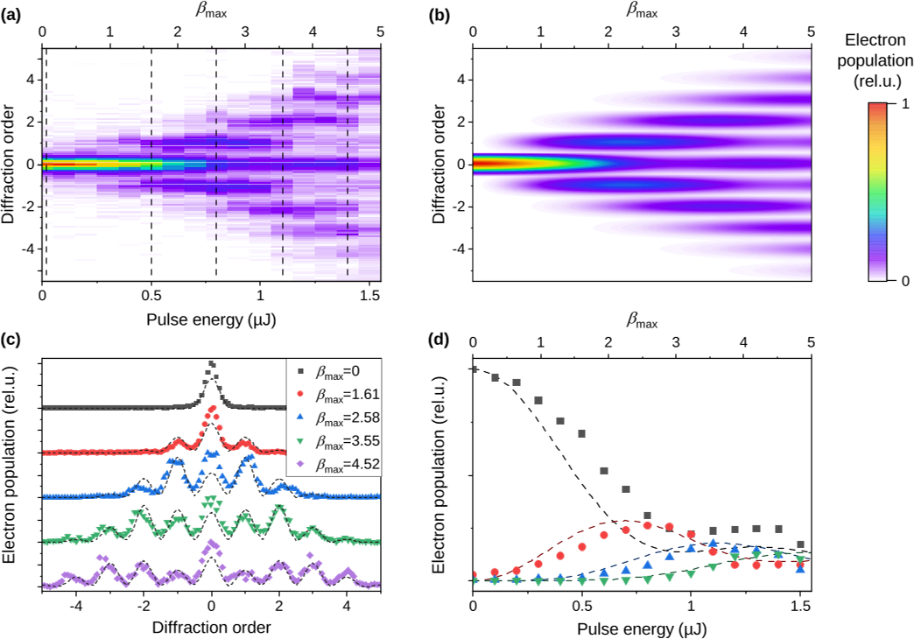

Imagine electrons not just as tiny particles but as waves that can be shaped and split by light itself. Scientists have now observed a quantum effect where high-energy electrons scatter coherently off a standing wave of light inside an electron microscope. This breakthrough opens the door to new ways of controlling electron beams, potentially enhancing the resolution and capabilities of electron microscopy.

> **TL;DR**
> - The Kapitza-Dirac effect, where electrons diffract from a light-generated grating, has been observed coherently at much higher electron energies than before.
> - This coherent electron-light interaction can serve as a beam splitter or phase modulator in electron microscopes, enabling advanced imaging techniques.

*Note: this summary is based on a preprint — research shared ahead of formal peer review.*

The Kapitza-Dirac effect is a fundamental quantum phenomenon where electrons behave like waves and diffract when passing through a periodic pattern of light—an optical standing wave formed by two intersecting laser beams. Previously, this effect was only seen with low-energy electrons because the momentum of visible photons is tiny compared to fast electrons, making diffraction angles extremely small and hard to detect. Understanding and harnessing this effect at higher electron energies could revolutionize electron microscopy by allowing precise control over electron wave phases and directions.

In this study, researchers used a scanning electron microscope equipped with a pulsed electron source producing electrons at energies of 20 and 30 keV, corresponding to de Broglie wavelengths of about 9 and 7 picometers. They created an optical standing wave using two counterpropagating pulsed laser beams at 1030 nm wavelength, focused to about 10 micrometers. By carefully aligning the electron beam to overlap with this light grating and employing a nanoscale slit as a spatial filter, they achieved the angular resolution needed to resolve individual electron diffraction peaks. The electron beam was scanned across the slit, and transmitted electrons were detected to map out the diffraction pattern as the laser intensity was varied.

The experiments revealed that as laser intensity increased, electrons exhibited discrete diffraction orders corresponding to absorption and emission of photons from the standing light wave. Notably, at longer laser pulse durations and under carefully controlled conditions, the populations of these diffraction orders oscillated coherently with increasing interaction strength. This reversible exchange of electron populations among diffraction states is a hallmark of coherent quantum behavior and had not been observed before at these high electron energies. The results matched well with theoretical models based on the ponderomotive potential of the optical standing wave acting on the electron wavefunction.

Demonstrating coherent Kapitza-Dirac diffraction with high-energy electrons inside a scanning electron microscope is a significant advance. It shows that electron beams can be coherently split and phase-modulated using light fields, which could be harnessed as beam splitters or phase plates in electron microscopy. Such tools would enable new interferometric imaging methods with enhanced sensitivity and resolution, potentially allowing scientists to probe materials and nanoscale structures with unprecedented detail. This work bridges fundamental quantum physics and practical microscopy technology, opening new avenues for research and applications.

While the experiments convincingly demonstrate coherent electron diffraction at high energies, the setup requires precise spatial and temporal overlap of electron and laser pulses, as well as nanoscale spatial filtering, which may limit immediate widespread adoption. The quantum effects rely on maintaining coherence over very small scales and short times, posing technical challenges. Further research is needed to integrate these techniques into routine electron microscopy workflows and to explore their full potential in imaging complex samples.

## Figures

*Electron scattering patterns change with laser energy, showing clear diffraction effects that match theoretical predictions. — Figure from Kamila Moriová et al., [CC BY 4.0](http://creativecommons.org/licenses/by/4.0/), caption edited.*

*Electron diffraction patterns change with laser power, matching theory, showing how electrons scatter in a Kapitza-Dirac effect at 30 keV energy. — Figure from Kamila Moriová et al., [CC BY 4.0](http://creativecommons.org/licenses/by/4.0/), caption edited.*

## Sources

- [Coherent regime of Kapitza-Dirac effect with electrons](https://arxiv.org/abs/2511.14508)
- DOI: [10.1103/9gg2-zy3l](https://doi.org/10.1103/9gg2-zy3l)

*This article reuses and adapts text and figures from the original research by Kamila Moriová et al., available via Phys. Rev. Lett. 137, 053604 (2026), under the [CC BY 4.0](http://creativecommons.org/licenses/by/4.0/) license.*
