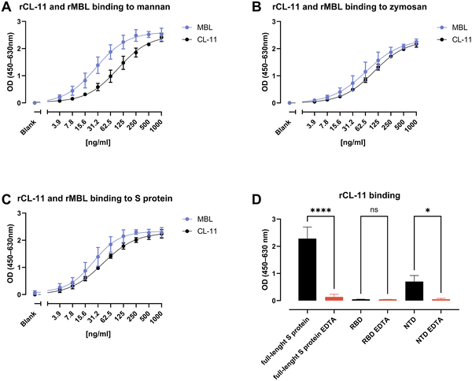
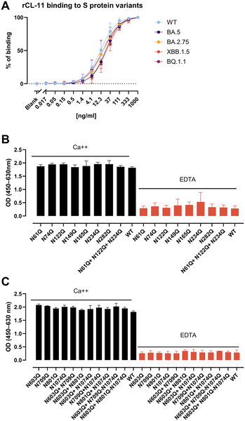
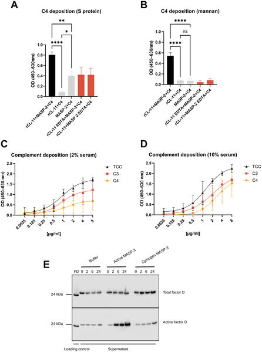
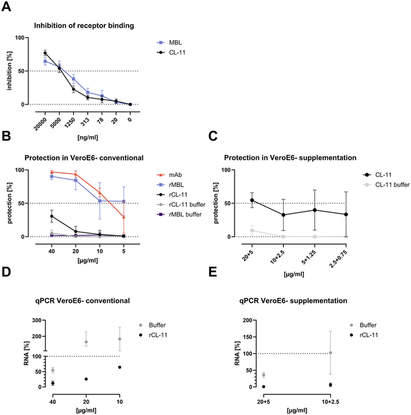

Did you know your lungs produce a molecule that can neutralize the COVID-19 virus without relying on antibodies? This molecule, called Collectin-11, acts as a hidden defender right at the frontlines of infection, recognizing and neutralizing SARS-CoV-2 by activating the body's complement system. This discovery adds a surprising new piece to our understanding of how the innate immune system protects us from respiratory viruses.

> **TL;DR**
> - Collectin-11 (CL-11), produced locally in lung tissue, binds to multiple glycan sites on the SARS-CoV-2 spike protein.
> - CL-11 activates complement pathways and neutralizes the virus in an antibody-independent manner, inhibiting infection of susceptible cells.

The innate immune system is our body's first line of defense against invading pathogens like viruses. One key player in this system is the complement cascade, a series of proteins that tag and help eliminate microbes. Among the complement activators are pattern recognition molecules such as mannose-binding lectin (MBL), known to recognize sugars on viral surfaces. Collectin-11 (CL-11) is a similar molecule but unlike MBL, which is produced in the liver and circulates in the blood, CL-11 is made locally in various tissues including the lung epithelium. Given the lungs are the primary site of SARS-CoV-2 infection, scientists wondered if CL-11 could play a direct role in neutralizing the virus.

To explore this, researchers produced recombinant CL-11 and a panel of SARS-CoV-2 spike proteins, including variants and versions with specific sugar (glycan) mutations. Using enzyme-linked immunosorbent assays (ELISA), they tested how CL-11 binds to the spike protein and whether this binding triggers activation of the complement system. They also conducted cell-based assays to see if CL-11 could prevent the virus from infecting cells. Complement activation was assessed by measuring deposition of complement components such as C4, C5, and the terminal complement complex on the spike protein in the presence of CL-11.

The study revealed that CL-11 binds strongly to multiple glycan sites on the SARS-CoV-2 spike protein, with binding patterns similar to MBL. This binding activates both the lectin and alternative complement pathways, leading to complement deposition on the virus surface. Importantly, CL-11 inhibited the spike protein’s ability to bind to the ACE2 receptor on host cells, effectively blocking viral entry. In cell culture experiments, CL-11 neutralized SARS-CoV-2 infection independently of antibodies. These effects were consistent across several variants of concern, including Omicron subtypes. The findings suggest that CL-11 acts as an early innate immune effector in the lungs, capable of neutralizing the virus before the adaptive immune system generates antibodies.

This discovery uncovers a previously unrecognized antiviral role for Collectin-11 and highlights the importance of local innate immune defenses in the respiratory tract. Unlike antibodies, which take days to develop after infection or vaccination, CL-11 is already present in lung tissue and can rapidly respond to viral invasion. Understanding how CL-11 functions opens new avenues for antiviral therapies that harness or mimic this natural defense mechanism. Such strategies could complement vaccines and antibody-based treatments, especially against emerging variants that partially evade antibody recognition.

While these results are promising, they are based on laboratory experiments using recombinant proteins and cell cultures. Further studies are needed to confirm the role of CL-11 in humans during natural SARS-CoV-2 infection and to explore how its levels and activity vary among individuals. Additionally, the interplay between CL-11 and other immune components in the complex lung environment remains to be fully understood. Nonetheless, this work provides a solid foundation for future research into innate immune strategies against respiratory viruses.

## Figures

*CL-11 protein binds strongly to specific parts of the COVID-19 spike protein and other ligands, showing key interaction patterns.*

*CL-11 protein binds differently to spike proteins from various COVID-19 variants and changes when sugar sites on the spike are mutated.*

*Study shows how proteins trigger immune responses by depositing complement factors on virus-like surfaces, highlighting key activation steps.*

*Lab tests show rCL-11 and rMBL proteins can block the virus from binding cells and reduce SARS-CoV-2 infection in cell cultures.*

## Sources

- [Collectin-11, a complement pattern recognition molecule, mediates pulmonary SARS-CoV-2 neutralization and protection](https://journals.plos.org/plospathogens/article?id=10.1371/journal.ppat.1014216)
- DOI: [10.1371/journal.ppat.1014216](https://doi.org/10.1371/journal.ppat.1014216)
