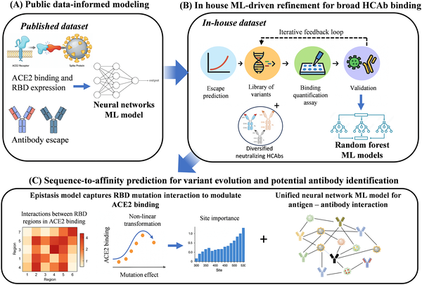
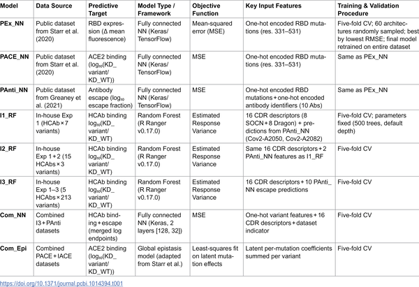
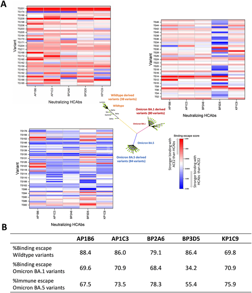
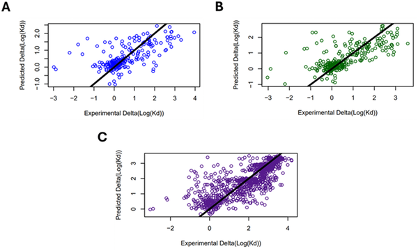

As the COVID-19 pandemic has shown, viruses like SARS-CoV-2 can evolve rapidly, creating new variants that sometimes dodge our immune defenses. But what if we could predict these viral changes before they spread widely? Scientists are now combining machine learning with lab experiments to anticipate how the virus’s spike protein mutates and which antibodies will still work against it. This dynamic approach aims to keep vaccines and treatments one step ahead of the virus.

> **TL;DR**
> - Researchers developed a machine learning framework that integrates public data and targeted experiments to predict how SARS-CoV-2 variants bind human cells and escape antibodies.
> - By iteratively refining models with experimental results, this approach improves accuracy and helps prioritize antibodies and vaccines effective against emerging variants.

SARS-CoV-2, the virus causing COVID-19, uses its spike protein to enter human cells by binding to the ACE2 receptor. Neutralizing antibodies target this spike protein to block infection. However, the virus continually mutates, especially in the receptor-binding domain (RBD) of the spike, sometimes reducing antibody effectiveness. Variants like Delta and Omicron have shown how mutations can impact vaccine and therapeutic efficacy. Predicting which mutations will emerge and how they affect antibody binding is crucial for pandemic preparedness but remains challenging due to the complexity of viral evolution and immune interactions.

The team combined machine learning models—including random forests and neural networks—with high-throughput lab experiments to study over 200 SARS-CoV-2 RBD variants derived from the original (wild-type) and Omicron strains. They first trained models on large public datasets measuring ACE2 binding, RBD expression, and antibody escape. Then, using an indirect transfer learning technique, predictions from these public-data models were used as features to train new models on their own experimental antibody binding data. This iterative cycle of prediction and targeted validation allowed continuous refinement of the models. The approach also encoded antibody features, such as complementarity-determining regions (CDRs), enabling predictions across different antibody types, including heavy-chain-only antibodies (HCAbs).

The integrated framework achieved strong predictive accuracy, with correlation coefficients up to 0.79 for antibody binding. The models successfully identified variants with increased ability to bind ACE2 and escape antibody recognition. Experimental validation showed that many variants derived from the wild-type strain escaped binding by tested antibodies, while escape rates varied for Omicron-derived variants. Iterative training with new experimental data improved model performance, enabling better prioritization of antibodies likely to remain effective against emerging variants. This combined computational and experimental approach provides a more flexible and anticipatory tool compared to static models.

This work represents a significant advance in pandemic preparedness by enabling rapid, data-driven assessment of emerging SARS-CoV-2 variants. By predicting how mutations affect viral infectivity and immune escape, the framework can guide updates to vaccines and antibody therapies before variants become widespread. The use of indirect transfer learning and iterative experiments enhances model adaptability to evolving viral landscapes. Beyond COVID-19, this approach offers a blueprint for responding to future viral outbreaks by integrating AI and targeted laboratory validation to stay ahead of pathogen evolution.

While promising, the models rely on available datasets and experimental measurements, which may not capture all possible viral mutations or antibody responses. Predictions are strongest for variants close in sequence to those studied and may be less accurate for highly divergent strains. The approach focuses on antibody binding and does not directly model other immune factors or viral fitness aspects. Continued data collection and model refinement will be necessary to maintain predictive power as the virus evolves. Nonetheless, this framework provides a valuable tool that complements traditional surveillance and experimental methods.

## Figures

*A three-step AI framework predicts how SARS-CoV-2 variants evolve and escape antibodies by combining data, experiments, and mutation analysis.*

*Summary of the machine learning models created and tested in this study.*

*This figure compares how well different COVID-19 variants bind to human cells and antibodies, showing which may better evade immune defenses.*

*Models predicting antibody binding improved as more data from various COVID variants were added, showing better accuracy and correlation.*

## Sources

- [Combining machine learning and iterative experiments to keep pace with emerging viral variants of concern](https://journals.plos.org/ploscompbiol/article?id=10.1371/journal.pcbi.1014394)
- DOI: [10.1371/journal.pcbi.1014394](https://doi.org/10.1371/journal.pcbi.1014394)
