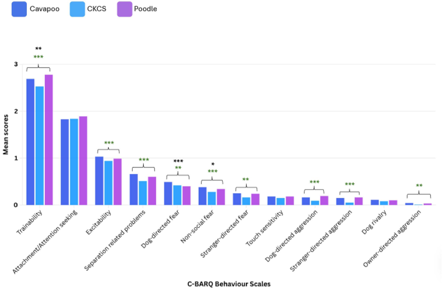
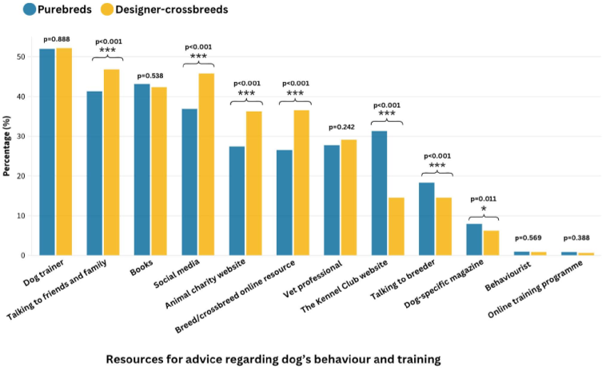
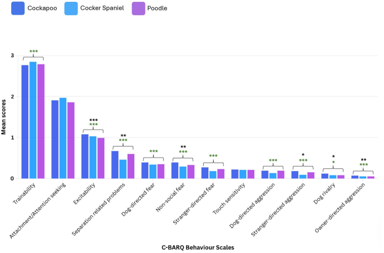
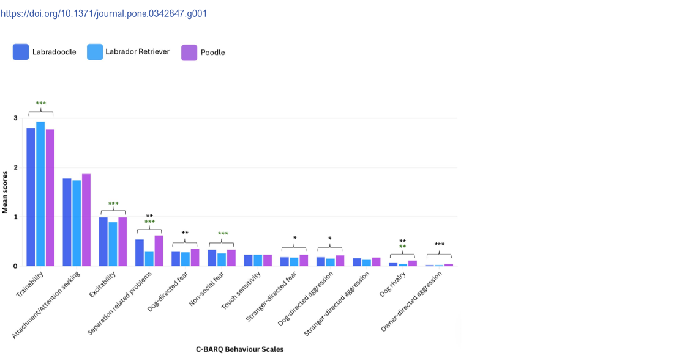

Designer-crossbreed dogs—those charming mixes like Cockapoos, Labradoodles, and Cavapoos—have surged in popularity, often praised for being easy to train and great with kids. But do these designer pups really live up to their reputation? A comprehensive UK study involving over 9,000 dogs offers new insights that might surprise prospective dog owners.

> **TL;DR**
> - Designer-crossbreed dogs, especially Cockapoos and Cavapoos, showed more undesirable behaviors compared to their purebred parent breeds in nearly half of the behavioral traits studied.
> - Labradoodles exhibited a more balanced behavioral profile, sometimes scoring better and sometimes worse than their progenitor breeds, suggesting variability among designer-crossbreeds.

Over the past decade, designer-crossbreed dogs—intentional mixes of two or more pure breeds—have become a booming trend. Their rising popularity is often fueled by beliefs that these dogs combine the best traits of their parents, such as being easier to train or more suitable for families with children. Yet, scientific data on their behavior has been scarce. Understanding canine behavior is crucial because mismatches between owners’ expectations and a dog’s actual temperament can lead to challenges in training, increased risk of problematic behaviors, and even relinquishment. This study aimed to fill that knowledge gap by systematically comparing behavioral traits of the three most popular Poodle-cross designer breeds in the UK—Cockapoos, Labradoodles, and Cavapoos—with their purebred progenitors.

The researchers gathered data through an online survey in early 2023, collecting responses from owners of 9,402 dogs aged up to five years. Participants included owners of Cockapoos, Labradoodles, Cavapoos, and their purebred parents such as Cocker Spaniels, Cavalier King Charles Spaniels, Labrador Retrievers, and various Poodle types. The survey used the Canine Behavioural Assessment and Research Questionnaire (C-BARQ), a validated tool that measures 12 subscales of dog behavior, covering areas like aggression, fear, excitability, and training responsiveness. Statistical analyses then compared behavioral scores between each designer-crossbreed and its progenitor breeds to identify significant differences in undesirable behaviors.

Contrary to the popular belief that designer-crossbreeds are uniformly easier to manage, the study found that these dogs often exhibited more undesirable behaviors than their purebred parents. Specifically, Cockapoos showed the highest number of problematic behaviors, scoring worse than both Cocker Spaniels and Poodles in 16 out of 24 behavioral comparisons. Cavapoos also scored worse than their progenitors in 11 of 24 comparisons. Labradoodles presented a more mixed picture, scoring worse than their parents in five behaviors but better in six, indicating more variability. Overall, designer-crossbreeds displayed more undesirable behaviors than a progenitor breed in 44.4% of comparisons, fewer in only 9.7%, and no difference in the rest. These results challenge the assumption that designer-crossbreeds inherently combine the best traits of their parent breeds.

This study provides valuable, evidence-based insights for prospective dog owners, breeders, and animal welfare advocates. By revealing that popular designer-crossbreeds may not always be easier to train or better suited for families with children, it encourages more informed decisions when choosing a dog. Understanding these behavioral tendencies can help set realistic expectations, improve training approaches, and reduce risks such as dog bites or relinquishment due to unmet behavioral expectations. Ultimately, this research underscores the importance of evaluating each dog as an individual rather than relying solely on breed stereotypes or marketing claims.

While the study benefits from a large sample size and a validated behavioral assessment tool, it relies on owner-reported data, which may be influenced by subjective perceptions or reporting biases. Environmental factors, owner experience, and training methods can also shape a dog’s behavior but were not fully controlled for in this analysis. Additionally, the study focused on dogs acquired as puppies within the UK, so findings may not generalize to other populations or older dogs. Further research incorporating direct behavioral observations and genetic analyses could deepen understanding of how crossbreeding influences canine behavior.

## Figures

*Average behavior scores for Cavapoos, Cavaliers, and Poodles show significant differences marked by stars in green and black.*

*Comparison of designer-crossbreed and purebred dog owners using different resources for behavior and training advice.*

*Average behavior scores for Cockapoos, Cocker Spaniels, and Poodles show significant differences marked by stars in green and black.*

*Average behavior scores for Labradoodles, Labradors, and Poodles show significant differences marked by colored stars for easy comparison.*

## Sources

- [Comparing undesirable behaviours between ‘designer’ Poodle-cross dogs and their purebred progenitor breeds](https://journals.plos.org/plosone/article?id=10.1371/journal.pone.0342847)
- DOI: [10.1371/journal.pone.0342847](https://doi.org/10.1371/journal.pone.0342847)
