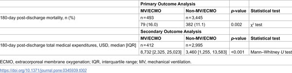

What happens to patients who survive the most severe forms of COVID-19? While much attention has focused on acute care during hospitalization, less is known about the health outcomes and medical costs these patients face after they leave the hospital. A new study from Japan sheds light on the risks of death and the financial burden in the six months following discharge for patients who required intensive respiratory support, such as mechanical ventilation or extracorporeal membrane oxygenation (ECMO).

> **TL;DR**
> - COVID-19 patients who needed mechanical ventilation or ECMO during hospitalization had higher mortality rates in the 180 days after discharge compared to those who did not require these interventions.
> - These patients also incurred significantly higher medical expenditures in the post-discharge period, suggesting ongoing healthcare needs and economic challenges.

The COVID-19 pandemic has led to a surge in critically ill patients worldwide, many of whom require advanced respiratory support like mechanical ventilation or ECMO. While these treatments can be lifesaving, survivors often face long-term health complications. Previous research has documented increased mortality and healthcare use during hospitalization, but data on outcomes after discharge, especially in Japan, have been limited. Understanding post-discharge mortality and costs is vital for healthcare planning and patient support.

Researchers conducted a retrospective cohort study using medical claims data from a Japanese municipality, analyzing patients hospitalized with COVID-19 between April 2020 and September 2021. They categorized patients into two groups: those who received mechanical ventilation or ECMO (indicating severe disease) and those who did not. The study examined mortality and total medical expenditures over 180 days following hospital discharge. Statistical analyses accounted for factors such as age, sex, comorbidities, and length of hospital stay to assess the association between advanced respiratory support and post-discharge outcomes.

The study analyzed nearly 4,000 discharged COVID-19 patients. Those who had required mechanical ventilation or ECMO faced a 16% mortality rate within 180 days post-discharge, significantly higher than the 11.1% observed in patients without such interventions. Additionally, the median medical costs for the MV/ECMO group were more than double those of the non-MV/ECMO group—approximately $8,700 versus $3,460. Factors such as older age, dementia, cancer, kidney disease, and cerebrovascular disease also contributed to increased mortality and expenditures. These findings highlight the sustained health risks and resource needs of survivors of severe COVID-19.

This study provides valuable evidence that surviving severe COVID-19 requiring intensive respiratory support does not mark the end of health challenges. Instead, these patients face elevated risks of death and substantial medical expenses for months after leaving the hospital. Recognizing these ongoing burdens can help healthcare providers and policymakers develop targeted follow-up care strategies and allocate resources effectively to support recovery and reduce long-term costs.

While the study benefits from a large, well-characterized cohort and robust statistical methods, it is limited to data from a single Japanese municipality, which may affect generalizability. The observational design cannot establish causality, and some factors influencing outcomes—such as social determinants of health or variations in post-discharge care—were not captured. Additionally, medical claims data may not fully reflect all healthcare utilization or patient quality of life after discharge. Future research including diverse populations and clinical details would deepen understanding of long-term outcomes after severe COVID-19.

## Figures

*Comparison of 180-day death rates and medical costs in COVID-19 patients based on use of breathing support machines.*

## Sources

- [Comparison of post-discharge mortality and medical expenditures in COVID-19 patients according to mechanical ventilation and extracorporeal membrane oxygenation use: The LIFE study](https://journals.plos.org/plosone/article?id=10.1371/journal.pone.0345939)
- DOI: [10.1371/journal.pone.0345939](https://doi.org/10.1371/journal.pone.0345939)
