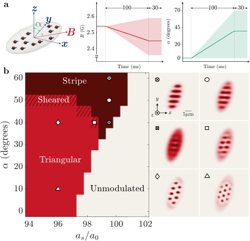
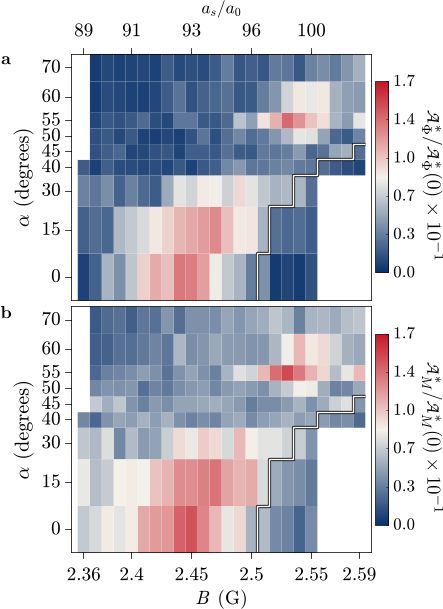
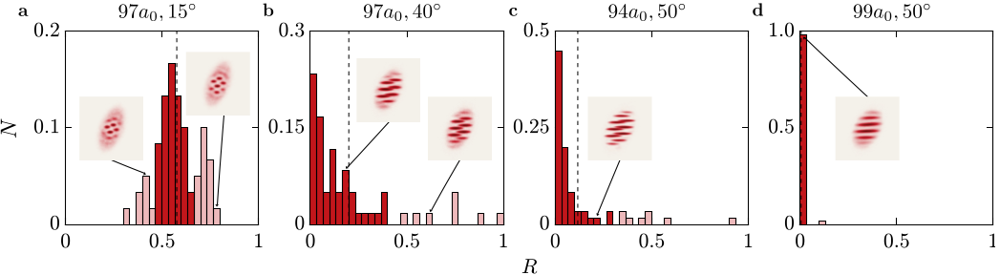
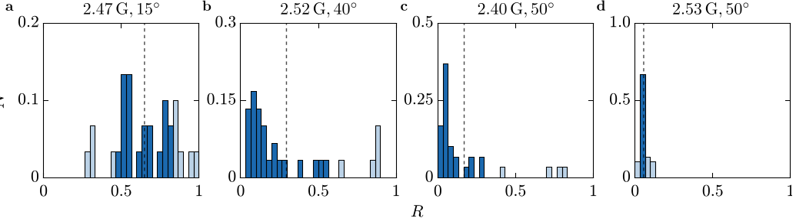

Imagine a state of matter that behaves like a solid with a crystal pattern, yet also flows without friction like a superfluid. Such a paradoxical quantum phase, called a supersolid, blends order and fluidity in a way that challenges our classical intuition. Recently, researchers have pushed the frontier by creating supersolids that can switch between distinct spatial patterns—triangular arrays and stripes—in a gas of magnetic atoms. This remarkable interplay of competing orders opens a new window into the complex behavior of quantum matter.

> **TL;DR**
> - Scientists experimentally realized and observed two competing supersolid phases—triangular droplet arrays and stripe patterns—in a two-dimensional dipolar quantum gas by tuning magnetic field orientation and interaction strength.
> - They identified a structural phase transition between these patterns marked by critical fluctuations, and confirmed that both phases exhibit global phase coherence, a hallmark of supersolidity.

*Note: this summary is based on a preprint — research shared ahead of formal peer review.*

Supersolids are exotic quantum states where matter simultaneously exhibits crystalline order—like atoms arranged in a repeating pattern—and superfluid order, allowing frictionless flow. First theorized decades ago in helium, supersolids have recently been realized in ultracold gases of highly magnetic atoms, where long-range dipolar interactions enable rich spatial structures. While one-dimensional supersolids with linear droplet chains have been studied, two-dimensional dipolar gases are predicted to support multiple competing crystal patterns, including triangular lattices and stripes. Understanding how these patterns emerge and compete is a fundamental challenge in quantum many-body physics.

In this experiment, a quantum gas of about 140,000 dysprosium atoms was confined in a shallow, elongated trap shaped like a surfboard. The atoms’ magnetic dipoles were aligned by applying a homogeneous magnetic field whose strength and tilt angle could be precisely controlled. By tuning the contact interaction strength via magnetic field magnitude and changing the dipole orientation angle, the researchers explored different regimes of spatial ordering. They imaged the gas density both in situ and after time-of-flight expansion to analyze spatial patterns and phase coherence. Theoretical simulations using an extended mean-field model incorporating quantum and thermal fluctuations guided and supported the observations.

The team observed distinct density-modulated states with either triangular droplet arrays or stripe-like patterns, depending on the dipole tilt angle and interaction strength. They defined a structural order parameter based on the Fourier transform of the density images to quantitatively distinguish these phases. Near a critical tilt angle range (~30° to 45°), the system exhibited enhanced fluctuations and non-Gaussian statistics in this order parameter, signaling a structural phase transition between triangular and stripe supersolids. Time-of-flight measurements revealed that both phases maintain global phase coherence near the modulation onset, confirming their supersolid nature. Farther from this transition, the phase coherence was lost, indicating insulating states.

This work experimentally demonstrates the coexistence and competition of multiple spatial orders in a two-dimensional dipolar supersolid, a long-predicted but previously elusive phenomenon. The ability to controllably tune between triangular and stripe patterns and to observe their critical fluctuations provides a versatile platform for studying intertwined symmetry-breaking phenomena in quantum matter. These insights deepen our understanding of complex quantum phases and pave the way for exploring novel quantum materials with tunable properties.

While the findings reveal rich quantum phase behavior, the experiments involve finite-size systems and coupled parameter ramps that complicate precise characterization of the phase transitions. The imaging technique integrates density along one axis, limiting the ability to fully resolve some subtle structural details, such as distinguishing sheared triangular arrays from stripes at large tilt angles. Additionally, the observed phenomena currently remain fundamental physics explorations without immediate practical applications. Future studies with refined control and theory will help clarify the nature of the transitions and criticality.

## Figures

*We studied gas behavior in a magnetic trap, showing how changing field strength and angle creates different patterns like unmodulated, triangular, and stripe states. — Figure from Karthik Chandrashekara et al., [CC BY 4.0](http://creativecommons.org/licenses/by/4.0/), caption edited.*

*Graphs show how two wave amplitudes change with variables B and α, highlighting the boundary between different wave patterns. — Figure from Karthik Chandrashekara et al., [CC BY 4.0](http://creativecommons.org/licenses/by/4.0/), caption edited.*

*Simulated distributions of R values from 60 runs show average and variation, with example density patterns for selected R ranges. — Figure from Karthik Chandrashekara et al., [CC BY 4.0](http://creativecommons.org/licenses/by/4.0/), caption edited.*

*Experimental results show how values of R vary under different conditions in triangular, fluctuating, and stripe phases. — Figure from Karthik Chandrashekara et al., [CC BY 4.0](http://creativecommons.org/licenses/by/4.0/), caption edited.*

## Sources

- [Competing triangular and stripe supersolid orders in a dipolar quantum gas](https://arxiv.org/abs/2608.20327)
- DOI: [10.48550/arxiv.2608.20327](https://doi.org/10.48550/arxiv.2608.20327)

*This article reuses and adapts text and figures from the original research by Karthik Chandrashekara et al., available via arXiv Quantum Physics, under the [CC BY 4.0](http://creativecommons.org/licenses/by/4.0/) license.*
