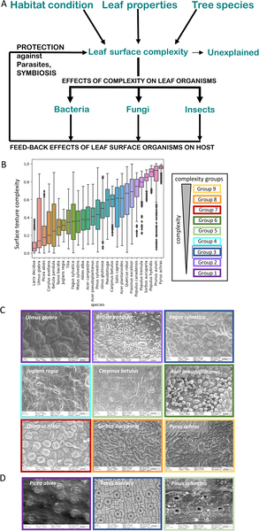
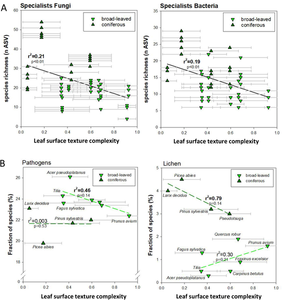
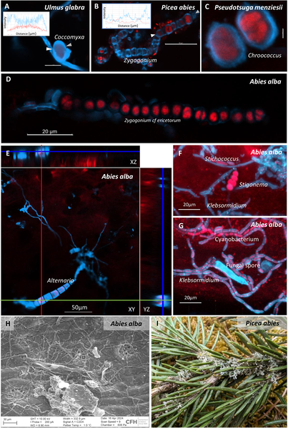
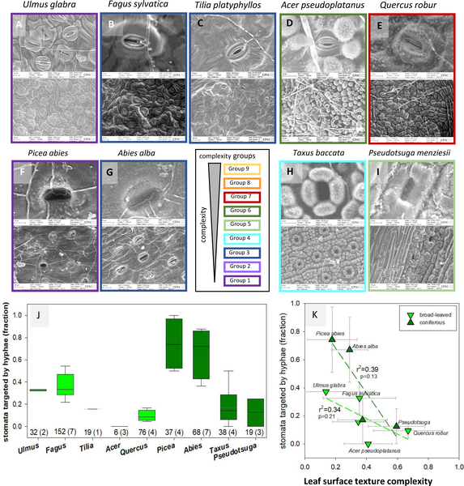

Did you know that the tiny textures on the surface of tree leaves can influence which microbes call them home? These microscopic landscapes are more than just plant decorations—they play a crucial role in shaping the invisible world of fungi and bacteria that interact with leaves throughout their life. Understanding these interactions could help us uncover natural ways forests defend themselves against diseases.

> **TL;DR**
> - Researchers developed a new method to quantify leaf surface texture complexity using scanning electron microscopy images.
> - They found that leaves with more complex surface textures tend to host fewer specialized fungal and bacterial pathogens, suggesting a protective effect.

Leaves are the frontline interface between trees and their environment, hosting diverse communities of microorganisms including fungi, bacteria, and algae. These microbes can be beneficial, neutral, or harmful, influencing leaf health and overall tree vitality. While chemical properties and leaf shape have been studied extensively, the role of leaf surface structures—such as tiny ridges, pores, and wax formations—in shaping microbial colonization has been less explored. Advances in microscopic imaging and machine learning now allow scientists to quantify these surface features and investigate their ecological significance.

In this study, scientists collected leaves and needles from 27 temperate forest tree species in Germany. Using scanning electron microscopy (SEM), they captured detailed images of the leaf undersides, focusing on areas without visible fungal colonization. They applied machine learning techniques to segment key features like stomata and extracted texture features from thousands of sub-images. These features included measures derived from image texture matrices, spectral analysis, and image compression data. To rank leaf surface complexity, they used a game-theoretic approach comparing pairs of images and scoring species accordingly. This novel complexity score was then correlated with microbial colonization patterns, leaf anatomical traits, and habitat preferences.

The researchers discovered that leaf surface texture complexity varied widely among tree species and correlated with anatomical features such as stomatal density and leaf orientation. Importantly, species with more complex leaf surfaces tended to harbor fewer specialist fungi and bacteria, including plant pathogens on broad-leaved trees and lichens on conifers. This suggests that complex leaf textures may act as a physical barrier or create microhabitats less favorable to harmful microbes. Microscopic images showed fungal threads growing toward leaf pores, with some leaves exhibiting structural features that appear to block fungal entry. These findings highlight leaf surface texture as an underappreciated trait influencing microbial diversity and interactions on leaves.

By quantitatively linking leaf surface texture to microbial colonization, this study opens new avenues for understanding plant-microbe co-evolution and ecosystem dynamics. The complexity score provides a tool for future research exploring how leaf traits affect microbial communities and plant health. From a practical perspective, insights into how leaf surface structures influence pathogen colonization could inform forest management and breeding programs aimed at enhancing natural disease resistance. Ultimately, appreciating the microscopic landscapes on leaves enriches our understanding of the subtle ways trees interact with their microbial partners and adversaries.

While the study presents a robust quantitative approach and compelling correlations, it remains exploratory. The protective role of leaf surface complexity against pathogens is suggested but not experimentally confirmed through manipulative tests. Microbial colonization is influenced by many factors, including chemical defenses and environmental conditions, which were not fully dissected here. Additionally, the study focused on a temperate forest community in Germany, so findings may differ in other ecosystems or climates. Future work integrating chemical, genetic, and ecological data will be needed to fully unravel the complex interactions between leaf surfaces and microbial communities.

## Figures

*Leaf surface texture varies across 27 tree species and may influence how organisms colonize and affect tree health.*

*Fungal and bacterial diversity, including pathogens and lichens, increases with leaf surface texture complexity, shown by species counts and stats.*

*Microscopic images show fungi, algae, and cyanobacteria interacting and forming networks on plant surfaces.*

*Fungal threads grow toward leaf pores, with some plants having protective barriers that block fungal entry, shown in detailed microscope images.*

## Sources

- [Complexity of leaf surface texture affects microbial colonization in temperate forest tree species](https://journals.plos.org/plosone/article?id=10.1371/journal.pone.0349938)
- DOI: [10.1371/journal.pone.0349938](https://doi.org/10.1371/journal.pone.0349938)
