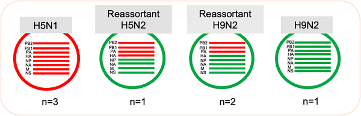
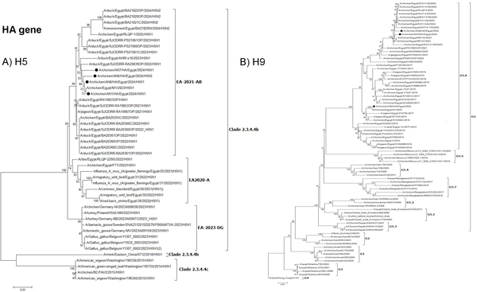

Imagine two different bird flu viruses infecting the same chicken, each carrying its own set of genetic instructions. When these viruses mix and swap parts of their genetic code—a process called reassortment—they can create new virus strains with unpredictable traits. Scientists studying poultry in Egypt have recently uncovered such viral gene swapping between the H5N1 and H9N2 bird flu viruses, raising important questions about how these new viruses might affect both birds and humans.

> **TL;DR**
> - H5N1 and H9N2 avian influenza viruses are co-circulating in Egyptian poultry, leading to the emergence of novel reassortant viruses that combine gene segments from both strains.
> - Some of these new reassortant viruses carry mutations linked to increased virulence and potential adaptation to mammals, underscoring the need for continuous monitoring and further research.

Avian influenza viruses (AIVs) are a group of contagious viruses that primarily infect birds but can sometimes jump to humans and other mammals. Among these, H5N1 is known for its high pathogenicity, causing severe disease in poultry and sporadic infections in people, while H9N2 is generally less virulent but widespread in poultry populations. Both viruses have a segmented RNA genome, meaning their genetic material is divided into eight separate pieces. When a single bird is infected by two different AIV strains simultaneously, these segments can be shuffled and exchanged, producing new reassortant viruses. This genetic mixing can result in viruses with altered properties, such as increased ability to infect new hosts or cause more severe disease. Egypt has experienced ongoing circulation of both H5N1 and H9N2 viruses in poultry, creating an environment ripe for such reassortment events.

To explore how these viruses are evolving in Egyptian poultry, researchers collected samples from 50 chicken flocks across seven regions in Egypt during 2024. They tested these samples for the presence of H5, H9, and other common poultry viruses using real-time reverse transcription PCR, a sensitive method to detect viral RNA. From positive samples, they isolated viruses by growing them in pathogen-free embryonated chicken eggs, then extracted viral RNA for full genome sequencing using Oxford Nanopore Technologies, which allows rapid reading of the entire viral genetic code. The team then analyzed the sequences to identify reassortment events and mutations, comparing them with known virus strains worldwide to understand their origins and relationships.

The study identified a new reassortant H5N2 virus that combined four gene segments (including those encoding key proteins like hemagglutinin and polymerase components) from the highly pathogenic H5N1 virus with four gene segments from the H9N2 virus. Additionally, two reassortant H9N2 viruses were found, which had acquired polymerase gene segments from H5N1 while retaining other genes from H9N2. Notably, these reassortant viruses carried specific mutations in their internal genes that were absent in other Egyptian H9N2 viruses. Some of these mutations have been previously associated with increased virulence—the ability to cause disease—and adaptation to mammalian hosts, suggesting these viruses might have enhanced potential to infect species beyond birds.

These findings are significant because they demonstrate active genetic reshuffling between two important avian influenza viruses in a region where poultry farming is widespread and closely linked to human populations. The emergence of reassortant viruses with mutations linked to mammalian adaptation raises concerns about zoonotic risk—the possibility that these viruses could infect humans and potentially spark outbreaks or pandemics. Continuous molecular surveillance, including whole genome sequencing, is therefore critical to detect such changes early. Understanding the genetic makeup of circulating viruses also informs vaccine design and control strategies to protect both poultry and public health.

While the study reveals the presence of reassortant viruses with mutations associated with increased virulence and mammalian adaptation, it does not directly assess how these viruses behave in live animals or humans. Further research is needed to evaluate the pathogenicity (disease-causing ability), transmissibility, and vaccine effectiveness against these new strains. Moreover, genetic changes alone do not guarantee increased risk; environmental factors and host interactions also play crucial roles. Therefore, caution is warranted in interpreting the potential threat, but the findings underscore the importance of vigilant monitoring.

## Figures

*Study viruses include H5N1, H5N2 (from H5N1 and H9N2 mix), and H9N2 types showing gene swapping between bird flu strains.*

*Phylogenetic tree showing relationships of Egyptian H5 and H9N2 viruses studied, marked with black dots.*

## Sources

- [Concurrent circulation of avian influenza viruses H5N1 and H9N2 enhances the genetic evolution of reassortant viruses in Egyptian poultry populations](https://journals.plos.org/plosone/article?id=10.1371/journal.pone.0348609)
- DOI: [10.1371/journal.pone.0348609](https://doi.org/10.1371/journal.pone.0348609)
