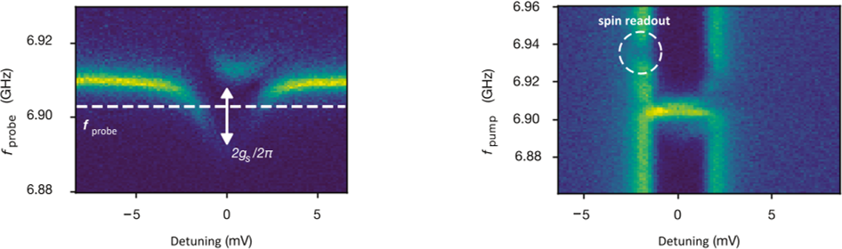
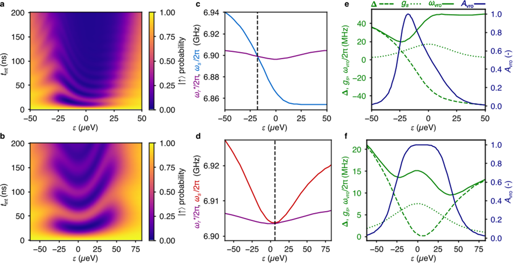

Imagine two tiny quantum bits, or qubits, each holding delicate quantum information encoded in the spin of a single electron. Now imagine these qubits are physically separated by a distance of hundreds of micrometers—seemingly far apart in the quantum realm. How can they communicate? Scientists have now shown that a single particle of light, a photon, can act as a messenger, carrying quantum information between these distant spins by harnessing a subtle quantum dance known as vacuum Rabi oscillations.

> **TL;DR**
> - Vacuum Rabi oscillations enable coherent energy exchange between a single photon and a single electron spin qubit in semiconductor quantum dots.
> - This interaction allows quantum information to be transferred between two distant spin qubits via photons confined in a superconducting microwave cavity.

*Note: this summary is based on a preprint — research shared ahead of formal peer review.*

Quantum computing promises revolutionary advances by exploiting the strange rules of quantum mechanics. A major challenge is connecting qubits that are physically separated, enabling them to share and process quantum information coherently. One promising approach uses photons—particles of light—as “flying qubits” to shuttle quantum states between stationary qubits. While vacuum Rabi oscillations, the coherent exchange of energy between a qubit and a photon, have been observed in various systems, achieving this with single electron spins in semiconductor quantum dots has been elusive due to the weak coupling and fast decoherence. This new work overcomes these hurdles by engineering a device that couples two distant spin qubits to a superconducting microwave cavity, enabling controlled photon-mediated interactions.

The researchers fabricated a hybrid device on an isotopically purified silicon substrate, hosting two double quantum dots (DQDs) separated by 250 micrometers. Each DQD traps a single electron whose spin acts as a qubit. These dots are coupled capacitively to a superconducting microwave resonator made from a thin niobium titanium nitride film, which confines microwave photons. By carefully tuning gate voltages, the electron wavefunctions are controlled to maximize their electric dipole moments, enhancing spin-photon coupling. Micromagnets create transverse magnetic field gradients enabling electric-dipole spin resonance (EDSR) and strong spin-charge hybridization, crucial for coupling spins to photons. The system is pulsed rapidly between regimes to initiate and read out vacuum Rabi oscillations, allowing coherent exchange of excitations between spins and photons, and between the two spins via the photon.

The team observed multiple vacuum Rabi oscillations between each spin qubit and the cavity photon mode, demonstrating coherent energy exchange at the single-quantum level. By concatenating these oscillations, they showed that an excitation initially in one spin qubit could be emitted as a single photon into the cavity and then absorbed by the second spin qubit, effectively transferring quantum information over a distance. Furthermore, they confirmed the quantum nature of the photon by measuring an acceleration in the vacuum Rabi frequency when the cavity contained a single photon, consistent with the cavity being in a Fock state. These results mark a significant step in controlling spin-photon interactions and implementing photon-mediated spin-spin coupling.

This work provides a foundational building block for scalable quantum computing architectures where distant qubits communicate via photons, a key requirement for modular quantum processors and quantum networks. The ability to coherently transfer quantum states between spins separated by hundreds of micrometers on a chip paves the way toward distributed quantum computation. Moreover, the techniques demonstrated here could integrate with quantum transducers converting microwave photons to optical photons, potentially linking quantum processors across longer distances through fiber optics, a crucial step toward a quantum internet.

While the experiments show clear vacuum Rabi oscillations and coherent spin-photon-spin interactions, the system still faces challenges such as decoherence and photon loss that limit operation fidelity and scalability. The device operates at millikelvin temperatures and requires precise control of magnetic fields and gate voltages, conditions that are experimentally demanding. Further work is needed to extend coherence times, improve photon detection, and integrate these components into larger quantum networks. Nonetheless, this study represents a credible and methodologically robust advance in quantum interface technology.

## Figures

*This figure shows how tuning a double quantum dot affects resonator frequency and reveals spin-photon interactions through changes in signal strength. — Figure from Xiao Xue et al., [CC BY 4.0](http://creativecommons.org/licenses/by/4.0/), caption edited.*

*Simulations show how spin behavior and frequencies change with interdot detuning in two quantum dot setups, revealing asymmetry in vacuum Rabi oscillations. — Figure from Xiao Xue et al., [CC BY 4.0](http://creativecommons.org/licenses/by/4.0/), caption edited.*

## Sources

- [Controllable interaction between photons and distant spins via vacuum Rabi oscillations](https://arxiv.org/abs/2608.03809)
- DOI: [10.48550/arxiv.2608.03809](https://doi.org/10.48550/arxiv.2608.03809)

*This article reuses and adapts text and figures from the original research by Xiao Xue et al., available via arXiv Quantum Physics, under the [CC BY 4.0](http://creativecommons.org/licenses/by/4.0/) license.*
