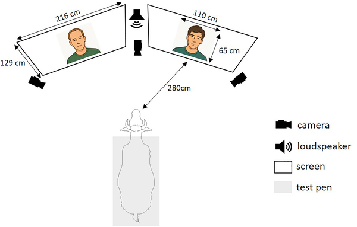
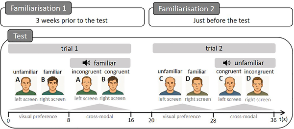
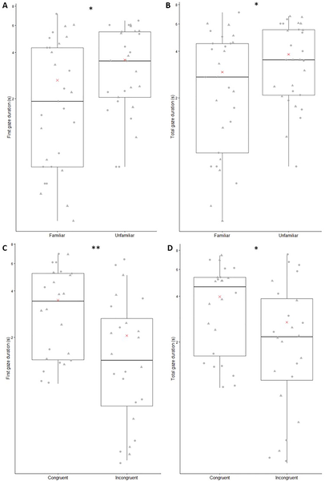

Did you know that cows can recognize human faces and voices? While we often think of cows as simple farm animals, recent research shows they possess more sophisticated social recognition skills than previously appreciated. By watching how cows respond to videos of familiar and unfamiliar people paired with matching or mismatching voices, scientists have uncovered evidence that cows not only tell people apart visually but also connect what they see with what they hear.

> **TL;DR**
> - Cows look longer at videos showing unfamiliar human faces when presented alongside familiar ones, indicating they can visually discriminate between people.
> - When hearing a voice paired with two videos, cows look longer at the video whose face matches the voice, demonstrating cross-modal recognition of humans.

Social recognition—the ability to identify and remember individuals—is fundamental for many animals to navigate their social worlds. While this has been extensively studied in species like dogs and horses, cows have received less attention despite living closely with humans for thousands of years. Understanding how cows perceive humans can improve animal welfare and deepen our knowledge of interspecies relationships. Previous studies suggested cows might use body cues to recognize humans, but whether they can identify people by facial features alone or link faces to voices remained unclear.

In this study, 32 Prim’ Holstein cows were tested using two complementary experiments. First, in a visual preference test, cows were shown two silent videos simultaneously—one of a familiar caretaker and one of an unfamiliar man—displayed on screens positioned on either side. Researchers measured how long cows looked at each face. Immediately afterward, cows underwent a cross-modal recognition test where the same two videos played alongside a voice recording of either the familiar or unfamiliar person. The voice was played from a speaker positioned between the screens, and cows’ gaze was recorded to see if they looked longer at the face matching the voice. Heart rate was also monitored to assess emotional responses. The videos featured men speaking neutral sentences unfamiliar to cows, and the presentation sides were randomized to avoid bias.

The results showed that during the visual test, cows spent significantly more time looking at the unfamiliar faces compared to familiar ones, suggesting they noticed and discriminated novel individuals. In the cross-modal test, cows looked significantly longer at the video whose face matched the voice being played, indicating they formed cross-modal mental representations linking faces and voices. These findings demonstrate that cows possess the ability to recognize and differentiate humans not only visually but also by integrating auditory information. The study also noted that cows’ heart rate varied with familiarity, hinting at emotional engagement during recognition.

This research adds to a growing body of evidence that domestic animals like cows have more complex social cognition than often assumed. Recognizing individual humans through multiple senses could influence how cows interact with their caretakers and respond to their environment. Such insights have practical implications for improving animal welfare and management by fostering positive human-animal relationships. Moreover, demonstrating cross-modal recognition in cows opens new avenues for studying animal cognition and communication across species boundaries.

While the study provides compelling evidence of cows’ face and voice recognition abilities, it focused on a specific breed and a limited set of human subjects, all male, to control variables. Future research could explore recognition across different genders, ages, and cultural contexts, as well as investigate how these abilities affect cows’ behavior in real-world interactions. Additionally, the emotional and cognitive mechanisms underlying these recognition processes warrant further study to fully understand their complexity.

## Figures

*A cow watched videos of familiar and unfamiliar faces on two screens while hearing voices, as cameras recorded its reactions.*

*Cows saw two faces and heard a voice to test if they recognize matching faces and voices in two 8-second trials.*

*Graphs show how long subjects looked at faces based on familiarity and video match, with medians, averages, and individual trial data.*

## Sources

- [Cows visually discriminate and cross-modally recognise familiar and unfamiliar human faces in videos](https://journals.plos.org/plosone/article?id=10.1371/journal.pone.0329529)
- DOI: [10.1371/journal.pone.0329529](https://doi.org/10.1371/journal.pone.0329529)
