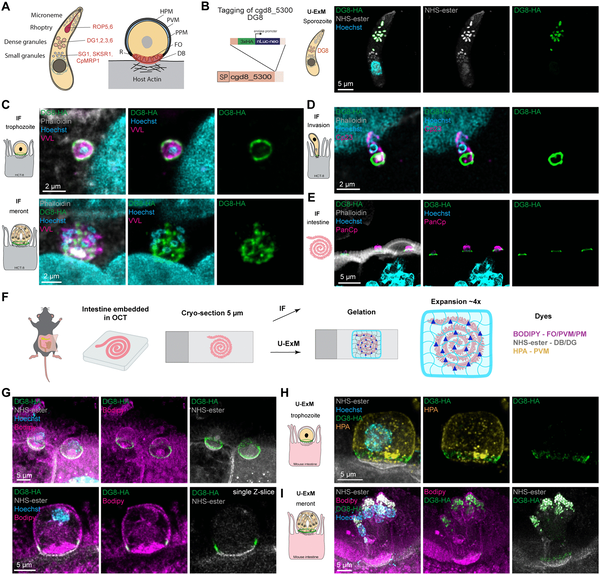
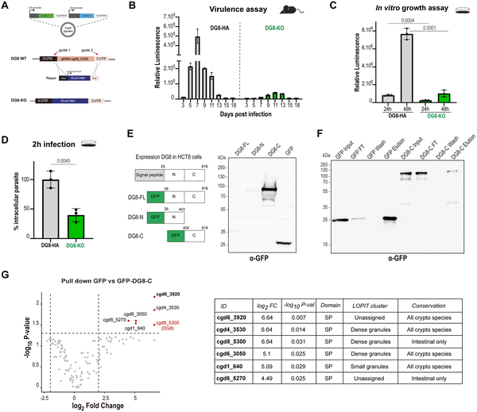
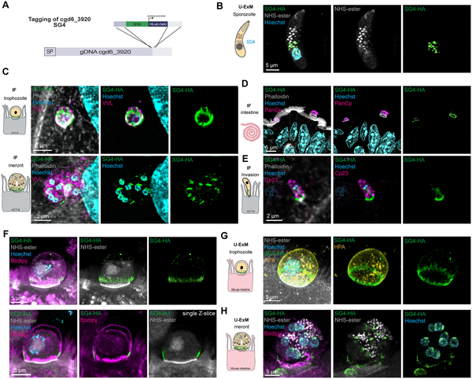
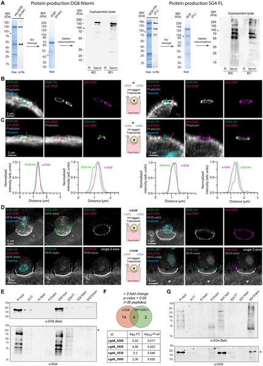

Imagine a microscopic battlefield deep within our intestines, where a tiny parasite constructs a sophisticated protein fortress to invade and thrive. Cryptosporidium parvum, a leading cause of deadly diarrheal disease in children worldwide, orchestrates this complex interface by secreting proteins that remodel the host cell environment. Recent advances in imaging and molecular biology have now revealed, with unprecedented clarity, how these secreted proteins assemble into layered structures that are essential for the parasite’s survival and infection process.

> **TL;DR**
> - Cryptosporidium secretes specialized proteins that form a complex, layered ring structure at the interface with host intestinal cells.
> - Disruption of one key protein, DG8, reduces parasite infection and growth, highlighting its role in parasite fitness and virulence.

Cryptosporidium parvum is a protozoan parasite responsible for cryptosporidiosis, a diarrheal disease that claims the lives of hundreds of thousands of children annually, especially in developing countries. Despite its global impact, effective treatments are limited, and the parasite’s unique intracellular niche within intestinal cells remains poorly understood. Unlike many related parasites, Cryptosporidium resides in a specialized compartment called the parasitophorous vacuole (PV), separated from the host cytoplasm by a complex interface. This interface includes a distinctive membrane invagination known as the feeder organelle, an electron-dense band, and a ring-shaped protein structure whose molecular composition and function had been elusive—until now.

Researchers used a combination of genetic tagging, advanced microscopy, and biochemical techniques to explore this interface. They focused on a dense granule protein named DG8, tagging it with fluorescent markers to track its location during infection. Using ultrastructure expansion microscopy (U-ExM), which physically enlarges tissue samples to improve resolution, they visualized DG8’s precise position in infected mouse intestinal tissue. Additionally, they created a DG8 knockout parasite strain using CRISPR-Cas9 gene editing to assess the protein’s role in infection. Pull-down experiments helped identify other secreted proteins interacting with DG8, including a small granule protein named SG4, which partially co-localizes with DG8 at the interface.

The study revealed that DG8 localizes to dense granules inside the parasite and, upon secretion, forms a distinct ring structure at the host-parasite interface. This ring sits above the electron-dense band and surrounds the feeder organelle at the base of the parasitophorous vacuole membrane. Parasites lacking DG8 showed significantly reduced infection levels in mice and impaired growth in cultured human intestinal cells, indicating that DG8 contributes to parasite fitness and virulence. Furthermore, DG8 is part of a larger complex of secreted proteins, with SG4 partially overlapping in location. The application of U-ExM allowed researchers to map these proteins’ spatial arrangement with unprecedented detail, revealing that the interface is organized into discrete, layered zones formed by multiple secreted effectors.

These findings provide critical insights into how Cryptosporidium constructs and maintains its unique host-parasite interface, a key to its ability to infect and survive within intestinal cells. Understanding the molecular architecture of this interface opens new avenues for therapeutic intervention, potentially guiding the development of drugs or vaccines targeting these secreted proteins. Given the global health burden of cryptosporidiosis and the current lack of highly effective treatments, this research represents an important step toward combating this neglected parasitic disease.

While the study clarifies the spatial organization and importance of DG8 and associated proteins, the precise biochemical functions of these secreted effectors remain to be fully elucidated. The knockout of DG8 reduced but did not eliminate infection, suggesting redundancy or compensatory mechanisms among parasite proteins. Moreover, translating these molecular insights into effective therapies will require further research to understand how these proteins interact with host cell pathways and how they can be targeted safely and effectively.

## Figures

*Protein cgd8_5300 forms a ring at the parasite-host cell interface, highlighting its role in parasite structure and interaction.*

*DG8 helps parasites grow and infect better, shown by less growth and infection when DG8 is removed in lab and mouse tests.*

*Protein Cgd6_3920 gathers at the parasite-host cell boundary, forming a ring-like structure during infection stages in cells and mouse tissue.*

*Antibodies show partial overlap between DG8 and SG4 proteins in infected intestinal tissue, highlighting their close interaction sites.*

## Sources

- [Cryptosporidium secreted proteins form a complex layered interface with the host cell](https://journals.plos.org/plospathogens/article?id=10.1371/journal.ppat.1014212)
- DOI: [10.1371/journal.ppat.1014212](https://doi.org/10.1371/journal.ppat.1014212)
