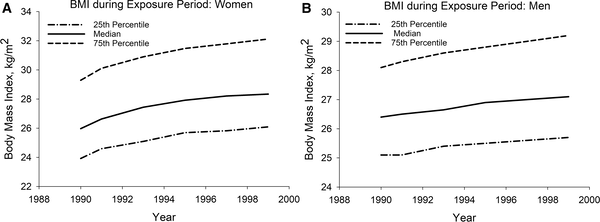

When it comes to heart health, your weight today is important—but how long you've carried extra weight might matter even more. A recent large-scale study examined how cumulative exposure to excess body weight over a decade influences the risk of heart attacks and strokes. The findings suggest that long-term excess weight is a stronger predictor of cardiovascular problems than a single measurement of body mass index (BMI), especially for younger adults.

> **TL;DR**
> - Long-term exposure to excess weight over a decade predicts cardiovascular risk better than BMI measured at one point in time.
> - The increased risk linked to prolonged excess weight is most pronounced in adults under 50, with little added risk seen in older age groups.

Obesity is a well-known risk factor for cardiovascular diseases such as heart attacks and strokes, which remain leading causes of death worldwide. Most studies have focused on BMI measured at a single time point, but people’s weight can fluctuate, and the duration of excess weight might influence health outcomes. Understanding how long-term excess weight exposure affects cardiovascular risk can help refine prevention strategies and public health messaging.

Researchers analyzed data from two large, ongoing prospective cohorts: the Nurses’ Health Study and the Health Professionals Follow-Up Study. They included over 136,000 participants who had at least one BMI measurement above 25 kg/m² between 1990 and 1999. The team calculated each person’s cumulative excess BMI exposure over that decade—essentially the average amount by which their BMI exceeded 25 each year. Starting in 2000, participants were followed for nearly 17 years to track incidence of fatal and non-fatal heart attacks and strokes. The analysis adjusted for baseline BMI, demographics, smoking, diabetes, hypertension, and other cardiovascular risk factors.

The study found that participants with the highest cumulative excess BMI exposure had significantly higher cardiovascular risk compared to those with the lowest exposure. This association was strongest for women under 50 and men under 65. Notably, baseline BMI measured at the start of the study was not associated with cardiovascular risk after accounting for cumulative excess BMI. This suggests that the duration and amount of excess weight over time better predicts cardiovascular events than a single BMI snapshot. The data also showed that many participants gained weight over the decade, highlighting the importance of monitoring weight trends rather than isolated measurements.

These findings emphasize the importance of long-term weight management to reduce cardiovascular risk, especially for younger adults. They suggest that healthcare providers and public health initiatives should focus not only on current weight but also on the history of excess weight exposure. Encouraging weight loss and maintenance early in adulthood could have lasting benefits in preventing heart attacks and strokes. The study also offers hope: since baseline BMI alone was not the key predictor, reducing excess weight at any point may help lower cardiovascular risk.

While this study benefits from a large sample size and long follow-up, it relies on self-reported weight data, which can be subject to inaccuracies. The study population primarily consisted of health professionals, which may limit generalizability to the broader public. Additionally, the analysis focused on BMI as a measure of excess weight, which does not distinguish between fat and muscle mass or fat distribution. Finally, the observational design cannot prove causation, though the findings align with existing evidence linking obesity and cardiovascular disease.

## Figures

*Figure 2 shows how body weight changed over time for women (A) and men (B) during the study period.*

## Sources

- [Cumulative excess weight exposure over time and cardiovascular risk: A prospective cohort study](https://journals.plos.org/plosone/article?id=10.1371/journal.pone.0344620)
- DOI: [10.1371/journal.pone.0344620](https://doi.org/10.1371/journal.pone.0344620)
