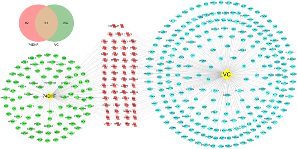
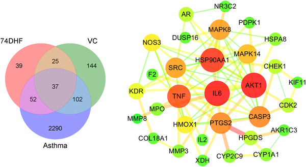

Asthma affects hundreds of millions worldwide, marked by airway inflammation, mucus overproduction, and breathing difficulties. While current medications help many, some patients still struggle with symptoms or side effects. What if natural compounds found in plants and everyday nutrients could team up to offer better relief? Recent research has delved into how a flavonoid extracted from licorice root and vitamin C might work together to calm asthma’s complex biological storm.

> **TL;DR**
> - The flavonoid 7,4’-Dihydroxyflavone (74DHF) and vitamin C each target multiple molecular pathways involved in asthma, including inflammation and airway remodeling.
> - Using systems pharmacology and lab tests, researchers found that combining 74DHF and vitamin C synergistically reduces inflammatory signals and fibrosis in lung cells, suggesting a promising complementary therapy.

Asthma is a multifaceted respiratory disease involving airway obstruction, heightened sensitivity, and chronic inflammation. Despite many available drugs like corticosteroids and bronchodilators, some patients experience inadequate control or side effects. Natural compounds have long been explored as potential adjunct therapies. The flavonoid 7,4’-Dihydroxyflavone (74DHF), derived from the herb Rhizoma Glycyrrhizae (licorice root), has shown anti-inflammatory effects by modulating immune pathways linked to asthma. Vitamin C (ascorbic acid), a common antioxidant, also influences immune regulation and has demonstrated benefits in respiratory conditions. However, how these two might work together at a molecular level was not well understood.

To uncover the combined effects of 74DHF and vitamin C, the researchers employed a systems pharmacology approach. This involved mining multiple databases to identify the molecular targets of each compound and known asthma-related genes. They then mapped overlapping targets and constructed protein interaction networks to highlight key nodes potentially influenced by both compounds. Gene Ontology and pathway enrichment analyses helped identify biological processes and signaling pathways involved. Finally, laboratory experiments using human lung epithelial cells and macrophages tested the effects of 74DHF and vitamin C—alone and combined—on inflammation and fibrosis markers induced by asthma-related stimuli.

The analysis revealed that 74DHF and vitamin C share 61 molecular targets related to asthma, including proteins involved in inflammation and airway remodeling. Among these, 37 targets overlapped with asthma-associated genes, with 20 identified as central 'hub' targets in the protein interaction network. Pathway analysis highlighted processes such as immune response regulation and fibrosis. Laboratory tests showed that the combination of 74DHF and vitamin C more effectively reduced inflammatory cytokines (like TNF-α and IL-6) in macrophages and inhibited fibrosis-related cell migration and protein markers in lung epithelial cells compared to either compound alone. These results support a synergistic effect in controlling key asthma pathologies.

This study provides a clearer picture of how a natural flavonoid and vitamin C might work together to modulate complex asthma mechanisms. By combining computational network analysis with experimental validation, the research offers a promising strategy to enhance asthma treatment using combination therapies that target inflammation and fibrosis. Such approaches could complement existing drugs, potentially improving efficacy and reducing side effects. Moreover, this work exemplifies how integrating systems pharmacology with lab experiments can accelerate the discovery of novel therapeutic combinations from natural products.

While the findings are encouraging, they are based on cell-based experiments and computational predictions. Further research, including animal models and clinical trials, is needed to confirm safety, optimal dosing, and effectiveness in humans. Additionally, the complexity of asthma means that individual responses may vary, and natural compounds can have side effects or interactions. Thus, these results should be viewed as a foundational step toward developing combination therapies rather than an immediate treatment recommendation.

## Figures

*Diagram showing how 74DHF and VC work together to fight asthma by targeting common and unique factors.*

*Diagram showing shared targets of 74DHF, VC, and asthma, plus a network of how 37 of these targets interact.*

## Sources

- [Deciphering the synergistic mechanism of a novel flavonoid-antioxidant combination for asthma by combining systems pharmacology and experimental validation](https://journals.plos.org/plosone/article?id=10.1371/journal.pone.0346165)
- DOI: [10.1371/journal.pone.0346165](https://doi.org/10.1371/journal.pone.0346165)
