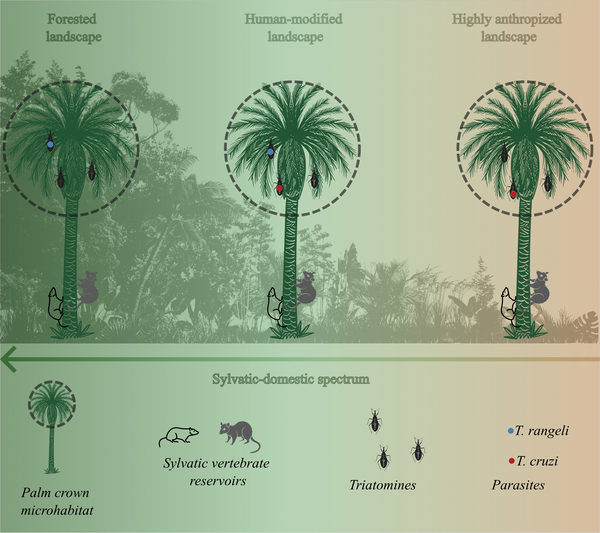
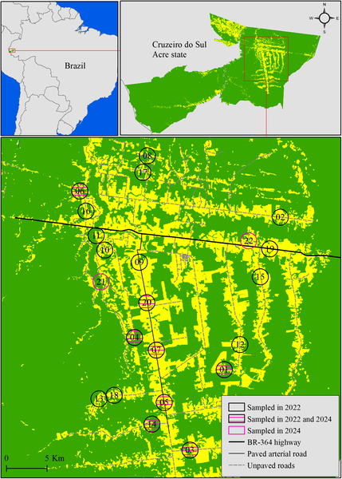
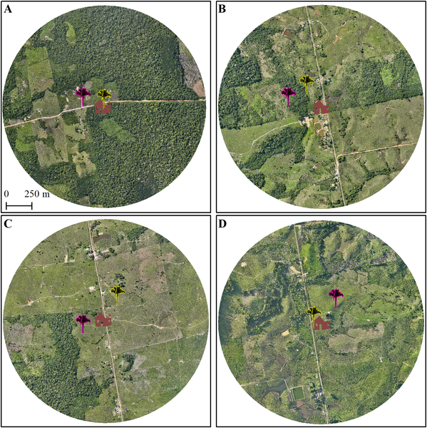

Imagine a tiny insect living high up in the crowns of palm trees deep in the Amazon rainforest. This insect, a triatomine bug, can carry a parasite that causes Chagas disease, a serious illness affecting millions in Latin America. But what happens when the forest around these palms is cut down and humans move closer? Recent research uncovers how deforestation and proximity to human homes influence the infection rates of these bugs, shedding light on how environmental change can increase disease risk at the forest’s edge.

> **TL;DR**
> - Deforestation in the southwestern Brazilian Amazon increases the likelihood that palm-dwelling triatomine bugs carry Trypanosoma cruzi, the parasite responsible for Chagas disease.
> - The closer these infected bugs live to human dwellings, the higher the risk of parasite spillover, even without bugs establishing permanent colonies inside homes.

Chagas disease is caused by the parasite Trypanosoma cruzi and is transmitted primarily by triatomine insects, often called 'kissing bugs.' In the Amazon, many of these bugs live in the crowns of palm trees, where they feed on wild animals like marsupials. This sylvatic (wild) cycle of transmission usually keeps the parasite away from humans. However, deforestation alters these natural habitats, forcing bugs and their hosts closer to human settlements. Understanding how changes in forest cover and human proximity affect infection patterns in these bugs is crucial for managing disease risk in tropical regions.

Researchers studied 20 sites around Cruzeiro do Sul in Acre state, Brazil, representing a gradient from intact forest to heavily deforested landscapes. In 2022 and 2024, they collected triatomine bugs from palm trees at varying distances from human homes. Using high-resolution satellite and drone imagery, they quantified forest cover and precisely measured how far each palm was from the nearest household. Molecular assays detected the presence of Trypanosoma cruzi and a related but non-pathogenic parasite, Trypanosoma rangeli, in the bugs. Statistical models then assessed how forest loss and proximity to people influenced infection rates.

The study found that the probability of triatomines being infected with T. cruzi was significantly higher in areas with more deforestation, especially when the bugs lived in palms closer to human dwellings. In contrast, infection rates with T. rangeli did not show any clear relationship with forest cover or distance to homes. Blood meal analysis revealed that bugs mostly fed on wild animals like marsupials, but also detected human blood in a bug collected just 33 meters from a house. Importantly, the T. cruzi strains identified were typical of wild transmission cycles, indicating that increased infection risk near homes does not require bugs to colonize inside houses.

These findings highlight a subtle but important ecological mechanism by which deforestation and human encroachment increase the risk of Chagas disease spillover. By reshaping the interactions between bugs, their wild hosts, and humans, forest loss creates conditions that favor parasite transmission near people. This knowledge is vital for public health strategies, emphasizing the need to consider environmental management alongside disease control in Amazonian and other tropical regions facing rapid land-use change.

While the study provides robust evidence linking deforestation and human proximity to increased T. cruzi infection in palm-dwelling triatomines, it focuses on one region and a specific set of palm habitats. The sample sizes of bugs were relatively modest, and the study did not directly measure human infection rates. Additionally, the complex dynamics of vector behavior and parasite transmission may vary in other ecological contexts. Further research is needed to generalize these findings and to explore interventions that can mitigate disease risk without compromising forest ecosystems.

## Figures

*Diagram showing how palm trees in the Amazon host bugs and animals, with bug types changing from wild to human areas along a deforestation gradient.*

*Map of Cruzeiro do Sul, Brazil, showing forest and human areas with 22 spots where bugs were studied in 2022 and 2024.*

*Maps show forest cover and palm tree locations near homes in Cruzeiro do Sul, Brazil, highlighting insect infections across different forest areas.*

## Sources

- [Deforestation and human proximity influence Trypanosoma cruzi infection in palm-dwelling triatomines](https://journals.plos.org/plosone/article?id=10.1371/journal.pone.0349311)
- DOI: [10.1371/journal.pone.0349311](https://doi.org/10.1371/journal.pone.0349311)
