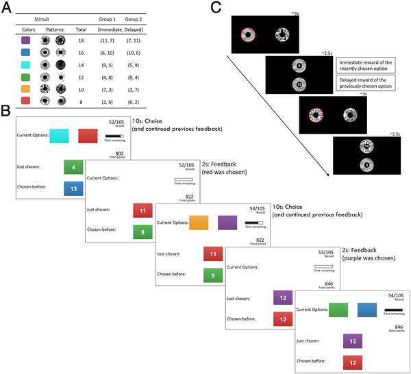
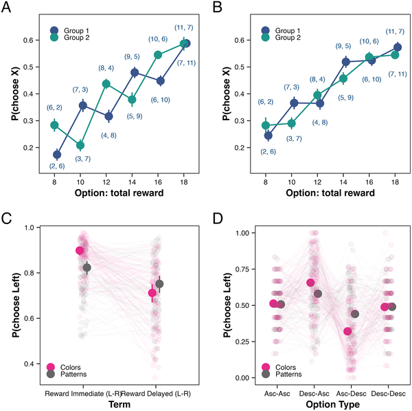
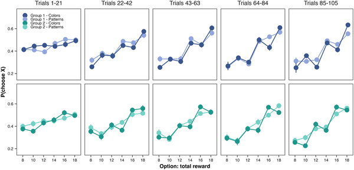
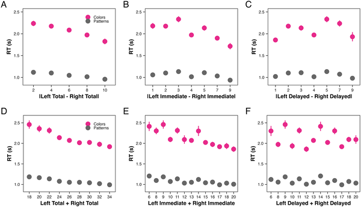

Why do we tend to focus more on immediate feedback, even when delayed information is just as important? Imagine learning a new skill or making decisions where some outcomes are clear right away, but others only become apparent later. You might think that if both pieces of information are equally valuable, we'd treat them the same. However, recent research shows that our brains systematically overweight immediate feedback, a quirk that can lead us astray.

> **TL;DR**
> - People consistently place more weight on immediate feedback than delayed feedback when learning, even if both are equally important.
> - This bias grows stronger over time and persists even when learning by observing others, revealing a costly cognitive flaw in how we process information.

Learning from feedback is fundamental to adapting and making good decisions. Traditional reinforcement learning models often assume that people update their expectations based on all available reward information equally. But in real life, actions often have multiple consequences that unfold over time—some immediate, some delayed. While it's well known that people prefer immediate rewards (a phenomenon called temporal discounting), it has been unclear whether this preference also reflects how we learn from feedback when immediate and delayed information are equally valuable. The new study by Cotet, Poensgen, and Krajbich explores this question using carefully designed experiments combining behavioral tasks and eye-tracking.

The researchers designed a task where participants chose between options that delivered rewards split into two parts: one immediate feedback given right after the choice, and one delayed feedback shown after the next trial. Crucially, all rewards were actually paid out at the end, so immediate and delayed feedback had equal real-world value. Participants learned the value of different options over many trials, with some options having higher immediate but lower delayed rewards, and others the opposite. Eye-tracking was used to measure where participants looked during feedback, and additional tests assessed whether this bias related to memory or patience in other tasks.

Across two large studies, participants showed a clear bias: they overweighted immediate feedback compared to delayed feedback by a factor of about 1.4 to 2.4. This led to more errors when the better option had higher delayed rewards but lower immediate rewards. Surprisingly, this bias increased as the experiment progressed, rather than diminishing with experience. Eye-tracking data showed a general tendency to look more at immediate feedback, but individual gaze patterns did not predict the behavioral bias, suggesting attention alone does not explain the effect. The bias also appeared when participants learned by watching others’ choices. Moreover, participants with stronger immediacy bias in learning were more likely to prefer smaller-sooner rewards in a separate intertemporal choice task, linking this learning bias to broader impatience.

This study reveals a subtle but important cognitive quirk: people do not just prefer immediate rewards, they also overweight immediate information about rewards when learning, even when it is no more valuable than delayed information. Unlike classic temporal discounting, this bias is objectively a mistake that leads to worse decisions. Understanding this bias can help explain why people often seem shortsighted and may inform strategies in education, behavioral interventions, and decision-making to better balance immediate and delayed information.

While the experiments were carefully controlled and combined behavioral and eye-tracking data, the study did not directly measure brain activity or neural mechanisms underlying this bias. The findings relate to a specific task where delayed and immediate feedback were equally valuable and delivered in a controlled setting, so real-world complexities might influence how this bias manifests. Additionally, while attention did not fully explain the bias, other cognitive factors like memory retrieval or agency might play roles that require further investigation.

## Figures

*Participants chose between colored or patterned options with varying rewards, receiving immediate and delayed feedback to learn over trials.*

*Graphs show how people choose options based on rewards, feedback timing, and whether options increase or decrease in value.*

*Graph shows how choices favoring rewards grow over time, with a rising preference for immediate rewards across trials.*

*Response times drop as value differences and overall values increase, especially for immediate choices, shown across three studies.*

## Sources

- [Delayed reward information is underweighted in reinforcement learning with dispersed feedback](https://journals.plos.org/ploscompbiol/article?id=10.1371/journal.pcbi.1014459)
- DOI: [10.1371/journal.pcbi.1014459](https://doi.org/10.1371/journal.pcbi.1014459)
